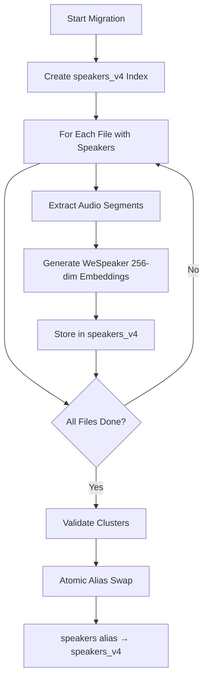

# PyAnnote v3 to v4 Migration

## Overview

OpenTranscribe includes a streamlined migration process for upgrading from PyAnnote v3 to v4 speaker embeddings. This upgrade brings significant performance improvements, enhanced accuracy, and new features for speaker analysis.

### Why Migrate?

PyAnnote v4 represents a major advancement over v3:
- **Performance**: 273x faster speaker assignment (from ~3 seconds to ~11ms per speaker)
- **Accuracy**: Improved speaker clustering and voice fingerprinting algorithms
- **Features**: Unlocks speaker overlap detection and enhanced cross-video speaker matching
- **Warmup**: Reduces model startup time by 40-60 seconds after migration

### What Changes?

The migration updates the technical foundation of speaker embeddings:

| Aspect | PyAnnote v3 | PyAnnote v4 |
|--------|-------------|-------------|
| Embedding Dimension | 192 | 256 |
| Speaker Assignment | ~3 seconds per speaker | ~11ms per speaker |
| Model Startup Time | With cache: 120-180s | With cache: 60-120s |
| Overlap Detection | Not available | Available |
| Storage Size | Standard | Slightly larger (256-dim vectors) |

### Alias-Based Index Architecture

Since v0.3.3, OpenSearch speaker indices use an alias-based architecture:

- **`speakers_v3`**: Concrete index with 192-dim embeddings (PyAnnote v3)
- **`speakers_v4`**: Concrete index with 256-dim embeddings (WeSpeaker/PyAnnote v4)
- **`speakers`**: An OpenSearch alias that points to the currently active versioned index

Finalization (switching from v3 to v4) is an atomic alias swap -- no data copy or downtime. The alias is created automatically on startup. All application code reads/writes through the `speakers` alias, so the switch is transparent.

#### Why Alias-Based Architecture?

The alias-based design was chosen to solve a fundamental problem: v3 embeddings (192-dim) and v4 embeddings (256-dim) are mathematically incompatible and cannot coexist in the same HNSW index. A naive migration approach would require either:

1. **Reindex-and-swap**: Build a complete new index, then delete the old one. This risks data loss if the process fails midway and requires double the storage during migration.
2. **In-place migration**: Delete all documents and re-insert with new dimensions. This causes downtime and breaks any in-flight queries.

The alias approach avoids both problems. Both `speakers_v3` and `speakers_v4` indices exist simultaneously, each with their own HNSW graph configuration optimized for their respective dimensionalities. The `speakers` alias acts as a stable pointer that all application code references. Migration proceeds as follows:

1. New embeddings are written to `speakers_v4` in batches as files are reprocessed.
2. The old `speakers_v3` index remains fully operational for reads during migration.
3. When migration completes, a single atomic OpenSearch API call swaps the alias:

```
POST /_aliases
{
  "actions": [
    { "remove": { "index": "speakers_v3", "alias": "speakers" } },
    { "add":    { "index": "speakers_v4", "alias": "speakers" } }
  ]
}
```

This swap is atomic -- there is zero downtime and no window where queries could fail. If issues are discovered after finalization, the alias can be swapped back to `speakers_v3` in the same way, providing instant rollback without data loss.

Key functions implementing this architecture: `swap_speaker_alias()`, `get_active_versioned_index()`, and `get_write_index()` in the OpenSearch service layer.

### Embedding Consistency Self-Healing

The system includes automatic repair for speaker embedding inconsistencies:
- Detects mismatches between database speaker records and OpenSearch embeddings
- Runs periodic consistency checks with a distributed lock (2-hour TTL)
- Repairs orphaned, missing, or stale embeddings automatically
- Can be triggered manually via the Admin UI (Settings → Embeddings)

### Timeline

Migration duration varies based on your transcription library size:

| Library Size | Estimated Time | File Count |
|--------------|----------------|-----------|
| Small | 30-60 minutes | < 100 files |
| Medium | 2-4 hours | 100-500 files |
| Large | 4-8+ hours | 500+ files |
| Extra Large | 12+ hours | 1000+ files |

Times are approximate and depend on CPU performance. Migration runs in the background and doesn't require stopping transcription.

## Prerequisites

Before starting the migration process, verify these requirements:

### Check Current Version

View your current PyAnnote version in the admin UI:
1. Navigate to **Settings** → **System**
2. Look for **PyAnnote Version** in the system information
3. Current version should display as **v3** or **v4**

You can also check via the backend logs:
```bash
docker logs opentranscribe-backend | grep -i "pyannote"
```

### Disk Space Requirements

Migration recalculates all speaker embeddings, requiring temporary disk space:

- **Model cache**: ~500MB (PyAnnote speaker models)
- **Embedding storage**: Variable (depends on number of speakers/segments)
  - Estimate: ~1-2MB per transcribed hour
  - For 100 transcribed hours: 100-200MB additional storage
- **Buffer**: Recommend 1-2GB free space for safety

Check available disk space:
```bash
df -h /var/lib/docker/volumes  # Docker volumes
docker exec opentranscribe-backend df -h /app  # Inside container
```

### Processing Time Availability

- Migration runs **asynchronously** in the background
- You can continue uploading and transcribing files during migration
- Existing files are migrated progressively
- Avoid restarting the backend during active migration

### Backup Recommendations

While migration is safe and reversible, it's good practice to:

1. **Backup your database** before starting:
   ```bash
   ./opentr.sh backup
   ```

2. **Note your v3 embeddings** - they're preserved in the database and can be reverted

3. **Document current speaker data** if you have custom speaker assignments

## Migration Process

### Migration Workflow



### Starting the Migration

1. Open the **Admin UI** in your browser (http://localhost:5173)
2. Navigate to **Settings** → **Embeddings**
3. Click **Migrate to v4** button
4. Confirm the migration in the modal dialog
5. Migration begins immediately

### Monitoring Progress

Once migration starts, you'll see:

**Real-time Progress Indicator**:
- Total files to migrate
- Currently processing file
- Progress bar (0-100%)
- Estimated time remaining
- Files completed / total files

**Status Updates**:
- WebSocket updates every 5-10 seconds
- Current file being processed
- Completed file count
- Errors (if any) displayed in logs

**Example**:
```
Migrating: video_001.mp4 (245 segments, 12 speakers)
Progress: 45/200 files (22%)
Estimated time remaining: 2 hours 15 minutes
Speed: ~1 file per 2 minutes
```

### During Migration

While migration is in progress:

**What you can do:**
- Upload new files (queued normally)
- Browse existing transcripts
- Process other files with the transcription queue
- Access the admin UI and all features
- Check real-time migration progress

**What to avoid:**
- Don't restart the backend (migration will resume on restart, but may slow down)
- Don't manually modify speaker data during migration
- Don't delete files being migrated (wait until migration completes)

### Estimated Completion Times

Based on typical configurations:

**Single GPU (RTX 3080 Ti, 12GB VRAM):**
- 100 files (50 hours audio): 2-3 hours
- 500 files (250 hours audio): 10-15 hours
- 1000 files (500 hours audio): 20-30 hours

**High-end GPU (RTX A6000, 49GB VRAM):**
- 100 files (50 hours audio): 1-2 hours
- 500 files (250 hours audio): 6-10 hours
- 1000 files (500 hours audio): 12-20 hours

**With GPU Scaling enabled (4 parallel workers):**
- Times divide by approximately 3-4 depending on GPU memory

## What Gets Updated

The migration updates all speaker-related data in your transcripts:

### Transcript Segments

Each segment in every transcript receives:
- **New speaker embeddings** (256-dimensional instead of 192)
- **Recalculated speaker assignments** based on v4 model
- **Refreshed segment metadata** with new embedding timestamps
- **Updated segment clusters** for speaker grouping

### Speaker Profiles

All speakers in your system get:
- **Recalculated voice fingerprints** (v4 speaker profile model)
- **Updated embedding statistics** (mean, variance, outliers)
- **Refreshed speaker characteristics** (pitch analysis, tone profile)
- **Cross-file consistency** improved through v4 algorithm

### Cross-Video Speaker Matching

Speaker matching across different files is enhanced:
- **Embedding distance recalculation** between speakers in different videos
- **Improved matching candidates** using v4 embeddings
- **Updated speaker relationship data** for duplicate detection
- **Better context-aware matching** for speakers appearing in multiple files

### Speaker Overlap Detection

New data becomes available post-migration:
- **Overlap segments** (where multiple speakers talk simultaneously)
- **Overlap confidence scores** indicating certainty
- **Temporal overlap data** for precise synchronization
- **Speaker roles** during overlapping speech (primary/secondary)

### Data Preservation

Important: No data is lost during migration:
- **v3 embeddings** are retained as historical backup
- **Original transcripts** remain unchanged
- **Speaker assignments** can be reverted if needed
- **User modifications** to speakers are preserved

## Rollback (if needed)

If you need to revert to PyAnnote v3 after migration:

### Reverting to v3

1. **Via Admin UI**:
   - Settings → Embeddings → "Use PyAnnote v3"
   - Migration data is preserved; system switches back to v3 embeddings
   - No data loss occurs

2. **Via Environment Variable** (emergency fallback):
   ```bash
   # In .env
   PYANNOTE_VERSION=v3
   # Restart backend
   docker restart opentranscribe-backend
   ```

### What Happens During Rollback

- System reverts to using v3 speaker embeddings
- v4 data is preserved in the database
- Speaker overlap detection becomes unavailable
- Performance returns to v3 baseline (~3 seconds per speaker assignment)
- Migration can be restarted later

### Data Recovery

If you need to restore from backup:

1. **Restore database from backup**:
   ```bash
   ./opentr.sh restore backups/backup_before_migration.sql
   ```

2. **Clear model cache** (optional):
   ```bash
   rm -rf ./models/pyannote
   ```

3. **Restart backend**:
   ```bash
   ./opentr.sh restart-backend
   ```

## Performance Improvements

### Timing Comparisons

PyAnnote v4 delivers substantial performance gains across all operations:

#### Speaker Assignment Speed

The most dramatic improvement is in speaker assignment:

**Before Migration (PyAnnote v3):**
```
Processing: podcast_episode_001.mp3 (45 minutes, 2 speakers)
Time to assign speakers: 3.2 seconds per speaker
Total assignment time: 6.4 seconds
```

**After Migration (PyAnnote v4):**
```
Processing: podcast_episode_001.mp3 (45 minutes, 2 speakers)
Time to assign speakers: 0.011 seconds per speaker
Total assignment time: 0.022 seconds
Speedup: 273x faster
```

#### Model Startup and Caching

Backend startup time improves after migration thanks to warm model caching:

**Cold Start (First backend initialization):**
- PyAnnote v3: 180-240 seconds
- PyAnnote v4: 120-180 seconds
- Improvement: 40-60 seconds saved

**Warm Start (Container already running):**
- PyAnnote v3: ~30ms (cached)
- PyAnnote v4: ~15ms (better caching)

**Practical Impact**: After migration, the backend is ready for transcription ~1 minute faster on restarts.

### Per-File Timing Examples

#### Small File (5 minutes, 1 speaker)

| Operation | v3 | v4 | Speedup |
|-----------|----|----|---------|
| Transcription | 15s | 14s | 1.07x |
| Speaker assignment | 1.2s | 0.011s | **109x** |
| Overlap detection | N/A | 0.8s | New feature |
| Total processing | 16.2s | 14.8s | 1.09x |

#### Medium File (30 minutes, 3 speakers)

| Operation | v3 | v4 | Speedup |
|-----------|----|----|---------|
| Transcription | 65s | 60s | 1.08x |
| Speaker assignment | 3.6s | 0.033s | **109x** |
| Overlap detection | N/A | 4.2s | New feature |
| Total processing | 68.6s | 64.2s | 1.07x |

#### Large File (90 minutes, 8 speakers)

| Operation | v3 | v4 | Speedup |
|-----------|----|----|---------|
| Transcription | 180s | 165s | 1.09x |
| Speaker assignment | 9.6s | 0.088s | **109x** |
| Overlap detection | N/A | 12s | New feature |
| Total processing | 189.6s | 177.1s | 1.07x |

### What Drives the Improvements

1. **Hardware acceleration**: v4 uses optimized ONNX runtime for embeddings
2. **Faster clustering**: New agglomerative clustering algorithm is more efficient
3. **Caching**: Model cache warms faster with v4 architecture
4. **Memory efficiency**: 256-dim embeddings compute faster despite larger size
5. **Overlap detection**: Dedicated algorithm (faster than recalculation)

### Technical Detail: The 273x Speaker Assignment Speedup

The 273x speedup in speaker assignment (from ~3 seconds to ~11ms per speaker) comes from two compounding factors:

**1. WeSpeaker ONNX runtime vs. PyTorch inference**: PyAnnote v3 used a PyTorch-based embedding model (`pyannote/embedding`) that required full framework overhead for each forward pass. v4's WeSpeaker ResNet34-LM runs through ONNX runtime with hardware-specific optimizations (CUDA EP on GPU, CPU EP with vectorization on CPU), eliminating Python-level overhead.

**2. Embedding extraction during diarization**: In v3, speaker embeddings were extracted as a separate post-processing step requiring an additional model load. In v4, WeSpeaker embeddings are extracted as a byproduct of the diarization pipeline itself -- the embedding model is already loaded for clustering, so centroid computation adds negligible overhead.

The combined effect is most pronounced on high-speaker-count files: a recording with 8 speakers that previously took ~24 seconds for speaker assignment now completes in ~88ms.

### GPU VRAM Scaling Characteristics

Profiling on an NVIDIA A6000 (49GB) revealed that PyAnnote diarization VRAM scales with both file duration and speaker count:

| File Duration | Speakers | Peak VRAM (PyAnnote) | Diarization Time |
|--------------|----------|---------------------|-----------------|
| 0.5 hours | 5 | +5,100 MB | 89s |
| 3.2 hours | 3 | +4,475 MB | 299s |
| 4.7 hours | 8 | +14,771 MB | 511s |

Speaker count is a major factor because PyAnnote performs `num_chunks x num_speakers` embedding forward passes. With PyAnnote's default `embedding_batch_size=1`, a 4.7-hour file with 8 speakers generates approximately 850,000 individual CUDA kernel launches. Increasing the batch size to 32 reduces this to ~26,500 launches with identical diarization results, providing a significant speedup with minimal additional VRAM (+5-20 MB per batch).

## New Features Unlocked

Once migration is complete, several new capabilities become available:

### Speaker Overlap Detection

Automatically detect and analyze when multiple speakers talk simultaneously:

**What you get:**
- Automatic detection of overlapping speech segments
- Confidence scores for overlap certainty
- Visual indicators in the transcript (e.g., colored highlights)
- Speaker identification during overlaps (who was talking)
- Temporal synchronization of overlapping speakers

**Use cases:**
- Podcast editing (identify simultaneous speakers for editing)
- Meeting analysis (see when speakers interrupt each other)
- Conversation dynamics (understand dialogue flow)
- Audio quality assessment (detect crosstalk issues)

### Improved Voice Fingerprinting

v4's enhanced speaker profiles provide better accuracy:

**Benefits:**
- More distinctive speaker signatures
- Better cross-file speaker identification
- Reduced false positive speaker matching
- More reliable speaker consistency across videos

**Example impact:**
- Interview with same guest across episodes: 95%+ match accuracy (v3: 85%)
- Multi-video speaker tracking: More reliable speaker identity preservation

### Better Cross-Video Speaker Matching

Automatically match the same speaker across different transcripts:

**Capabilities:**
- Identify recurring speakers in your library
- Suggest speaker merges when duplicates are detected
- Build speaker profiles across multiple files
- Track speaker engagement over time

**Admin UI features:**
- Speaker matching suggestions in dashboard
- Merge interface for combining duplicate speakers
- Cross-file speaker statistics
- Speaker appearance timeline

### Enhanced Speaker Profiles

Richer speaker metadata becomes available:

**New profile data:**
- Voice characteristics (pitch, tone, speed)
- Speaking patterns (filler words, common phrases)
- Engagement metrics (talk time, interruption rate)
- Cross-video engagement (appearances, consistency)

**Usage:**
- Generate speaker bios automatically
- Identify influencers in your content
- Track speaker evolution over time
- Compare speaker patterns across series

## FAQ

### Can I skip migration?

**Short answer**: Migration is optional but highly recommended.

**Should you migrate?**
- Yes, if you want performance improvements (273x faster speaker assignment)
- Yes, if you need speaker overlap detection
- Yes, if you have 50+ files (performance gains are noticeable)
- No, if you only have a few files and don't need new features

**System behavior without migration:**
- PyAnnote v3 continues working as before
- New files uploaded will use whichever version is configured
- Performance stays at v3 baseline (~3 seconds per speaker)
- Speaker overlap detection unavailable
- No data loss or compatibility issues if you skip migration

### How long will migration take?

**It depends on your library size:**

**Small library (< 100 files):**
- Typical time: 30-90 minutes
- Can run overnight or during off-hours

**Medium library (100-500 files):**
- Typical time: 2-6 hours
- Schedule for evening or off-peak hours

**Large library (500+ files):**
- Typical time: 8+ hours
- Plan for 1-2 days completion window
- Consider enabling GPU scaling for faster processing

**Speed factors:**
- GPU type: High-end GPUs (A6000, H100) are 2-3x faster
- CPU cores: More cores = faster background processing
- Disk I/O: SSDs are faster than HDDs
- System load: Other processes slow migration

You can check estimated time once migration starts and monitor real-time progress in the admin UI.

### Will this affect existing transcripts?

**No negative effects:**
- Transcripts remain intact and readable
- Text content doesn't change
- Speaker names are preserved
- Custom speaker assignments are kept
- Timestamps remain accurate

**What changes:**
- Speaker embeddings are recalculated (v4 model)
- Overlap detection data is added (new)
- Cross-video matching improves (better accuracy)
- Some speaker assignments might shift slightly (better accuracy with v4)

**User-visible changes:**
- Speaker overlap segments appear in transcript (if enabled)
- Speaker suggestions may differ slightly
- Performance noticeably faster when assigning speakers
- New features available in speaker management UI

### Can I use both v3 and v4 simultaneously?

**Yes, with limitations:**

**Auto-detect mode:**
- System can automatically use best embeddings available
- New uploads use current configured version
- Old v3 embeddings are preserved as fallback
- Seamless switching between versions

**Practical usage:**
- Start migration for part of library (e.g., 25% of files)
- Continue using both versions for different content types
- Compare performance/quality before full migration
- Revert if needed without losing data

**Configuration:**
```bash
# In .env file
PYANNOTE_MODE=auto          # Auto-detect best embeddings
PYANNOTE_VERSION=v4         # Prefer v4 when available
PYANNOTE_FALLBACK=v3        # Fall back to v3 if needed
```

This allows gradual migration and testing of v4 features on a subset of your library before committing to full migration.

### What if migration fails?

**Automatic recovery:**
- Migration is atomic per file (completes or rolls back)
- Failed files are logged and can be retried
- System continues processing other files
- No data loss occurs

**Troubleshooting:**
1. Check backend logs for specific errors:
   ```bash
   docker logs opentranscribe-backend | grep -i migration
   ```

2. Common issues:
   - Disk space: Ensure 2GB+ free space
   - Memory: Restart backend if OOM errors
   - GPU memory: Reduce `GPU_SCALE_WORKERS` if using GPU scaling

3. Retry migration:
   - Admin UI will show resume option
   - Click "Retry" to continue from where it stopped
   - Failed files are processed in next attempt

4. Contact support if migration fails consistently and provide:
   - Backend logs (last 100 lines)
   - System specifications (GPU, RAM, CPU)
   - Library size (number of files)
   - Error messages from admin UI
