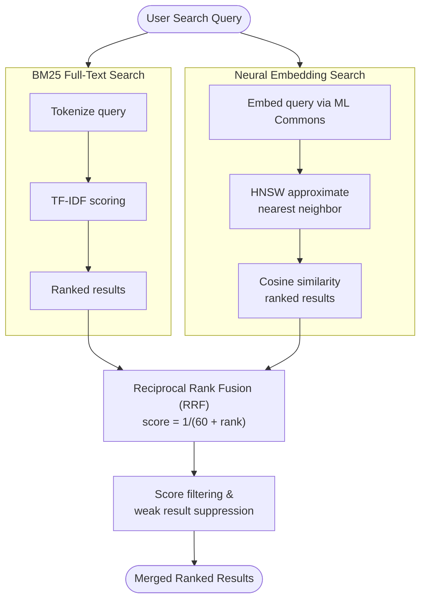

# OpenSearch Neural Search Setup

Neural search enables AI-powered semantic search capabilities in OpenTranscribe, allowing users to find transcripts based on meaning and context rather than just keywords.

## Overview

**What is Neural Search?**

Neural search uses machine learning embeddings to understand the semantic meaning of text. Instead of matching keywords, it finds conceptually similar content across transcripts.

**Examples:**
- Search for "financial reporting procedures" finds mentions of "quarterly earnings calls" and "budget reviews"
- Search for "meeting organizer" finds references to "facilitator", "moderator", "lead coordinator"
- Search for "action items" finds TODO discussions even if the word "action" isn't used

**Why It Matters:**
- Hybrid search (full-text + neural) provides 9.5x faster vector search
- Improves recall by finding related content traditional search misses
- Works across synonyms, paraphrases, and different phrasings
- Complements full-text search for comprehensive coverage

:::tip Hybrid Search
OpenTranscribe combines BM25 full-text search with neural search using Reciprocal Rank Fusion (RRF). This gives you the speed of keyword search plus the intelligence of semantic search.
:::

### Why Hybrid Search Beats Either Approach Alone

Keyword search (BM25) excels at exact matches -- names, dates, technical terms -- but fails when users phrase queries differently from the transcript. Neural search catches synonyms and paraphrases but can return false positives for conceptually adjacent but irrelevant content. The hybrid approach ensures both signals contribute:

- A document ranked #1 in keyword search and #5 in semantic search scores higher than one ranked #3 in both, because RRF rewards strong signal in either dimension.
- Documents appearing in both result lists get a natural boost, surfacing the most confidently relevant matches.
- Semantic-only results face additional filtering: the weakest 35% are suppressed, and remaining results must exceed a minimum score threshold. This prevents low-confidence semantic matches from diluting precise keyword results.

In practice, hybrid search eliminates the "I know it's in there but I can't find it" problem common with keyword-only search on conversational transcripts, where speakers rarely use the exact terms a user would search for.

## Prerequisites

Before enabling neural search, ensure:

- **OpenSearch 3.4.0+** - Required for ML Commons plugin
- **ML Commons Plugin Enabled** - For model management and embeddings
- **Sufficient VRAM**: Depends on model selection
  - Small models (all-MiniLM-L6-v2): 2-4GB
  - Medium models (all-mpnet-base-v2): 4-8GB
  - Large models (bge-large-en-v1.5): 8GB+
- **Available Disk Space**: ~500MB-2GB for model storage

:::note Model Download
Models are downloaded automatically on first use. Ensure your OpenSearch container has internet access during initial setup.
:::

## Available Models

OpenTranscribe supports three embedding models in different performance tiers:

### Tier 1: Small & Fast (Recommended for Most Users)

**Model**: `sentence-transformers/all-MiniLM-L6-v2`
- **Speed**: Fastest (2-5ms per embedding)
- **VRAM**: 2-4GB
- **Dimensions**: 384
- **Quality**: Good for most use cases
- **File Size**: ~80MB

**Best For:**
- Production deployments
- Budget-conscious setups
- Real-time search on large indexes
- Most transcription search tasks

### Tier 2: Medium & Balanced

**Model**: `sentence-transformers/all-mpnet-base-v2`
- **Speed**: Medium (10-20ms per embedding)
- **VRAM**: 4-8GB
- **Dimensions**: 768
- **Quality**: Better semantic understanding
- **File Size**: ~420MB

**Best For:**
- Systems with moderate VRAM
- Higher semantic accuracy requirements
- Mixed workloads
- Specialized terminology

### Tier 3: Large & High-Quality

**Model**: `sentence-transformers/bge-large-en-v1.5`
- **Speed**: Slower (20-50ms per embedding)
- **VRAM**: 8GB+
- **Dimensions**: 1024
- **Quality**: Highest accuracy, domain-optimized
- **File Size**: ~1.3GB

**Best For:**
- High-accuracy requirements
- Advanced systems with ample VRAM
- Production systems with performance optimization
- Enterprise deployments

:::info Model Comparison
All three models provide semantic search capabilities. Tier 1 (all-MiniLM) offers excellent value for most users. Choose Tier 2 or 3 only if you need higher accuracy and have the VRAM budget.
:::

### Model Selection Rationale

The default `all-MiniLM-L6-v2` was chosen for several specific reasons:

- **Latency**: At 2-5ms per embedding, it adds negligible overhead to the indexing pipeline and keeps search response times under 50ms even on large indexes. The 768-dim models (mpnet, distilroberta) take 3-4x longer per embedding.
- **Memory**: At 80MB and 384 dimensions, the HNSW vector index stays small. A 10,000-transcript deployment with ~50,000 chunks uses ~73MB of vector index memory with 384-dim vs ~147MB with 768-dim.
- **Transcript search characteristics**: Meeting transcripts are conversational English with limited vocabulary diversity. The accuracy gap between MiniLM-L6 and larger models is smaller on this domain than on academic benchmarks, because the semantic space is narrower.
- **Multilingual alternative**: For non-English deployments, `paraphrase-multilingual-MiniLM-L12-v2` provides 50+ language coverage at the same 384-dim footprint (420MB model, same embedding speed tier).

Changing models requires a full reindex of all transcripts, as the vector dimensions and semantic space differ between models.

## Configuration Steps

### Step 1: Access Admin Settings

1. Log in as admin
2. Navigate to **Settings** → **Search Configuration**
3. Look for "Neural Search" section

### Step 2: Enable Neural Search

1. Toggle **Enable Neural Search** to ON
2. System will verify OpenSearch connectivity and ML Commons status

:::warning ML Commons Check
If ML Commons is disabled, you'll see a warning. Contact your infrastructure team to enable the ML Commons plugin on your OpenSearch cluster.
:::

### Step 3: Select Embedding Model

1. Click **Select Model** dropdown
2. Choose from available models:
   - `all-MiniLM-L6-v2` (Recommended - fastest)
   - `all-mpnet-base-v2` (Balanced)
   - `bge-large-en-v1.5` (Highest quality)

3. System shows VRAM requirements for selected model
4. Click **Validate** to verify your system can support the model

### Step 4: Configure ML Service

1. Under **ML Service Configuration**:
   - **Embedding Service Endpoint**: Auto-detected (usually internal)
   - **Batch Size**: Default 32 (see Performance Tuning)
   - **Request Timeout**: Default 300 seconds

2. Click **Test Connection** to verify setup

### Step 5: Register Model Endpoint

1. Click **Register Model**
2. System downloads and registers the embedding model
3. Status indicator shows progress: "Downloading..." → "Registering..." → "Ready"

:::note Initial Setup
First-time model registration takes 5-15 minutes depending on model size and internet speed. Monitor logs in container or check status from admin panel.
:::

### Step 6: Verify Model is Working

1. Once status shows **Ready**, click **Test Embedding**
2. Enter sample text: `"This is a test transcript excerpt"`
3. System generates embedding and confirms working
4. Status badge shows **Active**

:::success Ready to Index
Once the model shows "Active" status, neural search is ready for use!
:::

## Performance Tuning

### Batch Size Recommendations

Batch size determines how many texts are embedded simultaneously:

| System VRAM | Small Model | Medium Model | Large Model |
|-------------|-----------|-------------|-----------|
| 4GB | 8-16 | Not recommended | Not recommended |
| 6GB | 16-32 | 8-16 | Not recommended |
| 8GB | 32-64 | 16-32 | 8-16 |
| 12GB+ | 64-128 | 32-64 | 16-32 |

**How to Adjust:**

1. Go to **Settings** → **Search Configuration** → **ML Service Settings**
2. Update **Batch Size**
3. Click **Save**
4. Recommendation: Start conservative (16) and increase if you have headroom

### Hybrid Search Pipeline



### Hybrid Search Strategy

OpenTranscribe uses **Reciprocal Rank Fusion (RRF)** to combine results:

**How It Works:**
1. BM25 full-text search returns top matches
2. Neural search returns semantically similar results
3. RRF merges rankings for balanced relevance

**RRF Formula**: `score = 1/(60 + rank)`

**Example:**
- User searches: "quarterly business review"
- BM25 finds: "Q3 earnings call", "financial summary report"
- Neural finds: "performance assessment meeting", "progress update discussion"
- Merged results show all related content

**Tuning RRF Weights:**

In settings:
- **BM25 Weight**: How much to value keyword matches (default: 1.0)
- **Neural Weight**: How much to value semantic similarity (default: 1.0)
- Adjust weights to emphasize one signal over the other

### Hybrid Search Recommendations

| Use Case | BM25 Weight | Neural Weight | Reasoning |
|----------|------------|---------------|-----------|
| Specific terms (names, dates) | 2.0 | 1.0 | Prioritize exact matches |
| Conceptual search (ideas, topics) | 1.0 | 2.0 | Prioritize meaning |
| Balanced (default) | 1.0 | 1.0 | Equal importance |

## Reindexing Transcripts

When you enable neural search or change models, you must reindex existing transcripts:

### Automatic Batch Indexing

1. Go to **Settings** → **Search Configuration**
2. Click **Reindex All Transcripts**
3. System displays progress:
   - Total transcripts to process
   - Currently processing count
   - Estimated time remaining

### Progress Monitoring

- Monitor in **Admin Dashboard** → **Background Tasks**
- View logs: `./opentr.sh logs opensearch`
- Estimated speed: 100-500 transcripts/hour (model-dependent)

:::note Large Indexes
For thousands of transcripts, reindexing runs in background. Users can continue using search while indexing occurs (searches use both indexed and un-indexed results).
:::

### Incremental Indexing

New transcripts are automatically embedded when uploaded. Only use "Reindex All" when:
- First enabling neural search
- Changing embedding models
- Recovering from indexing errors

## Frontend Features

### User Search Interface

**Search Bar Enhancement:**
- Automatic hybrid search (both full-text and neural)
- No user configuration required
- Results ranked by RRF relevance

**Advanced Search:**
1. Click **Advanced Search** option
2. Options:
   - **Search Type**: Full-text only, Neural only, or Hybrid (default)
   - **Min Score**: Filter by relevance (0.0-1.0)
   - **Filters**: Speaker, date, duration, tags

**Search Type Selection:**
- **Full-text only**: Fast keyword matching (use for specific terms)
- **Neural only**: Semantic matching (use for conceptual searches)
- **Hybrid** (default): Combines both approaches

### Model Selection in Settings

Users can see which embedding model is active:

**User Settings** → **Search Preferences**:
- Current model name and description
- Dimensions
- Batch indexing progress (if active)

:::note Admin Setting
Model selection is an admin-only feature. Users can only see which model is active and view search preferences.
:::

## Backend & Infrastructure

### Architecture

**Neural Search Pipeline:**

```
Upload Transcript
    ↓
Store in MinIO
    ↓
Index in OpenSearch (BM25 full-text)
    ↓
Embedding Generation (ML Commons)
    ↓
Store Vector Index (HNSW)
    ↓
Ready for Hybrid Search
```

**Key Components:**
- **ML Commons**: OpenSearch plugin for model management -- registers, deploys, and serves embedding models server-side so the backend sends raw text and receives vectors without loading models itself
- **ONNX Runtime**: Fast inference engine for embeddings
- **HNSW**: Hierarchical Navigable Small World graph for approximate nearest neighbor search
- **RRF**: Reciprocal Rank Fusion for result merging

#### HNSW Vector Indexing

The vector index uses HNSW (Hierarchical Navigable Small World) with these parameters:

| Parameter | Value | Purpose |
|-----------|-------|---------|
| `ef_construction` | 256 | Build-time quality (higher = more accurate index, slower build) |
| `m` | 16 | Number of bi-directional links per node (higher = better recall, more memory) |
| Similarity | Cosine | Distance metric for comparing embeddings |

These settings prioritize search recall over index build speed, which is appropriate because transcripts are indexed once (during post-processing) but searched many times. The index is also sorted by `file_uuid` + `chunk_index` to optimize the collapse-by-file grouping used in search results.

#### Server-Side Embeddings via ML Commons

OpenTranscribe generates embeddings server-side within OpenSearch rather than in the backend application. Documents are sent as raw text through an OpenSearch ingest pipeline that automatically calls the deployed ML model to generate vector embeddings during indexing. This eliminates network round-trips for embedding generation, ensures consistency (one model version across all indexed documents), and keeps the embedding model out of the backend's memory footprint.

### Database Schema

New tables created for neural search:

- `search_models` - Available models and configurations
- `embeddings` - Cached embeddings for transcripts
- `neural_index_status` - Indexing progress tracking

Existing tables enhanced:
- `transcript` - New `has_neural_embedding` flag
- `search_query` - New `search_type` field (full_text, neural, hybrid)

### API Endpoints

Admin endpoints (requires authentication):

```
POST /api/admin/search/enable-neural
GET  /api/admin/search/models
POST /api/admin/search/register-model
POST /api/admin/search/reindex
GET  /api/admin/search/reindex-status
```

User endpoints:

```
GET /api/search/hybrid
POST /api/search/validate
```

## Troubleshooting

### Issue: Models Not Discovered

**Symptoms**: Model dropdown appears empty or shows "No models available"

**Causes**:
- OpenSearch not running
- ML Commons plugin not enabled
- Network connectivity issue

**Solutions**:
1. Verify OpenSearch is running:
   ```bash
   docker compose ps | grep opensearch
   ```

2. Check ML Commons enabled:
   ```bash
   curl -s http://localhost:5180/_plugins/_ml/models | jq .
   ```

3. Check backend logs:
   ```bash
   ./opentr.sh logs backend | grep -i "neural\|embedding"
   ```

4. Restart backend:
   ```bash
   ./opentr.sh restart backend
   ```

### Issue: Embedding Generation Errors

**Symptoms**: Status shows "Error generating embeddings" or "Model failed to load"

**Error Messages & Solutions:**

| Error | Cause | Solution |
|-------|-------|----------|
| "Out of memory" | Batch size too large | Reduce batch size (settings → ML Service) |
| "Model not found" | Model registration failed | Re-register model from settings |
| "Timeout exceeded" | Model too slow | Increase timeout or select faster model |
| "CUDA not available" | GPU not detected | Verify GPU setup (see GPU Setup guide) |

**Debugging Steps**:
1. Check OpenSearch logs:
   ```bash
   docker compose logs -f opensearch | grep -i error
   ```

2. Monitor GPU/memory:
   ```bash
   nvidia-smi  # GPU memory usage
   docker compose top opensearch  # CPU/memory
   ```

3. Test with simple text:
   - Go to Settings → Search Configuration
   - Click "Test Embedding" with 1-2 word phrase
   - Check if it succeeds

### Issue: Search Performance Problems

**Symptoms**: Search queries are slow or timing out

**Possible Causes & Solutions:**

| Symptom | Cause | Solution |
|---------|-------|----------|
| Slow hybrid search | Large index + heavy load | Reduce batch size, increase timeouts |
| Neural-only search slow | Model too large | Switch to smaller model (all-MiniLM) |
| Timeout errors | Long request queue | Increase timeout in settings |
| High memory usage | Index too large | Monitor VRAM, consider archiving |

**Optimization Steps**:
1. Check index size:
   ```bash
   curl -s http://localhost:5180/_cat/indices?v | grep transcript
   ```

2. Monitor search performance:
   - Track average query time in dashboard
   - Compare full-text vs neural vs hybrid performance

3. Adjust RRF weights:
   - If neural results poor: increase BM25 weight
   - If keyword search insufficient: increase neural weight

### Issue: Memory Issues

**Symptoms**: "Out of memory", "Allocation failure", or crashes

**Quick Fixes**:
1. Reduce batch size:
   ```
   Settings → Search Configuration → Batch Size = 8 (from default 32)
   ```

2. Switch to smaller model:
   ```
   Settings → Select Model → all-MiniLM-L6-v2
   ```

3. Increase Docker memory allocation:
   ```yaml
   # Edit docker-compose.yml for opensearch service
   mem_limit: 8g  # Increase from current limit
   ```

4. Clear old embeddings cache:
   ```bash
   # Backend endpoint to clear embedding cache
   POST /api/admin/search/clear-cache
   ```

### Issue: Reindexing Stuck

**Symptoms**: Reindex status shows "In Progress" for hours

**Solutions**:
1. Check background task queue:
   ```bash
   # Monitor Celery tasks
   open http://localhost:5175/flower
   ```

2. Check container resources:
   ```bash
   docker compose stats opensearch
   ```

3. Force cancellation (if needed):
   ```bash
   # Backend endpoint to cancel reindex
   POST /api/admin/search/cancel-reindex
   ```

4. Restart OpenSearch:
   ```bash
   ./opentr.sh restart opensearch
   ```

## Offline & Airgapped Setup

For environments without internet access, download models on an internet-connected machine first.

### Step 1: Download Models on Internet Machine

```bash
# Download sentence-transformers models
python3 << 'EOF'
from sentence_transformers import SentenceTransformer

# Download desired model (example: all-MiniLM)
model = SentenceTransformer('sentence-transformers/all-MiniLM-L6-v2')
print(f"Model cached at: {model.model_path}")

# Models are cached at: ~/.cache/huggingface/hub/
EOF
```

### Step 2: Package Models

```bash
# Create archive of downloaded models
tar -czf embedding-models.tar.gz ~/.cache/huggingface/hub/

# Transfer to offline machine via USB, network share, etc.
```

### Step 3: Configure Offline Machine

```bash
# Extract models on offline machine
mkdir -p /path/to/opentranscribe/models/huggingface/
tar -xzf embedding-models.tar.gz -C /path/to/opentranscribe/models/huggingface/

# Update .env
echo "HUGGINGFACE_OFFLINE_MODE=true" >> .env
```

### Step 4: Disable Model Downloads

In admin settings:
1. Settings → Search Configuration
2. **Offline Mode**: Toggle ON
3. System will only use locally cached models
4. No internet access required

:::note Model Sync
If adding new models to offline machine:
1. Update models in step 1-2 on internet machine
2. Transfer updated archive to offline machine
3. Extract over existing models
4. Restart OpenTranscribe
:::

## Advanced Configuration

### Using Custom Models

:::warning Advanced Only
Custom model support requires backend code modifications. Only attempt if familiar with ONNX format and Python.
:::

**Prerequisites:**
- Model in ONNX format (preferred) or PyTorch
- Dimensions ≥ 256, ≤ 1536
- Model card with input/output specifications

**Steps:**
1. Save model to: `/models/custom-models/your-model-name/`
2. Add to backend config:
   ```python
   # backend/app/core/config.py
   CUSTOM_EMBEDDING_MODELS = {
       "custom/your-model": {
           "path": "./models/custom-models/your-model-name/",
           "dimensions": 768,
           "batch_size": 32,
       }
   }
   ```
3. Restart backend
4. Model appears in selection dropdown

### Scaling to Large Indexes

For deployments with 10,000+ transcripts:

**Recommended Configuration:**
- **Model**: all-MiniLM-L6-v2 (fast)
- **Batch Size**: 64-128 (if VRAM allows)
- **OpenSearch Heap**: 4-8GB minimum
- **Async Indexing**: Enable background batch processing

**Settings:**
```
Search Configuration → Advanced Settings
- Enable Batch Processing: ON
- Batch Size: 64
- Process Interval: 3600 seconds (1 hour)
- Max Concurrent Tasks: 4
```

## Next Steps

- [Search & Filters User Guide](../user-guide/search-and-filters.md) - How users interact with search
- [OpenSearch Cluster Setup](../installation/opensearch-cluster.md) - Multi-node deployments
- [Performance Optimization](../installation/performance-tuning.md) - Advanced tuning
- [Troubleshooting](../installation/troubleshooting.md) - General system issues
