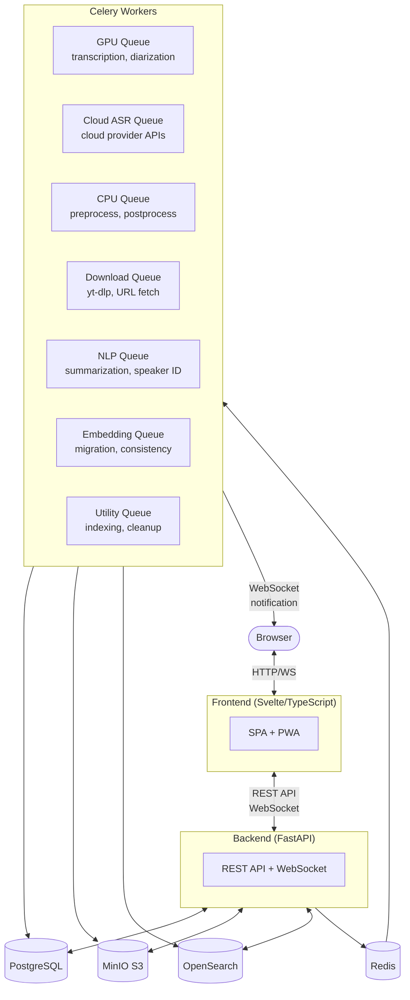
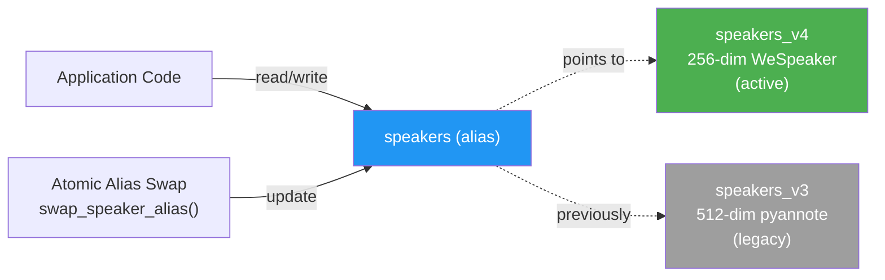
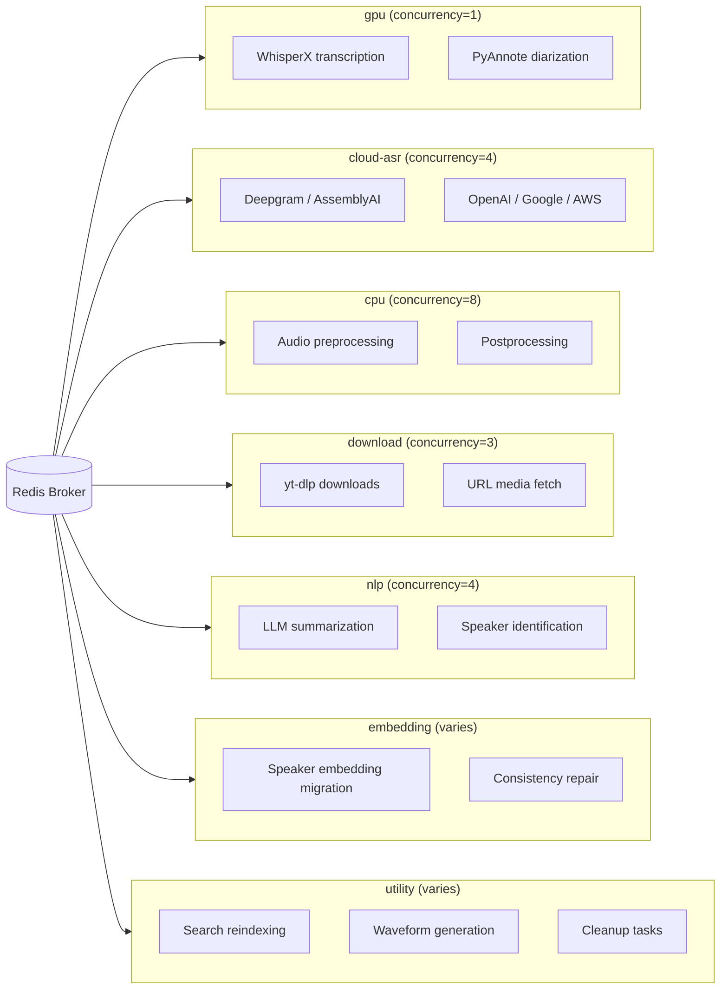

# Architecture

OpenTranscribe is built with a modern, scalable architecture designed for modularity and GPU efficiency.

## System Overview



## System Components

### Frontend (Svelte)
- Progressive Web App with TypeScript
- Responsive design with light/dark mode
- Real-time WebSocket updates
- Shared UI component library (`src/components/ui/`): BaseModal, Spinner, ProgressBar, SkeletonLoader, ActionBox

### Backend (FastAPI)
- Async Python with RESTful API
- OpenAPI documentation
- WebSocket support for real-time progress
- Modular shared modules:
  - `app/core/enums.py` — centralized FileStatus enum (single source of truth)
  - `app/core/exceptions.py` — custom exception hierarchy (`OpenTranscribeError` base)
  - `app/core/redis.py` — shared Redis singleton via `get_redis()` (process-wide, lazily created)
  - `app/services/interfaces.py` — Protocol interfaces for Storage, Search, Cache, Notification
  - `app/services/notification_service.py` — unified `send_task_notification()` wrapper
  - `app/utils/transcript_builders.py` — shared transcript formatting functions
  - `app/services/progress_tracker.py` — EWMA-based ETA for all long-running tasks

### Workers (Celery)
- **GPU Queue**: Transcription, diarization (concurrency=1)
- **Cloud ASR Queue**: Cloud speech providers (concurrency=4)
- **CPU Queue**: Audio preprocessing, postprocessing (concurrency=8)
- **Download Queue**: YouTube/URL downloads
- **NLP Queue**: LLM features (summarization, speaker ID)
- **Embedding Queue**: Speaker embedding extraction
- **Utility Queue**: Maintenance, error handlers

### Data Layer
- **PostgreSQL**: Relational data with Alembic-only migrations (no init_db.sql)
- **MinIO**: S3-compatible object storage with private buckets and optional AES-256-GCM encryption at rest
- **OpenSearch 3.4.0**: Full-text and vector search with alias-based speaker indices
- **Redis**: Task queue broker and caching singleton

## 3-Stage Transcription Pipeline

Transcription uses a Celery chain that separates CPU and GPU work for maximum GPU utilization:

```
CPU preprocess → GPU transcribe+diarize → CPU postprocess
```

### Stage 1: Preprocess (CPU Queue)
- Downloads media from MinIO
- Extracts audio via FFmpeg (presigned URL streaming or file download)
- Normalizes audio to WAV format
- Uploads preprocessed audio to MinIO temp storage
- Extracts media metadata (best-effort, non-blocking)

### Stage 2: Transcribe + Diarize (GPU Queue)
- Downloads preprocessed audio from MinIO temp
- Runs WhisperX transcription with word-level timestamps
- Runs PyAnnote speaker diarization
- Saves transcript segments to PostgreSQL
- Returns speaker mappings and native embeddings

### Stage 3: Postprocess (CPU Queue)
- Processes speaker embeddings (native PyAnnote centroids, no GPU needed)
- Indexes transcript in OpenSearch (whole-doc + chunk-level)
- Dispatches downstream tasks (summarization, speaker attributes, clustering)
- Cleans up MinIO temp audio
- Sends WebSocket completion notification

### Pipeline Benefits
- **GPU never idles**: While GPU processes file N, CPU preprocesses file N+1
- **Batch efficiency**: For 1000+ files, CPU queue (concurrency=8) prepares multiple files ahead
- **Error isolation**: Postprocess failures don't lose transcription data (segments already saved)
- **Queue routing**: Auto-resolves GPU vs cloud-asr queue based on user's ASR provider

### Error Handling
- Each stage has its own error handler for status updates
- A chain-level `link_error` callback (`on_pipeline_error`) ensures cleanup even if a task's internal handler fails
- Temp audio is always cleaned up (in `finally` block)

## Speaker Index Architecture



OpenSearch speaker indices use an alias-based architecture for zero-downtime version upgrades:

- **`speakers_v3`**: Concrete index, 192-dim embeddings (PyAnnote v3)
- **`speakers_v4`**: Concrete index, 256-dim embeddings (WeSpeaker/PyAnnote v4)
- **`speakers`**: OpenSearch alias pointing to the active versioned index

Migration between versions uses atomic alias swaps — no data copying required. The alias is created automatically on startup via `migrate_to_alias_based_indices()`.

## Embedding Consistency Self-Healing

The system includes automatic repair for speaker embedding inconsistencies:
- Detects mismatches between database speaker records and OpenSearch embeddings
- Runs periodic consistency checks with a distributed lock (2-hour TTL)
- Repairs orphaned, missing, or stale embeddings automatically
- Triggered on startup and via admin UI

## Database Management

All schema changes use **Alembic migrations** exclusively:
- No `init_db.sql` — the database is bootstrapped entirely through Alembic
- Migrations run automatically on backend startup
- Idempotent SQL (`IF NOT EXISTS`) for safety
- Migration detection logic in `app/db/migrations.py`

## Architecture Design Decisions

### Why the Modularization

The codebase underwent a major modularization refactor to address concrete maintainability issues identified during a code quality audit:

- **Duplicated UI patterns**: 13 modal components independently implemented identical backdrop, container, close button, and animation CSS (~1,500-2,000 duplicated lines). These were consolidated into `BaseModal.svelte` and the shared `src/components/ui/` library.
- **Scattered infrastructure code**: Redis connections were created ad-hoc across multiple files, risking connection leaks. The `app/core/redis.py` singleton ensures one connection per process with lazy initialization.
- **Notification fragmentation**: WebSocket notifications were sent through inconsistent patterns across tasks. The `notification_service.py` wrapper provides a single `send_task_notification()` entry point with structured payloads.
- **Circular import risk**: Enums like `FileStatus` were defined in model files and imported circularly. Centralizing in `app/core/enums.py` (re-exported from `models/media.py` for backward compatibility) eliminated this class of error.
- **Oversized files**: Several files exceeded 800-2,900 lines, making them difficult to review and test. The refactor split `speaker_tasks.py` into three focused modules (`speaker_identification_task.py`, `speaker_update_task.py`, `speaker_embedding_task.py`) with a thin re-export shim for backward compatibility.

### Protocol-Based Interfaces

The `app/services/interfaces.py` module defines Python `Protocol` classes for Storage, Search, Cache, and Notification services. This dependency inversion pattern allows tasks and services to depend on abstract interfaces rather than concrete implementations, enabling easier testing and future provider swaps (e.g., switching from MinIO to AWS S3).

### 7-Queue Celery Architecture



Tasks are separated into queues by resource type to prevent resource contention:

| Queue | Concurrency | Why Separate |
|-------|-------------|--------------|
| `gpu` | 1 | GPU memory is exclusive; concurrent GPU tasks cause OOM |
| `cloud-asr` | 4 | Network-bound cloud API calls, no GPU needed |
| `cpu` | 8 | CPU-bound preprocessing/postprocessing should not block GPU |
| `download` | 3 | Network-bound downloads with rate limiting |
| `nlp` | 4 | LLM API calls are network-bound, separate from transcription |
| `embedding` | varies | Speaker embedding extraction, can be CPU or GPU |
| `utility` | varies | Maintenance tasks, error handlers, reindexing |

This separation ensures GPU workers are never blocked waiting for a download to complete, and CPU-intensive postprocessing does not compete with GPU transcription for worker slots.

### Redis Singleton Pattern

The `get_redis()` function in `app/core/redis.py` returns a process-wide, lazily-created Redis connection. Before this consolidation, multiple modules created their own `redis.Redis()` instances, which led to connection pool exhaustion under load. The singleton pattern ensures at most one connection per process (using Redis database 0 for application data), with proper cleanup on shutdown.

## Deployment Models

- Development: docker-compose with hot reload (Vite dev server)
- Production: docker-compose with NGINX reverse proxy, CSP headers
- Offline: Airgapped deployment with pre-cached models
- Cloud: AWS/GCP/Azure with GPU instances
- Lite: Cloud-only ASR, no GPU required (~2GB image)

## Next Steps

- [Contributing](./contributing.md)
- [Docker Compose Installation](../installation/docker-compose.md)
