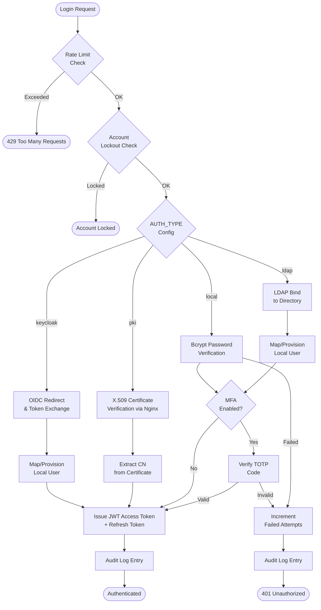

# Authentication & Security

OpenTranscribe includes enterprise-grade authentication and security features to meet organizational security requirements and compliance standards.

## Authentication Flow



## Authentication Methods

### Local Authentication
Default authentication using PostgreSQL-stored credentials:
- Username/password authentication
- Self-registration or admin-created accounts
- JWT-based session management

### LDAP/Active Directory
Integrate with existing directory services:
- Hybrid authentication (local + LDAP users)
- Auto-provisioning on first login
- Role mapping via `LDAP_ADMIN_USERS`
- Support for Active Directory and OpenLDAP

### OIDC/Keycloak
Single Sign-On via OpenID Connect:
- Integration with Keycloak identity server
- Support for identity federation
- Social login via Keycloak (Google, GitHub, etc.)
- Role synchronization
- **Federated logout** (New in v0.4.0): When a user logs out of OpenTranscribe, their Keycloak session is also terminated via the OIDC end-session endpoint, ensuring consistent session state across the identity provider

### PKI/X.509 Certificates
Certificate-based authentication:
- Mutual TLS authentication via Nginx
- CAC/PIV smart card support
- No passwords required
- Government/military environment support
- **Super admin password fallback** (New in v0.4.0): PKI-authenticated super admin accounts can optionally retain local password authentication as a fallback, ensuring administrative access even if certificate infrastructure is unavailable. Controlled via the `pki_allow_password_fallback` configuration setting

## Security Features

### Multi-Factor Authentication (MFA)
TOTP-based second factor authentication:
- Compatible with Google Authenticator, Authy, etc.
- QR code setup for easy enrollment
- One-time backup codes for recovery
- Per-user enablement

### Password Policies
FedRAMP IA-5 compliant password requirements:
- Configurable minimum length (default: 12)
- Character complexity (uppercase, lowercase, digits, special)
- Password history tracking (prevent reuse)
- Password expiration with grace period
- Common pattern detection

### Account Lockout
NIST AC-7 compliant account protection:
- Lock after configurable failed attempts
- Progressive lockout durations
- Admin unlock capability
- Automatic expiration

### Rate Limiting
Protection against brute force attacks:
- Per-IP rate limiting
- Configurable limits for auth and API endpoints
- Redis-backed for distributed deployments
- Trusted proxy support

### Audit Logging
FedRAMP AU-2/AU-3 compliant logging:
- Structured JSON or CEF format
- All authentication events captured
- Optional OpenSearch integration
- Request ID correlation

### Session Management
Secure session handling:
- JWT token-based sessions
- Refresh token rotation
- Concurrent session limits
- Session revocation

## Super Admin Configuration UI

OpenTranscribe provides an intuitive web-based interface for managing authentication methods:

**Access:** Settings → Authentication (admin-only)

**Features:**
- Enable/disable authentication methods without restart
- Configure provider-specific settings (LDAP, Keycloak, PKI)
- Store and manage API keys and credentials securely
- Support hybrid authentication (enable multiple methods simultaneously)
- Real-time configuration validation

**Storage:**
- All configuration is stored securely in the database (`auth_config` table)
- Sensitive values (API keys, passwords) encrypted with AES-256-GCM
- Configuration changes take effect immediately—no restart required
- Full audit trail of configuration changes

**Hybrid Authentication:**
You can enable multiple authentication methods at the same time. Users can log in using any enabled method:
- Local (username/password) + LDAP (directory service)
- Local + Keycloak (SSO)
- Local + PKI (certificate-based)
- Any combination of the four methods

## Configuration Storage

### Database-Driven Configuration

Authentication configuration is stored securely in the database, eliminating the need for environment variables:

**Storage Location:** `auth_config` table in PostgreSQL

**Encryption:** Sensitive values protected with AES-256-GCM cipher
- API keys and passwords encrypted at rest
- Encryption keys derived from application master secret
- Automatic encryption/decryption on read/write

**Multi-Method Support:**
Enable any combination of authentication methods:
- Enable local authentication for self-registered users
- Add LDAP to authenticate against your Active Directory
- Add Keycloak for enterprise SSO integration
- Add PKI for high-security certificate-based auth

All enabled methods work together—users can authenticate using any method you've configured.

**Admin-Only Access:**
- Configuration UI accessible only to super administrators
- Regular users cannot modify authentication settings
- All configuration changes are audit logged

**No Restart Required:**
Configuration changes take effect immediately. There is no need to restart services when modifying authentication settings through the admin UI.

## Design Rationale

### Why Hybrid Authentication?

Enterprise environments frequently require multiple authentication methods operating simultaneously. A government agency may need PKI/CAC for most users while retaining local accounts for service accounts and emergency access. An enterprise deploying Active Directory may also need Keycloak for federated partners. OpenTranscribe's hybrid model supports any combination of its four methods concurrently, so organizations do not need to choose a single provider.

### Database-Driven Configuration vs. Environment Variables

Early versions relied exclusively on `.env` variables for authentication settings. This created operational friction: changing an LDAP bind password or enabling a new auth method required restarting the backend service. The current database-driven approach (`auth_config` table) enables runtime reconfiguration through the admin UI with zero downtime. Environment variables are retained as a secondary override for backward compatibility and initial bootstrapping of new deployments.

### Credential Encryption

All sensitive values stored in the `auth_config` table (LDAP bind passwords, Keycloak client secrets, API keys) are encrypted at rest using **AES-256-GCM** with 96-bit random nonces and 128-bit authentication tags. Encryption keys are derived from the application master secret via PBKDF2-SHA256 with 600,000 iterations. The encrypted format uses a versioned prefix (`v3:salt:nonce:ciphertext+tag`) to support transparent algorithm upgrades. This approach satisfies NIST SP 800-132 key derivation requirements and FedRAMP SC-28 (Protection of Information at Rest).

### Security Audit Findings

A comprehensive security audit identified several authentication-related improvements that have been incorporated:

- **PKI trusted proxy enforcement**: When PKI is enabled in production, `PKI_TRUSTED_PROXIES` must be configured or the backend refuses to start, preventing certificate header injection attacks (CWE-287)
- **Keycloak audience validation**: Audience verification is enabled by default to prevent token confusion attacks when multiple Keycloak clients share a realm
- **PKI revocation checking**: Revocation soft-fail defaults to `false` in production, ensuring revoked certificates are properly rejected when OCSP/CRL services are available
- **Default secret detection**: The backend validates that critical secrets (`JWT_SECRET_KEY`, `ENCRYPTION_KEY`) are not using insecure defaults before starting in production mode

## Compliance

OpenTranscribe's security features support compliance with:

| Standard | Controls | Features |
|----------|----------|----------|
| FedRAMP | IA-2 | MFA, PKI authentication |
| FedRAMP | IA-5 | Password policies, PBKDF2-SHA256 (600k iterations) |
| FedRAMP | AU-2/AU-3 | Audit logging |
| FedRAMP | SC-12 | PBKDF2 cryptographic key derivation |
| FedRAMP | SC-13 | AES-256-GCM encryption, HS512 JWT signing |
| FedRAMP | SC-28 | Encrypted credentials at rest |
| FedRAMP | AC-8 | Classification banners, system use notification |
| NIST 800-53 | AC-7 | Account lockout |

### FIPS 140-3 Support

For federal and high-security deployments, OpenTranscribe supports FIPS 140-3 compliant cryptographic operations:

- **Password hashing**: PBKDF2-SHA256 with 600,000 iterations (NIST SP 800-132 / OWASP 2023)
- **Data encryption**: AES-256-GCM (replacing legacy Fernet/AES-128-CBC)
- **JWT signing**: HMAC-SHA512 (replacing legacy HS256)
- **Token hashing**: SHA-512
- **Migration**: Transparent auto-upgrade of legacy hashes on user login with dual-verification during transition

Enable via `FIPS_VERSION=140-3` in `.env`. See the FIPS 140-3 Compliance Guide for detailed configuration.

## Quick Start

### Configure via Super Admin UI (Recommended)

1. **Access the Admin Panel:**
   - Log in as a super administrator
   - Navigate to Settings → Authentication

2. **Enable Authentication Methods:**
   - Toggle authentication methods on/off as needed
   - Enter provider-specific configuration:
     - **Local Auth:** No configuration needed (always available)
     - **LDAP/Active Directory:** Server URL, bind DN, user search base
     - **Keycloak:** Realm URL, client ID, client secret
     - **PKI:** Certificate validation settings

3. **Enable Security Features:**
   - Multi-Factor Authentication (MFA)
   - Password Policies
   - Account Lockout Protection
   - Audit Logging

4. **Save and Test:**
   - Configuration takes effect immediately
   - Test login with each enabled method

### Configuration Scenarios

**Small Team (Local Only):**
- Local authentication sufficient for teams < 50 people
- Admin creates accounts or enable self-registration
- Optional MFA for additional security

**Enterprise Directory (LDAP):**
- Enable Local + LDAP for hybrid authentication
- Users log in with Active Directory credentials
- Local accounts available for service accounts/admins

**Enterprise SSO (Keycloak):**
- Enable Local + Keycloak for federated identity
- Users single sign-on via corporate identity provider
- Supports social login and multi-factor authentication

**High Security (PKI Certificates):**
- Enable Local + PKI for certificate-based authentication
- CAC/PIV smart card support for government/military
- No passwords required, client certificate verified by nginx

### Environment Variables (Optional)

Most configuration is managed through the admin UI. Optional environment variables for advanced deployment scenarios:

```bash
# Default authentication method (if not configured via UI)
AUTH_TYPE=local

# Optional: Pre-seed initial configuration
# These are only used if auth_config table is empty
LDAP_SERVER_URL=ldap://ldap.example.com:389
LDAP_SEARCH_BASE=ou=users,dc=example,dc=com
```

## Next Steps

- [Authentication Overview](../authentication/overview.md) - Detailed configuration
- [Environment Variables](../configuration/environment-variables.md) - Full configuration reference
- [FAQ](../faq.md) - Common questions
