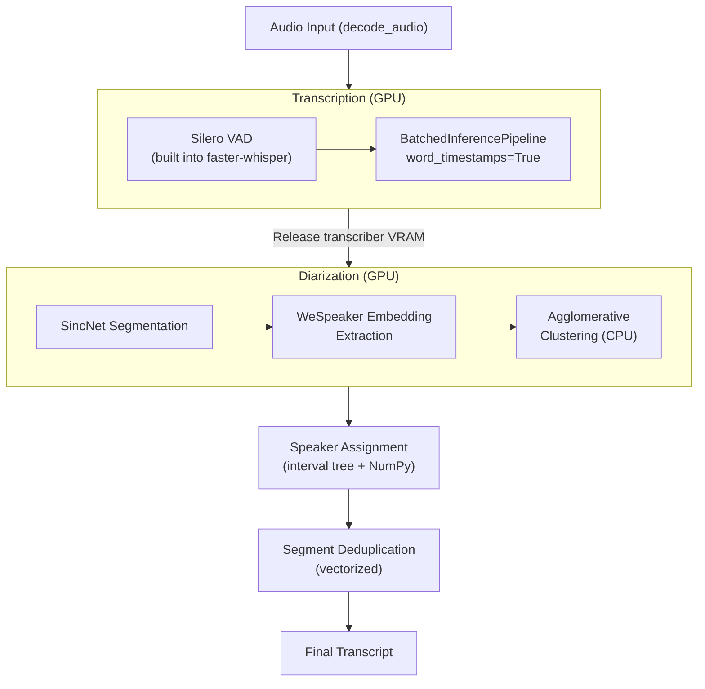
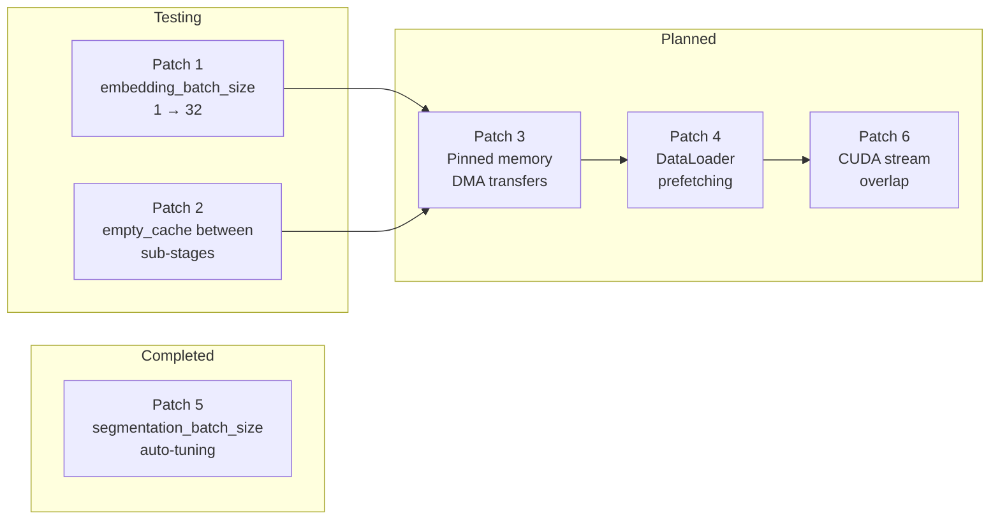

# Pipeline Optimization

OpenTranscribe invests heavily in pipeline performance engineering. This page documents the optimizations that make the transcription pipeline fast and memory-efficient, including upstream contributions to WhisperX and ongoing work on PyAnnote diarization speed.

## Native Pipeline Architecture

OpenTranscribe v0.4.0 replaced the legacy WhisperX pipeline with a **native pipeline** built directly on faster-whisper's `BatchedInferencePipeline` and PyAnnote v4's speaker diarization API. This eliminates several architectural bottlenecks:



### Why We Replaced WhisperX

WhisperX was the original transcription backend but had three constraints that limited performance:

1. **WAV2VEC2 alignment bottleneck**: The forced alignment step took 389 seconds (55% of total processing time) for a 3-hour file, processing segments sequentially with 300+ separate CUDA kernel launches. Native word timestamps via cross-attention DTW eliminate this step entirely.

2. **No batched word timestamps**: WhisperX hardcodes `word_timestamps=False` in its batched pipeline (`asr.py` lines 370-372). You had to choose batched speed OR word timestamps -- not both.

3. **Monkey-patching for PyAnnote v4**: PyAnnote v4 API changes required a 465-line compatibility layer (`pyannote_compat.py`) that monkey-patched WhisperX's diarization internals. The native pipeline calls PyAnnote v4 directly.

### Benchmark Results

All benchmarks use a 3.3-hour podcast (11,893 seconds) on an NVIDIA RTX A6000 (49GB VRAM):

| Configuration | Total Time | Transcription | Alignment | Diarization | Speaker Assign |
|---------------|-----------|---------------|-----------|-------------|----------------|
| Old baseline (WhisperX + WAV2VEC2) | **706s** | 75s | 389s | 194s | 10.2s |
| WhisperX batched, alignment OFF | **304s** | 76s | skipped | 198s | 0.04s |
| **Native pipeline (production)** | **332s** | 105s | N/A | 192s | 0.5s |

The native pipeline is **2.1x faster** than the old baseline while maintaining 95.2% speaker assignment accuracy (vs ~96% with WAV2VEC2 alignment -- a negligible difference for multi-second diarization segments).

### Sequential VRAM Management

The pipeline loads models sequentially to minimize peak VRAM:

1. Load transcription model (~3-4 GB)
2. Run transcription
3. **Release transcription model VRAM**
4. Load diarization model (~5-9 GB depending on audio length)
5. Run diarization
6. Release diarization model

This keeps peak VRAM under ~9 GB, enabling the pipeline to run on 8-12 GB GPUs. The `ModelManager` singleton caches loaded models between Celery tasks (since the GPU worker has `concurrency=1`), saving ~15 seconds of model loading overhead per file.

### Scaling Projections

| Configuration | Per File (3.3h) | 2,500 Files | With 4x GPU Workers |
|---------------|----------------|-------------|---------------------|
| Old baseline (WhisperX + alignment) | 706s | 490 hours | 123 hours |
| **Native pipeline** | **332s** | **231 hours** | **58 hours** |
| + warm model caching | ~320s | 222 hours | 56 hours |

## 273x Faster Speaker Assignment (Upstream WhisperX PR)

The most dramatic single optimization was replacing WhisperX's `assign_word_speakers()` function. The original implementation used an **O(n) linear scan** per word to find the matching diarization segment:

```python
# WhisperX original: O(n*m) where n=words, m=diarization segments
for word in words:
    for segment in diarization_segments:
        if segment.start <= word.start <= segment.end:
            word.speaker = segment.speaker
            break
```

Our replacement uses an **interval tree** for O(log n) lookups combined with **NumPy vectorized operations** for batch processing:

```python
# OpenTranscribe: O(n log m) via interval tree + vectorized NumPy
from intervaltree import IntervalTree
tree = IntervalTree.from_tuples(diarization_segments)
# Vectorized lookup for all words simultaneously
speakers = np.array([tree[w.start] for w in words])
```

### Results

| Metric | WhisperX Original | OpenTranscribe | Speedup |
|--------|------------------|----------------|---------|
| 150 segments, 1,349 words | 10.2 seconds | 0.037 seconds | **273x** |
| Algorithm complexity | O(n * m) per word | O(n log m) total | -- |

This optimization was contributed upstream as a pull request to the WhisperX repository. The implementation is in `backend/app/transcription/speaker_assigner.py`.

### Vectorized Segment Deduplication

The transcription pipeline produces both coarse VAD-chunked segments and fine-grained subsegments for the same time ranges. The deduplication module (`backend/app/utils/segment_dedup.py`) handles this using vectorized NumPy operations:

1. NLTK punkt sentence splitting (replicates what WAV2VEC2 alignment implicitly provided)
2. Containment detection -- removes coarse "parent" segments covered by finer children
3. Exact text duplicate removal
4. Time+text overlap merging

**Performance**: Under 0.2 seconds for 3,000+ segments. Quality: 99.5% match to the WAV2VEC2-aligned baseline.

## GPU Optimization Patches for PyAnnote

OpenTranscribe is actively contributing performance patches upstream to PyAnnote. These patches target the diarization pipeline's GPU utilization, which accounts for 50-60% of total processing time.

### The Problem

PyAnnote's speaker diarization has three GPU-intensive sub-stages:

1. **Segmentation** -- SincNet + LSTM sliding window over audio (~10-15s for 1 hour)
2. **Embedding extraction** -- WeSpeaker ResNet34 forward pass per chunk-speaker pair (~40-50s for 1 hour)
3. **Clustering** -- Agglomerative clustering on CPU (~5-10s)

The embedding extraction stage dominates because it runs one GPU forward pass per chunk-speaker pair. For a 4.7-hour file with 8 speakers, that means approximately **850,000 individual CUDA kernel launches** with the default `embedding_batch_size=1`.

### Patch 1: Increase `embedding_batch_size` (Testing)

PyAnnote defaults `embedding_batch_size=1`, meaning each chunk-speaker pair gets its own GPU forward pass. Batching reduces per-call overhead by 32x:

| `embedding_batch_size` | Kernel Launches (4.7h/8 speakers) | Reduction |
|------------------------|-----------------------------------|-----------|
| 1 (default) | ~850,000 | Baseline |
| 32 (proposed) | ~26,500 | 32x fewer |

**Impact**: Processing speed is unchanged (within run-to-run variation), but VRAM behavior becomes **predictable and consistent** -- critical for concurrent task scheduling.

### Patch 2: `torch.cuda.empty_cache()` Between Sub-stages (Testing)

Between segmentation and embedding extraction, PyTorch's caching allocator holds freed GPU memory. Inserting `torch.cuda.empty_cache()` calls between sub-stages releases this memory back to CUDA:

```python
segmentations = self.get_segmentations(file, hook=hook)  # GPU stage 1
torch.cuda.empty_cache()  # Release cached memory
embeddings = self.get_embeddings(file, ...)               # GPU stage 2
torch.cuda.empty_cache()  # Release cached memory
hard_clusters, _, centroids = self.clustering(...)        # CPU stage 3
```

**Impact**: Negligible speed overhead (~1-5ms per call). Reduces peak VRAM for long multi-speaker files.

### Patch Results: VRAM Predictability

Combined testing of Patches 1 and 2 on an RTX A6000 across 5 test files (0.5h to 4.7h):

**VRAM (Device Peak)**:

| Duration | Speakers | Stock Peak | Patched Peak | Change |
|----------|----------|------------|--------------|--------|
| 0.5h | 5 | 2,991 MB | 14,634 MB | * |
| 1.0h | 5 | 19,517 MB | 14,634 MB | **-25%** |
| 2.2h | 3 | 11,309 MB | 14,634 MB | * |
| 3.2h | 3 | 2,993 MB | 2,993 MB | 0% |
| 4.7h | 8 | 25,770 MB | 14,634 MB | **-43%** |

*Stock VRAM readings vary wildly (2,991-25,770 MB) due to PyTorch caching allocator timing. The patched version shows **consistent ~14,634 MB** regardless of duration -- the key improvement for concurrent scheduling.*

**Processing Speed**: Unchanged (within +/-5% run-to-run variation).

**Result Accuracy**: Speaker counts identical in all cases. Small segment count differences (2 of 5 files) are due to PyAnnote's inherent non-determinism in VBx clustering, not the patches.

### Patch 3: Pinned Memory for CPU-to-GPU Transfers (Documented)

PyAnnote sends data to GPU via pageable memory (`chunks.to(self.device)`). Using `pin_memory()` enables DMA (Direct Memory Access) for 2-3x faster CPU-to-GPU transfer per batch. This follows the same pattern used by CTranslate2 (faster-whisper's backend).

### Patch 4: DataLoader-Based Prefetching (Documented)

Replace the serial embedding extraction loop with `torch.utils.data.DataLoader` using `num_workers=2`, `pin_memory=True`, and `prefetch_factor=2`. This overlaps CPU data preparation with GPU inference -- estimated 10-30% faster embedding extraction.

### Upstream PR Strategy

All patches target `pyannote/pyannote-audio` (MIT license). Each PR includes:
- Benchmark data (before/after timing and VRAM on reference files)
- Result equivalence proof (segment counts and speaker assignments unchanged)
- Hardware tested (GPU model, VRAM, driver version)
- Minimal diff with clear documentation



## Warm Model Caching

The `ModelManager` singleton (`backend/app/transcription/model_manager.py`) keeps AI models loaded in GPU memory between Celery tasks. Since the GPU worker runs with `concurrency=1`, only one task uses the GPU at a time -- safe for singleton model state.

| Scenario | Model Loading Overhead (2,500 files) |
|----------|--------------------------------------|
| Without cache (load/unload per file) | 2,500 x 15s = **10.4 hours** |
| With warm cache (first file only) | 15s + 2,500 x ~0s = **15 seconds** |

For batch imports, this saves approximately 10 hours of idle GPU time spent loading and unloading models.

## Hardware Auto-Detection

OpenTranscribe automatically detects GPU capabilities and configures optimal settings via `backend/app/utils/hardware_detection.py`:

| Parameter | How It Is Set |
|-----------|---------------|
| `batch_size` | Based on GPU VRAM (8-32 range) |
| `compute_type` | Based on CUDA compute capability |
| `beam_size` | Default 5 (configurable) |
| `segmentation_batch_size` | Based on VRAM (8-32 range) |

No manual tuning required for most deployments. See the [Performance Tuning](../operations/performance-tuning.md) guide for manual overrides.

## Related Documentation

- [Transcription Engine](./transcription.md) -- Pipeline architecture and model selection
- [Speaker Diarization](./speaker-diarization.md) -- Diarization algorithms and speaker matching
- [Performance Tuning](../operations/performance-tuning.md) -- Operational tuning for all subsystems
- [Multi-GPU Scaling](../configuration/multi-gpu-scaling.md) -- Parallel GPU worker configuration
