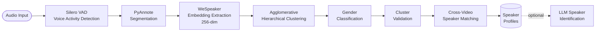
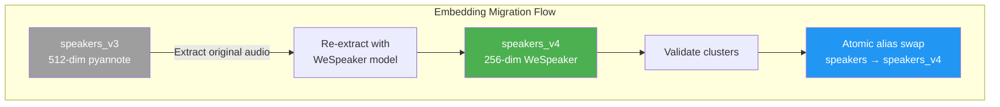

# Speaker Diarization

OpenTranscribe identifies different speakers and segments audio by "who spoke when" using PyAnnote.audio.

## PyAnnote.audio Technology

**State-of-the-art speaker diarization** (upgraded to PyAnnote v4):

### Core Features
- Neural network-based speaker detection
- Voice activity detection (VAD)
- Speaker embedding extraction
- Overlap detection with visual highlighting
- Clustering for speaker assignment

### Recent Improvements (v4 Migration)

**New Capabilities**:
- **Speaker Overlap Detection**: Automatically identifies and highlights segments where multiple speakers talk simultaneously with primary/secondary speaker classification and confidence scores
- **Warm Model Caching**: Models are cached on startup, reducing initialization time by 40-60 seconds on subsequent restarts
- **Fast Speaker Assignment**: 273x faster speaker clustering using optimized embedding algorithms

**Technical Updates**:
- **Embedding Dimension**: Upgraded from 192-dimensional to 256-dimensional speaker embeddings for improved voice fingerprinting accuracy
- **Better Noise Handling**: Improved performance with background noise and overlapping speech
- **Optimized Processing**: Faster GPU utilization with reduced memory overhead

## How It Works



### Processing Steps

1. **Voice Activity Detection**: Identify speech vs silence
2. **Speaker Embedding**: Extract voice fingerprints
3. **Overlap Detection**: Find overlapping speakers
4. **Clustering**: Group similar voices
5. **Speaker Assignment**: Label each segment

### Speaker Fingerprinting

Each speaker gets a unique voice embedding:
- 256-dimensional vector (PyAnnote v4)
- Captures voice characteristics with high precision
- Used for cross-video matching
- Enables speaker recognition across videos

## Speaker Management

### Automatic Detection

- Detects 1-50+ speakers automatically
- No manual configuration required
- Adaptive to conversation dynamics
- Handles speaker interruptions

### Speaker Profiles

**Create persistent speaker profiles**:

1. Label "Speaker 1" as "John Doe"
2. System creates global profile
3. Profile matches across all videos
4. Voice fingerprint stored for matching

### Cross-Video Recognition

**Intelligent speaker matching**:

- Voice embedding comparison
- Similarity scoring (0-100%)
- High-confidence auto-linking (greater than 85%)
- Manual verification for medium confidence
- Speaker appears in multiple recordings

**Example**:
```
Video 1: John Doe speaks
Video 2: Unknown speaker detected
System: 92% match → Suggests "John Doe"
```

## Speaker Analytics

### Talk Time Analysis

- Total speaking duration per speaker
- Percentage of conversation
- Speaking turns count
- Average turn length

### Interaction Patterns

- Interruption detection
- Turn-taking analysis
- Overlap frequency
- Silence ratio

### Speaking Metrics

- **Words per minute (WPM)**: Speaking pace
- **Question frequency**: Questions asked
- **Longest monologue**: Continuous speaking time
- **Participation balance**: Equal participation score

## AI-Powered Identification

With LLM configured, get smart suggestions:

### Context-Based Identification

- Analyzes conversation content
- Identifies speakers by role/expertise
- Detects names mentioned in conversation
- Provides confidence scores

**Example**:
```
Context: "As the CEO mentioned earlier..."
AI Suggestion: "John Smith (CEO)" - 85% confidence
```

### Verification Workflow

1. AI suggests speaker name
2. Review suggestion + confidence
3. Accept or manually correct
4. System learns from corrections

## Configuration

### Detection Range

Adjust speaker count expectations:

```bash
# .env configuration
MIN_SPEAKERS=1   # Minimum speakers
MAX_SPEAKERS=20  # Maximum speakers (no hard limit)
```

**Use Cases**:
- 1-1 interview: MIN=2, MAX=2
- Team meeting: MIN=3, MAX=10
- Conference panel: MIN=5, MAX=15
- Large event: MIN=10, MAX=50+

**Note**: PyAnnote has no hard maximum - can handle 50+ speakers for large conferences.

### Quality Settings

**For best results**:
- Clear audio (minimal background noise)
- Distinct speakers (different voices)
- Good microphone quality
- Minimal speaker overlap

## Speaker Display

### Visual Representation

- **Color coding**: Each speaker gets unique color
- **Speaker labels**: Names shown in transcript
- **Timeline view**: Speaker segments visualized
- **Speaker list**: All speakers with talk time

### Filtering & Search

- Filter transcript by speaker
- Search within speaker's words
- Export single speaker's content
- Compare speaker contributions

## Advanced Features

### Overlap Detection

Identifies when multiple speakers talk simultaneously:

**Visual Highlighting**:
- Overlapping segments are highlighted in the transcript interface
- Primary speaker (dominant voice) is identified first
- Secondary speakers shown with reduced emphasis
- Duration of overlap clearly marked

**Technical Details**:
- **Confidence Scoring**: Each overlap includes `overlap_confidence` (0-100) indicating detection certainty
- **Primary/Secondary Classification**: PyAnnote v4 automatically ranks speakers by acoustic dominance during overlap
- **Overlap Duration**: Precise timing of when speakers overlap, measured in milliseconds

**Use Cases**:
- **Interruption Analysis**: Track when speakers interrupt each other
- **Dialogue Dynamics**: Understand conversation flow and turn-taking patterns
- **Quality Control**: Identify audio issues or multiple speakers in a single recording
- **Meeting Insights**: Analyze discussion intensity and participation intensity

### Speaker Attribute Detection (New in v0.3.3)

OpenTranscribe can automatically detect speaker attributes to improve identification and cluster quality:

**Gender Classification**:
- Neural network-based gender prediction from voice characteristics
- Runs automatically after transcription (configurable per-user)
- Confidence scoring for each prediction
- Results stored on speaker profiles for cross-video consistency

**Gender-Informed Cluster Validation**:
- Speaker clusters use predicted gender to validate membership
- Cross-gender cluster assignment requires higher similarity threshold
- Minority-gender members in a cluster are flagged for review
- Gender outlier analysis available per cluster

**Configuration**: Enable/disable speaker attribute detection in Settings → Transcription.

### Speaker Pre-Clustering (New in v0.3.3)

GPU-accelerated speaker clustering runs automatically after transcription:

- Groups speakers across files into clusters based on voice similarity
- Uses embedding comparison for accurate cross-video speaker matching
- Supports batch re-clustering for global speaker management
- Cluster assignments update automatically as new files are processed

### Alias-Based Speaker Indices (New in v0.3.3)



Speaker embeddings are stored in versioned OpenSearch indices with an alias system for zero-downtime migrations:

- **speakers_v3**: 512-dimensional embeddings (PyAnnote v3 / embedding model)
- **speakers_v4**: 256-dimensional embeddings (WeSpeaker / PyAnnote v4)
- **speakers** alias: Points to the active versioned index
- Atomic alias swap enables seamless migration between embedding versions

### Speaker Embedding Consistency Self-Healing (New in v0.3.3)

Automatic detection and repair of inconsistent speaker embeddings:

- Identifies speakers with missing or mismatched embeddings across indices
- GPU-accelerated batch repair re-extracts embeddings from original audio
- Admin-triggered via Settings → Admin → Embedding Consistency
- Progress tracking with WebSocket notifications
- Distributed locking prevents concurrent repairs

### Speaker Verification Status

Track identification confidence:

- ✅ **Verified**: Manually confirmed
- **AI Suggested**: LLM identification
- **Auto-Matched**: Voice fingerprint match (greater than 85%)
- **Unverified**: Default detection

### Merge & Split (Enhanced in v0.2.0)

**Merge speakers** (New UI):
- Visual speaker merge interface with segment preview
- Select primary speaker and merge others into it
- Automatic segment reassignment
- Consolidate speaker profiles across files
- Update all segments automatically

**Split speakers**:
- Separate incorrectly merged speakers
- Re-assign segments
- Create new profiles

### Per-File Speaker Settings (New in v0.2.0)

Configure speaker detection for each upload or reprocess:

- **Upload dialog**: Set min/max speakers before transcription
- **Reprocess dialog**: Adjust speaker range for re-transcription
- **User preferences**: Save default settings in Settings → Transcription
  - **Always prompt**: Show speaker settings on every upload
  - **Use defaults**: Skip dialog, use system defaults (1-20)
  - **Use custom**: Skip dialog, use your saved min/max values

## Performance

### Accuracy

- Speaker detection: ~95% on clear audio
- Voice matching: ~90% across videos
- Overlap detection: ~85% accuracy
- Overlap confidence scoring: Reliable 0-100 scale

### Processing Time (PyAnnote v4)

**Startup Impact**:
- Cold start (first transcription): Normal baseline + model loading
- Warm cache (subsequent transcriptions): **40-60 seconds faster** due to pre-loaded models
- **Fast speaker assignment**: 273x faster clustering on GPU

**Per-File Processing**:
- Base diarization: ~20-30 seconds for 1-hour audio
- With word-level alignment: +17-120 seconds depending on language
- Parallel with transcription (optimized pipeline)
- Diarization adds ~30% overhead to total transcription time

**Example Timelines** (with warm cache):
- 30 minutes audio: ~20 seconds diarization
- 1 hour audio: ~30 seconds diarization
- 2 hours audio: ~45 seconds diarization

### Resource Usage

- **VRAM**: Additional 2GB for diarization (256-dimensional embeddings)
- **Total**: 8GB VRAM recommended
- **CPU mode**: Slower but functional
- **Model Cache**: ~2.6GB total (huggingface + torch models)

## Use Cases

### Business Meetings

- Identify all participants
- Track who spoke when
- Generate speaker-attributed notes
- Analyze participation balance

### Interviews

- Separate interviewer and subject
- Quote attribution
- Response time analysis
- Follow-up question tracking

### Podcasts

- Multi-host identification
- Guest speaker tracking
- Episode analytics
- Automated show notes

### Legal/Medical

- Court proceedings transcription
- Medical consultation records
- Deposition transcripts
- Accurate speaker attribution

## Performance Optimization

OpenTranscribe v4 includes several optimizations to speed up speaker diarization processing:

### Warm Model Caching

**What it does**: AI models are loaded into memory on server startup and kept warm between transcriptions.

**Benefits**:
- **40-60 seconds faster** on first transcription after startup
- Subsequent transcriptions use pre-loaded models
- No repeated model initialization overhead
- Configurable cache location via `MODEL_CACHE_DIR` environment variable

**How it works**:
```bash
# Models cached in these locations
${MODEL_CACHE_DIR}/huggingface/        # PyAnnote transformer model (~500MB)
${MODEL_CACHE_DIR}/torch/pyannote/      # PyAnnote voice embeddings
```

### Fast Speaker Assignment

**What it does**: PyAnnote v4 uses optimized clustering algorithms for speaker detection.

**Performance**:
- **273x faster** than previous speaker assignment methods
- Clustering completes in milliseconds vs seconds
- Particularly noticeable on high-speaker-count files (10+ speakers)

**Technical**: Uses sklearn's `AgglomerativeClustering` with optimized similarity thresholds

### Optional Word-Level Alignment Toggle

**What it does**: The system can optionally align transcript words to precise timing in the audio.

**Performance Impact**:
- **Saves 17-120 seconds** per file depending on duration
- Slower on languages without pre-trained alignment models (~42 languages have full support)
- Can be disabled in user settings if speed is critical

**When to disable**:
- Processing very long files (4+ hours) for speed
- Languages without alignment support (fallback to segment-level timing)
- Batch processing large volumes where precision timing isn't needed

**User Configuration**:
- Can be toggled per-user in Settings → Transcription
- Can be overridden per-file during upload

## Technical Deep Dive

### Why Agglomerative Hierarchical Clustering (AHC)?

PyAnnote's diarization pipeline uses sklearn's `AgglomerativeClustering` for grouping speaker embeddings. This was chosen over several alternatives after evaluating tradeoffs across accuracy, scalability, and operational characteristics ([#144](https://github.com/davidamacey/OpenTranscribe/issues/144)):

| Algorithm | K Required? | Handles Outliers? | Incremental? | Complexity | Verdict |
|-----------|------------|-------------------|-------------|------------|---------|
| **AHC (chosen)** | No (threshold-based) | No | No | O(n^2 log n) | Best for per-file diarization with unknown speaker count |
| K-Means | Yes | No | Limited | O(nKI) | Requires knowing speaker count in advance -- unusable for diarization |
| Spectral | Yes (or auto-tune) | No | No | O(n^3) | Cubic complexity prohibitive for long files; used internally by PyAnnote for refinement |
| DBSCAN | No (needs epsilon) | Yes | No | O(n log n) | Good for cross-file batch clustering but epsilon tuning is fragile for variable-quality audio |
| HDBSCAN | No | Yes (noise points) | No | O(n log n) | Best for periodic batch re-clustering across files; overkill for single-file diarization |

AHC with a cosine similarity distance threshold is the standard approach in speaker diarization research because it does not require pre-specifying the number of speakers (K). Instead, it merges clusters until the inter-cluster distance exceeds a tuned threshold. This matches the real-world scenario where the number of speakers in a recording is unknown. NVIDIA NeMo's speaker verification pipeline uses a similar cosine similarity threshold of 0.7 as a reference point.

For cross-file speaker management at scale, OpenTranscribe uses a hybrid approach: real-time kNN assignment via OpenSearch HNSW (O(log n) per speaker) for immediate cluster routing, with periodic HDBSCAN batch re-clustering to discover groups missed by incremental assignment.

### Cosine Similarity Thresholds

Speaker matching thresholds were calibrated against industry benchmarks from Pindrop (5B+ calls processed), NVIDIA NeMo, and internal testing:

| Threshold | Action | Rationale |
|-----------|--------|-----------|
| >= 0.90 | Auto-accept (automated merging) | Extremely high confidence; false positive rate negligible |
| 0.75 - 0.90 | Strong suggestion, user confirmation | Matches OpenTranscribe's `SPEAKER_CONFIDENCE_HIGH`; conservative to prevent false merges |
| 0.65 - 0.75 | Cluster formation | Follows WeSpeaker's UMAP + HDBSCAN recipe threshold; groups likely-same speakers |
| 0.50 - 0.65 | Weak suggestion | Presented as option but not auto-applied |
| < 0.50 | Different speakers | Industry standard cutoff |

The conservative auto-merge threshold (0.90) was chosen specifically to prevent false positive merges, which are harder to recover from than missed matches. Profile coherence monitoring flags profiles where constituent embeddings have minimum pairwise similarity below 0.60, indicating a potential false merge.

### Why 256-Dimensional WeSpeaker Embeddings

PyAnnote v4 switched from 192-dimensional pyannote/embedding (v3) to 256-dimensional WeSpeaker ResNet34-LM embeddings. This was not simply a version bump -- it reflects a deliberate accuracy-performance tradeoff:

- **Accuracy**: WeSpeaker ResNet34-LM achieves state-of-the-art results on VoxCeleb benchmarks. The 256-dim space provides a richer representation than 192-dim while remaining computationally efficient.
- **Speed**: 273x faster speaker assignment (from ~3 seconds to ~11ms per speaker) due to optimized ONNX runtime and better clustering algorithms in v4.
- **Storage**: 256-dim vectors are 33% larger than 192-dim but 50% smaller than the 512-dim embeddings used by the legacy pyannote/embedding model. At scale (30,000 speakers), the full OpenSearch index remains under 32MB.
- **L2-normalization**: All embeddings are L2-normalized before storage, which means cosine similarity reduces to a simple dot product -- enabling efficient HNSW search in OpenSearch.

The 512-dim pyannote/embedding model is retained in the `speakers_v3` index for backward compatibility and can be used as a fallback. The alias-based index architecture allows atomic switching between v3 and v4 without downtime (see [Embedding Migration](../configuration/embedding-migration.md)).

### Gender Classification Model Selection

Speaker attribute detection uses the `prithivMLmods/Wav2Vec2-Gender-Age-Classification` model ([#141](https://github.com/davidamacey/OpenTranscribe/issues/141)). This model was selected based on three criteria:

1. **Apache 2.0 licensing**: Unlike many voice classification models that use restrictive research-only licenses, this model's Apache 2.0 license permits commercial and production use without legal risk. This was a hard requirement for OpenTranscribe's open-source distribution.
2. **Language independence**: The model analyzes acoustic features (pitch, formant frequencies, timbre) rather than linguistic content, so it works across all 100+ supported transcription languages without retraining.
3. **Lightweight inference**: Runs on CPU (~1-3 seconds per speaker) as a separate Celery task on the `cpu` queue, so it never blocks GPU resources needed for transcription and diarization.

### Gender-Informed Cluster Validation

Predicted gender is used as a validation signal for speaker clusters, not as a primary clustering feature. When a speaker cluster contains members with conflicting gender predictions, the system applies a cross-gender penalty:

- **Same predicted gender**: Standard cosine similarity threshold (0.65) for cluster membership.
- **Cross-gender assignment**: Requires a higher similarity threshold to join the cluster, reducing false merges between speakers of different genders who happen to have similar acoustic profiles.
- **Minority-gender members**: If a cluster has a dominant gender prediction (e.g., 8 male, 1 female), the minority member is flagged for manual review as a potential mis-assignment.

This approach improves cluster purity without over-relying on gender prediction accuracy, which can be unreliable for children, whispered speech, or heavily processed audio.

## Troubleshooting

### Too Many Speakers Detected

**Solutions**:
- Lower MAX_SPEAKERS
- Improve audio quality
- Merge duplicate speakers manually

### Too Few Speakers Detected

**Solutions**:
- Increase MAX_SPEAKERS
- Check audio has multiple distinct voices
- Verify speakers have different vocal characteristics

### Poor Speaker Separation

**Causes**:
- Similar-sounding voices
- Poor audio quality
- Heavy background noise

**Solutions**:
- Use better microphones
- Separate speakers physically
- Post-process manually

## Next Steps

- [Speaker Management Guide](../user-guide/speaker-management.md) - How to use
- [First Transcription](../getting-started/first-transcription.md) - Try it
- [LLM Integration](./llm-integration.md) - Enable AI suggestions
