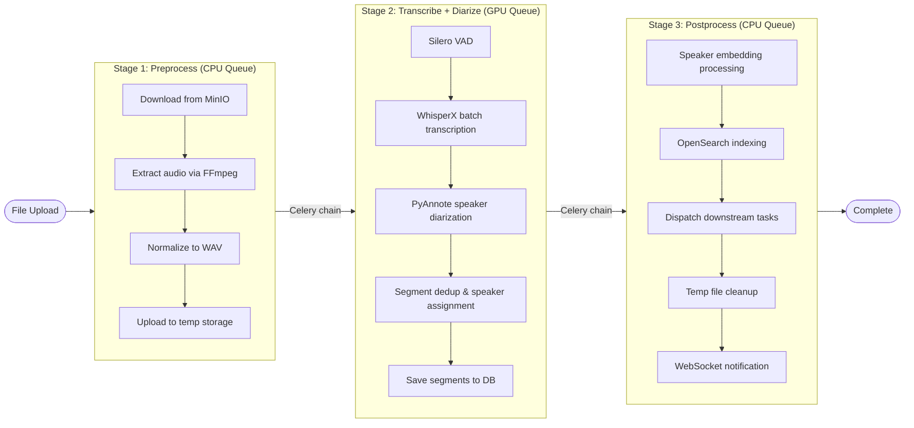
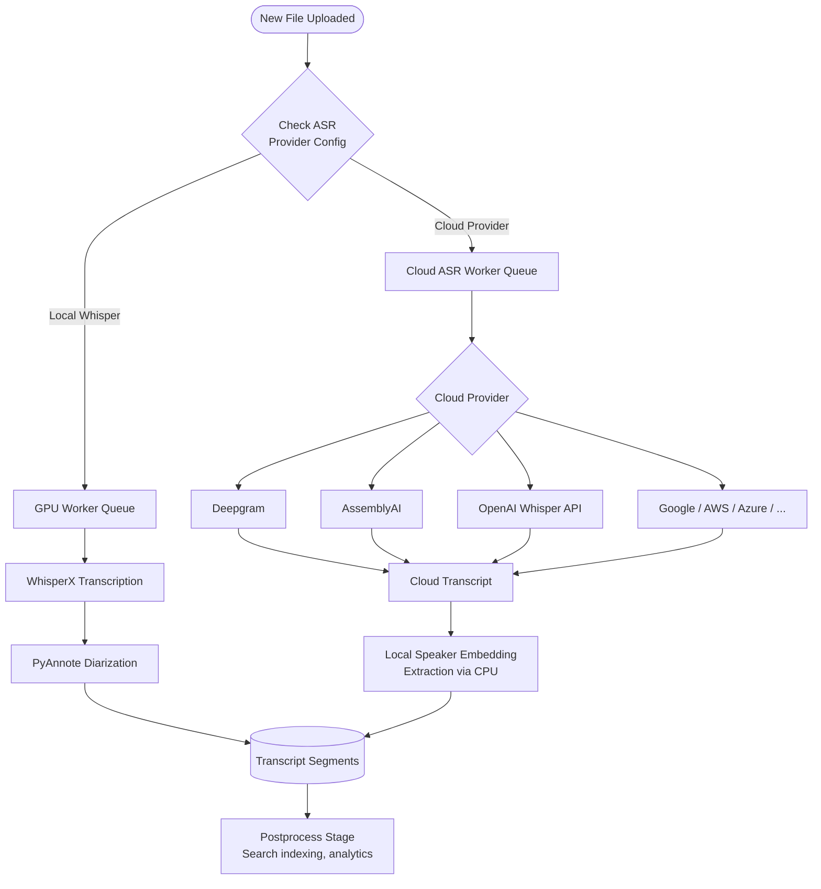

# Transcription Engine

OpenTranscribe uses WhisperX 3.8.1 with the faster-whisper backend for state-of-the-art speech recognition. The transcription pipeline uses a 3-stage architecture that separates CPU and GPU work for maximum throughput, and supports both local Whisper models and cloud ASR providers.

## WhisperX Technology

**WhisperX** combines multiple AI models for superior transcription:

- **Whisper**: OpenAI's robust speech recognition model
- **Faster-Whisper**: Optimized inference engine (4-8x faster) with BatchedInferencePipeline
- **Native Word Timestamps**: Cross-attention DTW for word-level timing (no separate alignment model needed)
- **Voice Activity Detection**: Silero VAD for precise speech detection

## Performance

### Speed

- **GPU**: 40x+ realtime (1-hour file in ~90 seconds; up to 54x at peak concurrency)
- **CPU**: 0.5-1x realtime (slower than playback)
- **Batch Processing**: Process multiple files concurrently

### Accuracy

OpenTranscribe uses the **large-v3-turbo** model by default (as of v0.4.0):

- Word Error Rate (WER): ~3-5% on clean audio
- Robust to accents and speech variations
- Handles technical terminology well
- Works with background noise
- **6x faster than previous large-v2 model**

## Model Selection

Choose the right Whisper model for your use case:

| Use Case | Model | Speed | Accuracy | Why |
|----------|-------|-------|----------|-----|
| **English audio** | `large-v3-turbo` | **6x faster** | Excellent | Default, fastest option |
| **Spanish/French/German/Japanese** | `large-v3-turbo` | **6x faster** | Excellent | Good accuracy, fast |
| **Thai/Cantonese/Vietnamese** | `large-v3` | Standard | Better | Turbo has reduced accuracy for these |
| **Translation to English** | `large-v3` | Standard | Excellent | **Turbo cannot translate** |
| **Maximum accuracy needed** | `large-v3` | Standard | **Best** | Slightly better than turbo |

**Critical Note**: The `large-v3-turbo` model cannot translate audio to English. If you enable "Translate to English" in settings, you must switch to `large-v3`.

**Configuration**:

Set the model in Settings → Transcription → Model Selection, or via environment variable:

```bash
WHISPER_MODEL=large-v3-turbo  # Default (6x faster)
WHISPER_MODEL=large-v3        # For translation or maximum accuracy
WHISPER_MODEL=large-v2        # Legacy (not recommended)
```

## Multi-Language Support

**100+ Languages Supported**:

OpenTranscribe supports transcription in over 100 languages, including:

- English (US, UK, Australian, Indian)
- Spanish, French, German, Italian, Portuguese
- Russian, Japanese, Chinese (Simplified/Traditional)
- Arabic, Hindi, Korean, Vietnamese, Thai
- Dutch, Polish, Turkish, Swedish, Norwegian
- And 80+ more languages from the Whisper model

### Language Settings (New in v0.2.0)

**User-Configurable Options**:

1. **Source Language**:
   - Auto-detect (default) - Whisper automatically identifies the language
   - Manual selection - Specify language for improved accuracy

2. **Translation to English**:
   - Toggle on/off - Choose to keep original language or translate
   - Default: Off (keeps original language)
   - Useful when you need English output from foreign audio

3. **Word-Level Timestamp Support**:
   - All 100+ languages now support native word-level timestamps via faster-whisper cross-attention DTW (as of WhisperX 3.8.1)
   - No separate alignment model (WAV2VEC2) required — timestamps are generated during transcription

**Language Settings Location**: Settings → Transcription → Language Settings

## Word-Level Timestamps

Every word gets precise timing:

```json
{
  "word": "OpenTranscribe",
  "start": 1.24,
  "end": 1.89,
  "confidence": 0.98
}
```

**Benefits**:
- Click transcript to seek in media player
- Precise speaker segment boundaries
- Accurate subtitle generation
- Time-stamped comments

### Cross-Attention DTW vs. WAV2VEC2 Forced Alignment

OpenTranscribe uses **cross-attention Dynamic Time Warping (DTW)** for word timestamps instead of the WAV2VEC2 forced alignment approach used by older versions of WhisperX. This was a deliberate architectural decision:

**Why cross-attention DTW is better for this use case:**

| Factor | Cross-Attention DTW | WAV2VEC2 Alignment |
|--------|--------------------|--------------------|
| Language coverage | All 100+ Whisper languages | ~42 languages only |
| Extra model required | No (uses Whisper's own attention) | Yes (~300MB per language) |
| Processing time (3hr file) | Included in transcription | +389 seconds (55% of total) |
| Speaker assignment accuracy | 95.2% | ~96% |

The key insight is that speaker diarization segments are typically 2-30 seconds long. A word timestamp that is off by 200ms still falls within the correct multi-second diarization segment in >95% of cases. The WhisperX paper (arXiv:2303.00747) measured 78.9% vs 84.1% precision at a **200ms tolerance** -- a gap that matters for subtitle authoring but not for speaker assignment.

**Timestamp drift mitigation**: The WhisperX paper identified cumulative timestamp drift as a critical problem with vanilla Whisper's sequential 30-second window processing. OpenTranscribe eliminates this entirely by using Silero VAD to pre-segment audio into independent chunks processed in parallel via `BatchedInferencePipeline`. Each segment starts fresh with no dependency on previous segments, converting cumulative O(n) drift into independent O(1) per-segment noise.

**Post-processing pipeline**: Without WAV2VEC2 alignment, raw Whisper segments need additional cleanup. OpenTranscribe applies four post-processing stages: (1) word timestamp validation (monotonicity enforcement, duration caps, low-confidence interpolation for words with probability &lt; 0.3), (2) NLTK sentence splitting to break coarse VAD chunks into sentence-level segments, (3) vectorized segment deduplication (&lt;0.2s for 3000+ segments), and (4) timestamp clamping to eliminate 50-220ms overlaps between adjacent segments.

**Benchmark results** (3.3-hour test file on RTX A6000): The native pipeline completes in 332 seconds vs 706 seconds with WAV2VEC2 alignment -- a 2.1x speedup with only ~1% reduction in speaker assignment accuracy.

## Audio Processing

### Waveform Visualization

- Visual representation of audio
- Click-to-seek functionality
- Speaker segment highlighting
- Real-time progress indicator

### Audio Enhancement

- Noise reduction (automatic)
- Volume normalization
- Sample rate conversion
- Multi-channel audio support

## Available Models (Advanced)

While `large-v3-turbo` is recommended for most users, other models are available for specific needs:

| Model | VRAM | Speed | Accuracy | Use Case |
|-------|------|-------|----------|----------|
| tiny | 1GB | Fastest | Good | Quick drafts, testing |
| base | 1GB | Very fast | Better | Testing |
| small | 2GB | Fast | Great | CPU systems / hybrid mode |
| medium | 5GB | Moderate | Excellent | Balanced performance |
| large-v2 | 6GB | Slower | Excellent | Legacy (slower than turbo) |
| **large-v3-turbo** | 6GB | **6x faster** | **Excellent** | **Production (default)** |
| large-v3 | 6GB | Standard | **Best** | Translation, maximum accuracy |

**Default Recommendation**: Use `large-v3-turbo` for production (6x faster with excellent accuracy)

**Alternative**: Use `large-v3` if you need translation to English or maximum accuracy

:::info Hybrid Mode (Low-VRAM GPU / macOS)
When the GPU cannot fit the transcription model (or on macOS), OpenTranscribe automatically switches to **hybrid mode**: the `small` model runs on CPU (int8) while PyAnnote diarization stays on GPU/MPS. You still get speaker-separated transcripts — just at CPU transcription speeds (~15–30× real-time).

Override with `WHISPER_HYBRID_MODE=true/false/auto` and `WHISPER_HYBRID_CPU_MODEL=small|medium|base`.
:::

## Technical Details

### 3-Stage Processing Pipeline (New in v0.4.0)

OpenTranscribe uses a 3-stage Celery chain architecture that separates CPU-bound and GPU-bound work for maximum hardware utilization:



**Stage 1 — Preprocess (CPU queue)**:
1. Download media from storage
2. Extract audio from video (FFmpeg with presigned URL streaming)
3. Normalize and convert to WAV
4. Upload preprocessed audio to temp storage for GPU worker

**Stage 2 — Transcribe + Diarize (GPU queue)**:
1. Voice Activity Detection (Silero VAD)
2. Batched transcription with native word-level timestamps (cross-attention DTW)
3. Speaker diarization with PyAnnote v4
4. Segment deduplication and speaker assignment
5. Save segments to database

**Stage 3 — Postprocess (CPU queue)**:
1. Speaker embedding processing and cross-video matching
2. OpenSearch indexing (full-text + chunk-level)
3. Downstream task dispatch (summarization, speaker attributes, clustering)
4. Temp file cleanup

**Batch Processing Benefits**:
While the GPU processes file N, the CPU queue preprocesses file N+1 in parallel, ensuring the GPU always has work ready with zero idle time.

```
File 1:  [CPU preprocess] → [GPU transcribe+diarize] → [CPU postprocess]
File 2:       [CPU preprocess] → [GPU transcribe+diarize] → ...
File 3:            [CPU preprocess] → ...
```

#### Why a 3-Stage Chain?

The 3-stage architecture was designed to solve several concrete problems with the previous monolithic task approach:

1. **CPU/GPU separation for throughput**: Audio extraction (FFmpeg) and search indexing are CPU-bound work that previously blocked the GPU worker. By moving these to separate Celery queues, the GPU processes transcription continuously without idle gaps. For batch imports of hundreds of files, this overlap eliminates the ~15-30 seconds of CPU work per file that previously left the GPU idle.

2. **Fault isolation**: Each stage can fail independently without losing completed work. If OpenSearch indexing fails in Stage 3, the transcript and diarization from Stage 2 are already saved to the database. Only the failed stage needs to be retried.

3. **Selective reprocessing** ([#143](https://github.com/davidamacey/OpenTranscribe/issues/143)): The stage separation enables re-running individual pipeline stages without repeating the full pipeline. Users can re-index search without re-transcribing, or regenerate an AI summary without touching the transcript. This avoids wasting GPU time re-transcribing a 2-hour file just to update its summary.

4. **Retry granularity**: Celery retries apply per-stage. A transient GPU OOM error during transcription retries only Stage 2, not the entire pipeline. Postprocess tasks (search indexing, embedding extraction) have their own retry policies tuned for their failure modes.

### Cloud ASR Providers (New in v0.4.0)



In addition to local Whisper models, OpenTranscribe supports cloud ASR providers for API-lite deployments that don't require a GPU ([#150](https://github.com/davidamacey/OpenTranscribe/issues/150)):

| Provider | Diarization | Translation | Notes |
|----------|-------------|-------------|-------|
| **Deepgram** | Yes | Yes | High accuracy, fast |
| **AssemblyAI** | Yes | No | Strong diarization |
| **OpenAI Whisper API** | No | Yes | Cloud version of Whisper |
| **Google Speech-to-Text** | Yes | No | Enterprise-grade |
| **AWS Transcribe** | Yes | No | AWS ecosystem |
| **Azure Speech** | Yes | Yes | Microsoft ecosystem |
| **Speechmatics** | Yes | Yes | Enterprise accuracy |
| **Gladia** | Yes | Yes | European provider |

**Configuration**: Set the ASR provider per-user in Settings, or via environment variables. The pipeline automatically routes transcription tasks to the appropriate queue (`gpu` for local, `cloud-asr` for cloud providers).

**API-Lite Mode**: Cloud providers require no GPU — the backend runs on CPU-only hardware while offloading transcription to cloud APIs. The API-Lite Docker image is ~2 GB vs 8.9 GB for the full image, making it practical for organizations without GPU hardware. Cloud-transcribed files still get local speaker embedding extraction (CPU-friendly WeSpeaker model) so cross-file speaker matching works identically across local and cloud-transcribed files.

### Supported Formats

**Audio**:
- MP3, WAV, FLAC, M4A, OGG, WMA
- Any format FFmpeg can decode

**Video**:
- MP4, MOV, AVI, MKV, WebM, FLV
- Audio extracted automatically

### File Size Limits

- Maximum upload: **4GB**
- Suitable for GoPro and high-quality recordings
- No duration limits
- Handles multi-hour recordings

## Quality Optimization

### Best Practices

**For Best Results**:
- Use lossless formats (WAV, FLAC) when possible
- Ensure clear audio (minimal background noise)
- Use external microphones for better quality
- Avoid excessive compression

**GPU Optimization**:
- Use `float16` compute type
- Increase batch size (if VRAM available)
- Enable GPU acceleration
- Use large-v3-turbo model (default, 6x faster)

**CPU Optimization**:
- Use smaller model (small or medium)
- Use `int8` compute type
- Reduce batch size
- Consider cloud GPU for large jobs

## Advanced Features

### Auto-Cleanup Garbage Segments (New in v0.2.0)

Automatically detects and removes erroneous transcription artifacts:

**What It Cleans**:
- Random special characters and symbols
- Gibberish text from audio noise
- Extremely short nonsense segments
- Repeated characters/patterns

**Configuration** (Settings → Transcription):
- **Enable/Disable**: Toggle garbage cleanup on/off
- **Threshold**: Set maximum word length for detection

**Default**: Enabled with sensible thresholds

:::tip
Enable this feature for cleaner transcripts, especially with noisy audio or music in the background.
:::

### Custom Vocabulary

Improve transcription accuracy for domain-specific terminology by adding custom vocabulary terms. These are used as hotwords for faster-whisper (local transcription) and keyword boosting for cloud ASR providers that support it (Deepgram, AssemblyAI, Speechmatics).

**Supported Domains**: medical, legal, corporate, government, technical, general

**Managing Vocabulary** (Settings > Custom Vocabulary):

- **Add terms** one at a time with a domain and optional category
- **Bulk import** up to 1,000 terms at once via JSON
- **Export** your vocabulary as a JSON file for backup or sharing
- **Activate/deactivate** individual terms without deleting them
- **System terms** are shared read-only entries visible to all users; user terms are private

**Example use cases**:
- Medical: drug names, procedures, anatomical terms
- Legal: case citations, legal Latin phrases, statute numbers
- Corporate: product names, internal project codenames, acronyms
- Technical: API names, programming terms, hardware model numbers

**Per-user scope**: Each user manages their own vocabulary. Terms are applied automatically during transcription when the corresponding domain is active

### Punctuation & Formatting

- Automatic punctuation
- Sentence capitalization
- Paragraph breaks
- Quote detection

### Confidence Scoring

Every word includes confidence score:
- High confidence: greater than 0.9
- Medium confidence: 0.7-0.9
- Low confidence: less than 0.7

Use for quality control and review.

## Integration

### Export Formats

- **Plain Text**: Simple transcript
- **SRT**: Subtitles with timestamps
- **VTT**: Web video subtitles
- **JSON**: Full data with metadata

### API Access

Programmatic access via REST API:
- Upload files
- Check transcription status
- Retrieve results
- Manage transcriptions

## Comparison

### vs. Cloud Services

| Feature | OpenTranscribe | Cloud Services |
|---------|----------------|----------------|
| **Privacy** | 100% local | Data sent to cloud |
| **Cost** | Free (after hardware) | Per-minute fees |
| **Speed** | 40x+ realtime (GPU) | Varies |
| **Internet** | Not required | Required |
| **Customization** | Full control | Limited |

### vs. Manual Transcription

- **40x+ faster** than human transcription (up to 54x at peak concurrency)
- **Consistent quality** (no fatigue)
- **Word-perfect timing** (impossible manually)
- **Lower cost** (no per-hour fees)

## Next Steps

- [GPU Setup](../installation/gpu-setup.md) - Enable GPU acceleration
- [First Transcription](../getting-started/first-transcription.md) - Try it out
- [Speaker Diarization](./speaker-diarization.md) - Add speaker detection
