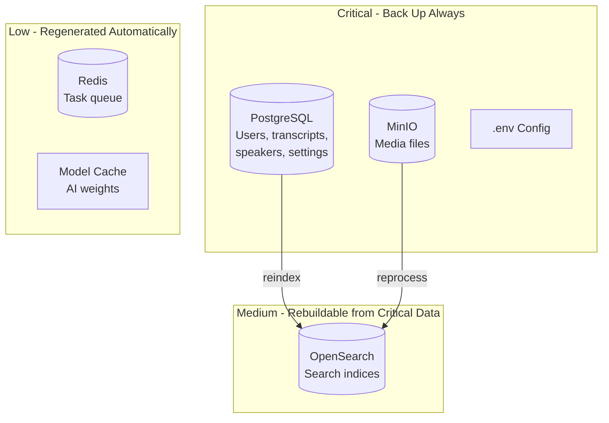

# Backup & Restore

This guide covers backup strategies, restore procedures, and disaster recovery for OpenTranscribe deployments.

## What to Back Up

OpenTranscribe stores data across several services. Understanding each component helps you prioritize your backup strategy.

| Component | Docker Volume / Location | Contents | Priority |
|-----------|--------------------------|----------|----------|
| **PostgreSQL** | `postgres_data` | Users, transcripts, segments, speakers, settings | Critical |
| **MinIO** | `minio_data` | Uploaded media files (audio/video) | Critical |
| **OpenSearch** | `opensearch_data` | Full-text and vector search indices | Medium (rebuildable) |
| **Redis** | `redis_data` | Task queue state, cache | Low (ephemeral) |
| **Model Cache** | `${MODEL_CACHE_DIR:-./models}/` | AI model weights (~2.5GB) | Low (re-downloadable) |
| **Configuration** | `.env`, `docker-compose.*.yml` | Environment and deployment config | Critical |

:::tip Priority Guide
**Critical** components contain irreplaceable data. **Medium** components can be rebuilt from critical data (e.g., reindexing). **Low** components are automatically regenerated or re-downloaded.
:::



## Database Backup

### Using opentr.sh (Recommended)

The built-in backup command creates a timestamped SQL dump:

```bash
./opentr.sh backup
```

This creates a file at `./backups/opentranscribe_backup_YYYYMMDD_HHMMSS.sql`.

### Manual pg_dump

For more control over the backup process:

```bash
# Full database dump
docker compose exec -T postgres pg_dump -U postgres opentranscribe > backup.sql

# Compressed backup (recommended for large databases)
docker compose exec -T postgres pg_dump -U postgres opentranscribe | gzip > backup.sql.gz

# Custom format (supports parallel restore)
docker compose exec -T postgres pg_dump -U postgres -Fc opentranscribe > backup.dump
```

### Automated Backup with Cron

Set up automatic daily backups:

```bash
# Edit crontab
crontab -e

# Add daily backup at 2:00 AM
0 2 * * * cd /opt/opentranscribe && ./opentr.sh backup

# With log rotation (keep last 30 days)
0 2 * * * cd /opt/opentranscribe && ./opentr.sh backup && find ./backups -name "*.sql" -mtime +30 -delete
```

### Automated Backup with systemd Timer

For systems using systemd:

```ini
# /etc/systemd/system/opentranscribe-backup.service
[Unit]
Description=OpenTranscribe Database Backup

[Service]
Type=oneshot
WorkingDirectory=/opt/opentranscribe
ExecStart=/opt/opentranscribe/opentr.sh backup
ExecStartPost=/usr/bin/find /opt/opentranscribe/backups -name "*.sql" -mtime +30 -delete
```

```ini
# /etc/systemd/system/opentranscribe-backup.timer
[Unit]
Description=Daily OpenTranscribe Backup

[Timer]
OnCalendar=*-*-* 02:00:00
Persistent=true

[Install]
WantedBy=timers.target
```

```bash
# Enable the timer
sudo systemctl daemon-reload
sudo systemctl enable --now opentranscribe-backup.timer

# Check timer status
sudo systemctl list-timers opentranscribe-backup.timer
```

## MinIO / Storage Backup

MinIO stores all uploaded media files. Back up using the MinIO Client (`mc`):

```bash
# Install mc (if not already available)
docker run --rm -it --entrypoint /bin/sh minio/mc

# Or use mc from within the MinIO container
docker compose exec minio mc alias set local http://localhost:9000 $MINIO_ROOT_USER $MINIO_ROOT_PASSWORD

# Mirror all buckets to a local directory
docker compose exec minio mc mirror local/ /backup-destination/

# Or from the host with mc installed
mc alias set opentranscribe http://localhost:5178 $MINIO_ROOT_USER $MINIO_ROOT_PASSWORD
mc mirror opentranscribe/ ./backups/minio/
```

### Volume-Level Backup

Alternatively, back up the Docker volume directly:

```bash
# Stop MinIO to ensure consistency
docker compose stop minio

# Copy volume data
docker run --rm -v opentranscribe_minio_data:/data -v $(pwd)/backups:/backup \
  alpine tar czf /backup/minio_data_$(date +%Y%m%d).tar.gz -C /data .

# Restart MinIO
docker compose start minio
```

:::warning
Volume-level backups require stopping the MinIO container to ensure data consistency. Use `mc mirror` for online backups.
:::

## OpenSearch Backup

OpenSearch indices can be rebuilt by reindexing from PostgreSQL, but backing them up avoids reindex time.

### Snapshot Repository

```bash
# Register a snapshot repository (filesystem-based)
curl -X PUT "http://localhost:5180/_snapshot/backup_repo" -H 'Content-Type: application/json' -d '{
  "type": "fs",
  "settings": {
    "location": "/usr/share/opensearch/backup"
  }
}'

# Create a snapshot
curl -X PUT "http://localhost:5180/_snapshot/backup_repo/snapshot_$(date +%Y%m%d)?wait_for_completion=true"

# List snapshots
curl -s "http://localhost:5180/_snapshot/backup_repo/_all" | python3 -m json.tool
```

:::note
For filesystem snapshots, you need to mount a backup directory into the OpenSearch container and add `path.repo` to the OpenSearch configuration. For most deployments, simply reindexing after a restore is simpler.
:::

### Rebuilding Instead of Restoring

If you skip OpenSearch backups, you can rebuild indices after restoring PostgreSQL:

1. Start all services
2. Go to **Admin Settings** in the UI
3. Use the **Reindex All** function to rebuild search indices from the database

## Configuration Backup

Always back up your environment configuration:

```bash
# Back up .env (contains secrets - store securely)
cp .env ./backups/.env.$(date +%Y%m%d)

# Back up any custom compose overrides
cp docker-compose.local.yml ./backups/ 2>/dev/null
cp docker-compose.gpu-scale.yml ./backups/ 2>/dev/null
```

:::danger
The `.env` file contains database passwords, API keys, and encryption keys. Store configuration backups securely and never commit them to version control.
:::

## Model Cache

The model cache (`${MODEL_CACHE_DIR:-./models}/`) contains downloaded AI model weights (~2.5GB total). These are automatically re-downloaded on first use, so backing them up is only necessary for **offline/air-gapped deployments**.

```bash
# Only needed for offline deployments
tar czf backups/models_$(date +%Y%m%d).tar.gz -C ${MODEL_CACHE_DIR:-./models} .
```

## Automated Backup Schedule

Here is a recommended backup schedule combining all components:

```bash
#!/bin/bash
# /opt/opentranscribe/scripts/full-backup.sh
set -euo pipefail

BACKUP_DIR="/opt/opentranscribe/backups/$(date +%Y%m%d_%H%M%S)"
mkdir -p "$BACKUP_DIR"

cd /opt/opentranscribe

# 1. Database (critical)
docker compose exec -T postgres pg_dump -U postgres opentranscribe | gzip > "$BACKUP_DIR/database.sql.gz"
echo "Database backup complete."

# 2. Configuration (critical)
cp .env "$BACKUP_DIR/.env"
cp docker-compose.local.yml "$BACKUP_DIR/" 2>/dev/null || true

# 3. MinIO media files (critical, can be large)
docker run --rm -v opentranscribe_minio_data:/data -v "$BACKUP_DIR":/backup \
  alpine tar czf /backup/minio_data.tar.gz -C /data .
echo "MinIO backup complete."

# 4. Cleanup old backups (keep 30 days)
find /opt/opentranscribe/backups -maxdepth 1 -type d -mtime +30 -exec rm -rf {} +

echo "Full backup complete: $BACKUP_DIR"
```

```bash
# Cron: run full backup weekly, database-only backup daily
# Daily database backup at 2:00 AM
0 2 * * * cd /opt/opentranscribe && ./opentr.sh backup

# Weekly full backup at 3:00 AM on Sundays
0 3 * * 0 /opt/opentranscribe/scripts/full-backup.sh
```

## Restore Procedures

### Restoring the Database

Using `opentr.sh`:

```bash
./opentr.sh restore backups/opentranscribe_backup_20260310_020000.sql
```

This command automatically:
1. Stops backend and all Celery workers
2. Restores the SQL dump into PostgreSQL
3. Restarts all stopped services

Manual restore:

```bash
# Stop services that use the database
docker compose stop backend celery-worker celery-download-worker \
  celery-cpu-worker celery-nlp-worker celery-embedding-worker celery-beat

# Restore from plain SQL
docker compose exec -T postgres psql -U postgres opentranscribe < backup.sql

# Or from compressed backup
gunzip -c backup.sql.gz | docker compose exec -T postgres psql -U postgres opentranscribe

# Or from custom format
docker compose exec -T postgres pg_restore -U postgres -d opentranscribe backup.dump

# Restart services
docker compose start backend celery-worker celery-download-worker \
  celery-cpu-worker celery-nlp-worker celery-embedding-worker celery-beat
```

### Restoring MinIO Data

```bash
# Stop MinIO
docker compose stop minio

# Restore volume from tar backup
docker run --rm -v opentranscribe_minio_data:/data -v $(pwd)/backups:/backup \
  alpine sh -c "rm -rf /data/* && tar xzf /backup/minio_data.tar.gz -C /data"

# Start MinIO
docker compose start minio
```

### Restoring OpenSearch

If you have a snapshot:

```bash
# Close indices first
curl -X POST "http://localhost:5180/_all/_close"

# Restore from snapshot
curl -X POST "http://localhost:5180/_snapshot/backup_repo/snapshot_20260310/_restore?wait_for_completion=true"
```

If you do not have a snapshot, reindex from the database using the Admin UI after PostgreSQL is restored.

### Restoring Configuration

```bash
# Restore .env (review before applying - may contain stale values)
cp backups/.env /opt/opentranscribe/.env

# Restart all services to pick up configuration
docker compose down
docker compose up -d
```

## Disaster Recovery

### Full System Recovery from Scratch

If you need to rebuild the entire system from backups:

```bash
# 1. Install Docker and Docker Compose on the new server

# 2. Clone or copy the OpenTranscribe repository
git clone https://github.com/davidamacey/OpenTranscribe.git /opt/opentranscribe
cd /opt/opentranscribe

# 3. Restore configuration
cp /path/to/backup/.env .env

# 4. Start infrastructure services only
docker compose up -d postgres minio redis opensearch

# 5. Wait for PostgreSQL to be ready
until docker compose exec postgres pg_isready -U postgres; do sleep 2; done

# 6. Restore the database
docker compose exec -T postgres psql -U postgres opentranscribe < /path/to/backup/database.sql

# 7. Restore MinIO data
docker run --rm -v opentranscribe_minio_data:/data -v /path/to/backup:/backup \
  alpine sh -c "tar xzf /backup/minio_data.tar.gz -C /data"

# 8. Start all remaining services
docker compose up -d

# 9. Reindex OpenSearch (via Admin UI or API)
# The backend will run Alembic migrations automatically on startup

# 10. Verify the system
curl -f http://localhost:5174/api/health
```

### RTO/RPO Considerations

| Metric | Target | How to Achieve |
|--------|--------|----------------|
| **RPO** (max data loss) | 24 hours | Daily database backups |
| **RPO** (aggressive) | 1 hour | Hourly database backups + WAL archiving |
| **RTO** (time to recover) | 1-2 hours | Documented recovery runbook + tested backups |
| **RTO** (aggressive) | 15-30 minutes | Pre-staged infrastructure + automated restore scripts |

For lower RPO, consider PostgreSQL WAL (Write-Ahead Log) archiving for point-in-time recovery.

## Testing Backups

Untested backups are not backups. Verify your backups regularly:

```bash
# 1. Create a test database
docker compose exec postgres createdb -U postgres opentranscribe_test

# 2. Restore backup into test database
docker compose exec -T postgres psql -U postgres opentranscribe_test < backups/opentranscribe_backup_latest.sql

# 3. Verify row counts
docker compose exec postgres psql -U postgres opentranscribe_test -c "
  SELECT 'users' as table_name, count(*) FROM \"user\"
  UNION ALL
  SELECT 'media_files', count(*) FROM media_file
  UNION ALL
  SELECT 'transcripts', count(*) FROM transcript_segment;
"

# 4. Clean up test database
docker compose exec postgres dropdb -U postgres opentranscribe_test
```

:::tip
Schedule a quarterly disaster recovery drill where you restore from backup onto a separate machine to validate the entire recovery process end-to-end.
:::
