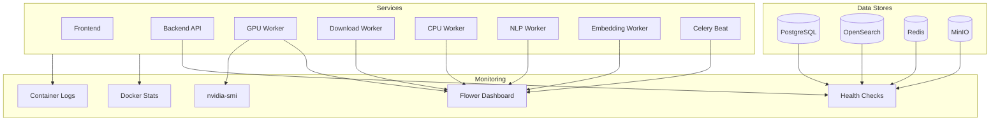

# Monitoring & Logging

OpenTranscribe runs as a multi-service Docker Compose application with GPU-accelerated AI processing, background task queues, and several data stores. Effective monitoring ensures reliable operation and early detection of issues.

## Monitoring Architecture



## Service Health Checks

Every service in OpenTranscribe has a Docker health check. These are defined in `docker-compose.yml` and automatically monitored by Docker.

| Service | Container | Health Check | Interval | What It Verifies |
|---------|-----------|-------------|----------|------------------|
| PostgreSQL | `opentranscribe-postgres` | `pg_isready -U postgres` | 5s | Database accepts connections |
| MinIO | `opentranscribe-minio` | `curl -f http://localhost:9000/minio/health/live` | 5s | Object storage API is responsive |
| Redis | `opentranscribe-redis` | `redis-cli ping` (with auth if configured) | 5s | Cache/broker responds to PING |
| OpenSearch | `opentranscribe-opensearch` | `curl -sS http://localhost:9200` | 5s | Search cluster is reachable |
| Backend | `opentranscribe-backend` | `curl -f http://localhost:8080/health` | 10s | FastAPI app is serving requests |
| GPU Worker | `opentranscribe-celery-worker` | `celery inspect ping -d gpu-transcription@$HOSTNAME` | 30s | Worker is connected to broker and responsive |
| Download Worker | `opentranscribe-celery-download-worker` | `celery inspect ping -d media-downloader@$HOSTNAME` | 30s | Worker is connected and processing downloads |
| CPU Worker | `opentranscribe-celery-cpu-worker` | `celery inspect ping -d cpu-processor@$HOSTNAME` | 30s | Worker handles CPU-bound tasks |
| NLP Worker | `opentranscribe-celery-nlp-worker` | `celery inspect ping -d ai-nlp@$HOSTNAME` | 30s | Worker handles LLM/NLP tasks |
| Embedding Worker | `opentranscribe-celery-embedding-worker` | `celery inspect ping -d search-indexer@$HOSTNAME` | 30s | Worker handles search embedding tasks |
| Celery Beat | `opentranscribe-celery-beat` | Checks `/app/celerybeat-schedule` modification time < 300s | 30s | Scheduler is writing schedule file |
| Flower | `opentranscribe-flower` | Web UI on port 5555 | N/A | Monitoring dashboard is accessible |

Check all health statuses at once:

```bash
docker ps --format "table {{.Names}}\t{{.Status}}\t{{.Ports}}"
```

## Flower Dashboard

Flower provides real-time monitoring of all Celery workers and tasks.

**Access:** `http://localhost:5175/flower`
**Default credentials:** `admin` / `flower` (configurable via `FLOWER_USER` and `FLOWER_PASSWORD` in `.env`)

### What to Monitor in Flower

| Tab | Key Metrics | What to Look For |
|-----|-------------|------------------|
| **Dashboard** | Active/processed/failed task counts | Failed count increasing, active count stuck |
| **Workers** | Online workers, task counts per worker | Workers offline, uneven task distribution |
| **Tasks** | Task state, runtime, args | Tasks stuck in STARTED for too long, repeated failures |
| **Queues** | Queue depth per queue | Messages backing up in `gpu` queue |
| **Broker** | Redis connection status | Broker connectivity issues |

### Queue Architecture

OpenTranscribe uses dedicated queues for different workload types:

| Queue | Worker | Concurrency | Purpose |
|-------|--------|-------------|---------|
| `gpu` | `celery-worker` | 1 (default) | Transcription + diarization (GPU-bound) |
| `download` | `celery-download-worker` | 3 | Media URL downloads (I/O-bound) |
| `cpu,utility` | `celery-cpu-worker` | 8 | CPU-bound processing tasks |
| `nlp,celery` | `celery-nlp-worker` | 4 | LLM summarization, speaker ID |
| `embedding` | `celery-embedding-worker` | 1 | Search index embedding generation |

### Flower Configuration

Flower is configured with these operational settings in `docker-compose.yml`:

- `--max_tasks=10000` -- retains last 10,000 tasks in the dashboard
- `--persistent=True` -- persists task history to `/app/flower.db`
- `--purge_offline_workers=600` -- removes offline workers after 10 minutes
- `--natural_time=True` -- displays human-readable timestamps

## Docker Container Monitoring

### Resource Usage

```bash
# Live resource usage for all containers
docker stats

# One-shot snapshot
docker stats --no-stream

# Specific container
docker stats opentranscribe-celery-worker
```

### Restart Counts

Frequent restarts indicate instability (often OOM kills or crash loops):

```bash
# Check restart counts
docker inspect --format='{{.Name}}: {{.RestartCount}}' $(docker ps -aq) 2>/dev/null | sort -t: -k2 -nr

# Check if a container was OOM killed
docker inspect --format='{{.Name}}: OOMKilled={{.State.OOMKilled}}' $(docker ps -aq) 2>/dev/null
```

### Container Events

```bash
# Watch for container start/stop/die events
docker events --filter 'type=container' --format '{{.Time}} {{.Actor.Attributes.name}} {{.Action}}'
```

## GPU Monitoring

### nvidia-smi

```bash
# One-shot GPU status
nvidia-smi

# Continuous monitoring (updates every 1 second)
watch -n 1 nvidia-smi

# Compact output with utilization and memory
nvidia-smi --query-gpu=index,name,utilization.gpu,memory.used,memory.total,temperature.gpu --format=csv,noheader,nounits
```

### VRAM Profiling

OpenTranscribe includes built-in VRAM profiling that uses NVML (not PyTorch) for accurate device-level memory tracking. This captures memory used by CTranslate2, which is invisible to `torch.cuda.memory_allocated()`.

Enable profiling:

```bash
# In .env
ENABLE_VRAM_PROFILING=true
```

View profiling results:

```bash
# Via Admin API
curl http://localhost:5174/api/admin/gpu-profiles

# Via profiling test script
./scripts/gpu-profile-test.sh --results
```

### Key GPU Metrics

| Metric | Normal Range | Warning Threshold |
|--------|-------------|-------------------|
| GPU Utilization | 80-100% during transcription | Sustained 0% with queued tasks |
| VRAM Usage (idle) | ~5.5 GB (models loaded) | N/A |
| VRAM Usage (transcription) | +300-400 MB above idle | N/A |
| VRAM Usage (diarization) | +1-11 GB (scales with audio length) | >90% of total VRAM |
| Temperature | 40-80 C | >85 C sustained |

## Database Monitoring

### PostgreSQL

```bash
# Connection count
docker exec opentranscribe-postgres psql -U postgres -d opentranscribe -c \
  "SELECT count(*) as connections FROM pg_stat_activity;"

# Active queries
docker exec opentranscribe-postgres psql -U postgres -d opentranscribe -c \
  "SELECT pid, state, query_start, query FROM pg_stat_activity WHERE state = 'active';"

# Table sizes
docker exec opentranscribe-postgres psql -U postgres -d opentranscribe -c \
  "SELECT relname AS table, pg_size_pretty(pg_total_relation_size(relid)) AS size
   FROM pg_catalog.pg_statio_user_tables ORDER BY pg_total_relation_size(relid) DESC LIMIT 10;"

# Slow queries (if pg_stat_statements is enabled)
docker exec opentranscribe-postgres psql -U postgres -d opentranscribe -c \
  "SELECT calls, mean_exec_time::numeric(10,2) AS avg_ms, query
   FROM pg_stat_statements ORDER BY mean_exec_time DESC LIMIT 5;"

# Cache hit ratio (should be >95%)
docker exec opentranscribe-postgres psql -U postgres -d opentranscribe -c \
  "SELECT round(100.0 * sum(blks_hit) / nullif(sum(blks_hit + blks_read), 0), 2) AS cache_hit_ratio
   FROM pg_stat_database WHERE datname = 'opentranscribe';"
```

### Connection Limits

The default `max_connections` is 200 (configurable via `PG_MAX_CONNECTIONS` in `.env`). Monitor connection usage to avoid exhaustion -- each backend instance, Celery worker, and Flower connection consumes a slot.

## OpenSearch Monitoring

```bash
# Cluster health (green/yellow/red)
curl -s http://localhost:5180/_cluster/health | python3 -m json.tool

# Index stats (document counts, sizes)
curl -s http://localhost:5180/_cat/indices?v

# Node stats (JVM heap, disk, CPU)
curl -s http://localhost:5180/_nodes/stats/jvm,os,fs | python3 -m json.tool

# Pending tasks
curl -s http://localhost:5180/_cluster/pending_tasks | python3 -m json.tool

# ML model status (neural search)
curl -s http://localhost:5180/_plugins/_ml/models/_search -H 'Content-Type: application/json' \
  -d '{"query":{"match_all":{}}}'
```

### OpenSearch Health Status

| Status | Meaning | Action |
|--------|---------|--------|
| **green** | All shards assigned | Normal operation |
| **yellow** | Primary shards OK, replicas unassigned | Expected in single-node deployments |
| **red** | Some primary shards unassigned | Investigate immediately -- data may be unavailable |

## Log Management

### Log Locations

All services log to Docker's logging driver (default: `json-file`). Access logs via `docker compose logs` or `docker logs`.

```bash
# All services
docker compose logs -f

# Specific service (with timestamps)
docker compose logs -f --timestamps backend

# Last 100 lines from GPU worker
docker logs --tail 100 opentranscribe-celery-worker

# Using opentr.sh
./opentr.sh logs backend
./opentr.sh logs celery-worker
```

### Log Levels

| Service | Default Level | Environment Variable |
|---------|--------------|---------------------|
| Backend (FastAPI) | `info` | `LOG_LEVEL` |
| Celery Workers | `info` | Set in `command:` (e.g., `--loglevel=info`) |
| Flower | `info` | Set in `command:` |
| PostgreSQL | `notice` | PostgreSQL config |
| OpenSearch | `info` | OpenSearch config |

### What to Look For in Logs

| Service | Log Pattern | Indicates |
|---------|------------|-----------|
| GPU Worker | `torch.cuda.OutOfMemoryError` | GPU VRAM exhausted -- reduce batch size or concurrency |
| GPU Worker | `VRAM Usage [...]` | Per-stage VRAM reporting (when profiling enabled) |
| Backend | `Alembic migration` | Database schema migration on startup |
| Backend | `Model registered` | OpenSearch neural model initialization |
| Download Worker | `yt-dlp` errors | Media download failures (auth, geo-restriction) |
| NLP Worker | `LLM provider` errors | LLM API failures (timeout, rate limit, auth) |
| OpenSearch | `circuit_breaking_exception` | JVM heap exhausted -- increase `OPENSEARCH_JAVA_OPTS` |

## Key Metrics to Watch

| Metric | How to Check | Warning Threshold | Action |
|--------|-------------|-------------------|--------|
| Disk space | `df -h` | Under 10% free | Clean old transcriptions, expand storage |
| GPU VRAM | `nvidia-smi` | >90% sustained | Reduce `BATCH_SIZE`, lower concurrency |
| GPU temperature | `nvidia-smi` | >85 C | Improve cooling, reduce workload |
| `gpu` queue depth | Flower dashboard | >20 pending | Add GPU workers or upgrade GPU |
| PostgreSQL connections | `pg_stat_activity` | >80% of max_connections | Increase `PG_MAX_CONNECTIONS` |
| OpenSearch heap | `_nodes/stats/jvm` | >85% of heap | Increase `OPENSEARCH_JAVA_OPTS` |
| Redis memory | `redis-cli info memory` | >80% of maxmemory | Increase limit or tune eviction |
| Container restarts | `docker inspect` | >3 in 1 hour | Check OOM kills, review logs |
| Celery task failures | Flower tasks tab | >5% failure rate | Review failed task args and exceptions |
| MinIO disk usage | MinIO Console | Under 10% free | Archive old media, expand storage |

## Integration with External Monitoring

OpenTranscribe does not ship with built-in Prometheus/Grafana integration, but its services expose standard interfaces that work with external monitoring stacks.

### Prometheus + Grafana

- **Node Exporter**: Install on the host for CPU, memory, disk, and network metrics
- **NVIDIA GPU Exporter**: Use [dcgm-exporter](https://github.com/NVIDIA/dcgm-exporter) for GPU metrics in Prometheus format
- **PostgreSQL Exporter**: Use [postgres_exporter](https://github.com/prometheus-community/postgres_exporter) pointed at the exposed PostgreSQL port
- **Redis Exporter**: Use [redis_exporter](https://github.com/oliver006/redis_exporter) for Redis metrics
- **OpenSearch**: OpenSearch exposes `/_prometheus/metrics` via the [prometheus-exporter plugin](https://github.com/aiven/prometheus-exporter-plugin-for-opensearch)
- **Flower**: Flower exposes a JSON API at `/api/workers` and `/api/tasks` that can be scraped by a custom exporter
- **Docker**: Use [cAdvisor](https://github.com/google/cadvisor) for per-container resource metrics

### Datadog / New Relic / Similar

- Use the vendor's Docker integration for container metrics
- Point database integrations at exposed ports (PostgreSQL 5176, Redis 5177, OpenSearch 5180)
- Use the NVIDIA GPU integration for GPU metrics
- Configure log collection from Docker's json-file driver

### Syslog / ELK

Configure Docker's logging driver to forward to syslog or a centralized log collector:

```json
{
  "log-driver": "syslog",
  "log-opts": {
    "syslog-address": "tcp://logserver:514",
    "tag": "opentranscribe/{{.Name}}"
  }
}
```

## Alerting Recommendations

Set up alerts for these critical conditions:

| Condition | Severity | Detection | Recommended Action |
|-----------|----------|-----------|-------------------|
| Service container down | Critical | Docker health check fails 3x | Auto-restart (Docker handles this), page if persists >5 min |
| GPU OOM | High | `torch.cuda.OutOfMemoryError` in GPU worker logs | Reduce `BATCH_SIZE`, check for concurrent diarization |
| Disk space under 10% | High | `df -h` or node exporter | Archive media, expand storage |
| `gpu` queue >50 tasks | Medium | Flower API or Redis `LLEN gpu` | Scale GPU workers, prioritize batches |
| OpenSearch red status | Critical | `_cluster/health` API | Check disk space, review shard allocation |
| PostgreSQL connections >80% | Medium | `pg_stat_activity` | Increase `PG_MAX_CONNECTIONS`, check connection leaks |
| Redis memory >80% | Medium | `redis-cli info memory` | Increase maxmemory, review eviction policy |
| Task failure rate >5% | Medium | Flower dashboard | Review failed task exceptions |
| GPU temperature >85 C | High | `nvidia-smi` | Improve cooling, throttle workload |
| Celery worker offline >5 min | High | Flower workers tab | Check container logs, restart worker |
