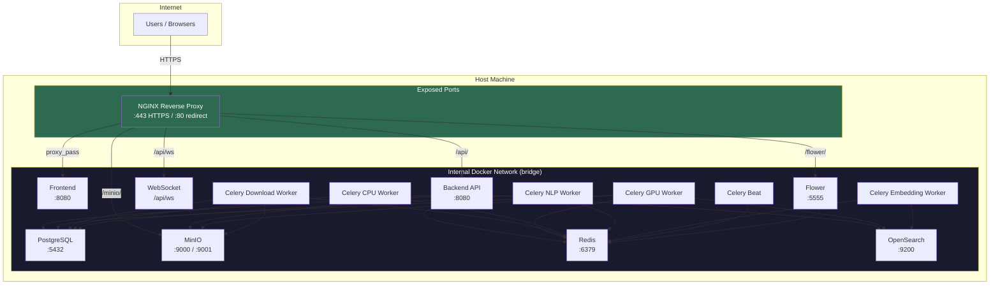

# Production Deployment & Hardening Guide

This guide covers everything needed to deploy OpenTranscribe in a production environment -- from pre-deployment preparation through security hardening and ongoing monitoring.

## Production Network Architecture

The following diagram shows which services are exposed externally versus isolated on the internal Docker network.



In production, **only NGINX ports 80 and 443 should be exposed** to the network. All other services communicate exclusively over the internal Docker bridge network.

---

## 1. Pre-Deployment Checklist

Complete these items before starting the production stack.

### Hardware Verification

| Component | Minimum | Recommended |
|-----------|---------|-------------|
| CPU | 4 cores | 8+ cores |
| RAM | 8 GB | 16-32 GB |
| Storage | 50 GB SSD | 200+ GB NVMe SSD |
| GPU | NVIDIA with 6 GB VRAM | NVIDIA with 12+ GB VRAM |
| NVIDIA Driver | 525+ | 535+ |

Verify GPU availability:

```bash
nvidia-smi
docker run --rm --gpus all nvidia/cuda:12.1.0-base-ubuntu22.04 nvidia-smi
```

### DNS and Domain

- Point your domain (e.g., `transcribe.example.com`) to your server's public IP via an A record.
- Verify resolution: `dig +short transcribe.example.com`
- For internal/homelab deployments, configure local DNS or hosts files (see the [NGINX Setup](../configuration/nginx-ssl.md) guide).

### SSL/TLS Certificates

For publicly accessible deployments, use Let's Encrypt:

```bash
sudo apt install certbot
sudo certbot certonly --standalone -d transcribe.example.com

mkdir -p nginx/ssl
sudo ln -sf /etc/letsencrypt/live/transcribe.example.com/fullchain.pem nginx/ssl/server.crt
sudo ln -sf /etc/letsencrypt/live/transcribe.example.com/privkey.pem nginx/ssl/server.key
```

For internal deployments, generate self-signed certificates:

```bash
./scripts/generate-ssl-cert.sh opentranscribe.local --auto-ip
```

### HuggingFace Token

A HuggingFace token is required for downloading PyAnnote speaker diarization models. You must accept the model license agreements on the HuggingFace website before the token will work.

1. Create an account at [huggingface.co](https://huggingface.co)
2. Accept the license for [pyannote/speaker-diarization-3.1](https://huggingface.co/pyannote/speaker-diarization-3.1)
3. Accept the license for [pyannote/segmentation-3.0](https://huggingface.co/pyannote/segmentation-3.0)
4. Generate an access token at [huggingface.co/settings/tokens](https://huggingface.co/settings/tokens)
5. Add to your `.env` file: `HF_TOKEN=hf_your_token_here`

### Pre-Download AI Models

Download all AI models before starting the stack, especially for air-gapped or bandwidth-constrained environments:

```bash
bash scripts/download-models.sh models
```

This downloads approximately 2.5 GB of models to `${MODEL_CACHE_DIR:-./models}/`, including WhisperX, PyAnnote, sentence-transformers, and OpenSearch neural search models.

---

## 2. Production Docker Compose

OpenTranscribe uses a layered Docker Compose pattern. Production deployments combine the base configuration with production-specific overrides.

### Compose File Stack

| File | Purpose |
|------|---------|
| `docker-compose.yml` | Base configuration shared by all environments |
| `docker-compose.prod.yml` | Production overrides (Docker Hub images, pull policies) |
| `docker-compose.nginx.yml` | NGINX reverse proxy service |
| `docker-compose.local.yml` | Prevents pulling from Docker Hub (use with local builds) |
| `docker-compose.pki.yml` | PKI/mTLS certificate authentication overlay |

### Starting Production

The recommended way to start production is through the management script:

```bash
./opentr.sh start prod
```

This automatically selects the correct compose files, detects GPU availability, checks model permissions, and starts all services in the correct order.

For manual control:

```bash
docker compose \
  -f docker-compose.yml \
  -f docker-compose.prod.yml \
  -f docker-compose.nginx.yml \
  up -d
```

### Restart Policies

All services in the base configuration use `restart: always`, which means containers restart automatically after crashes or host reboots. Docker's restart policy also applies after a system reboot if the Docker daemon is enabled as a systemd service:

```bash
sudo systemctl enable docker
```

### Security Options

Every service in the base configuration includes `security_opt: [no-new-privileges:true]`, which prevents privilege escalation inside containers.

---

## 3. Reverse Proxy and SSL/TLS

NGINX acts as the single entry point for all external traffic, terminating TLS and proxying requests to internal services.

### NGINX Configuration

The NGINX configuration template lives at `nginx/site.conf.template`. Environment variables are substituted at container startup via `envsubst`.

Key settings in the production NGINX config:

```nginx
# TLS protocols -- only modern, secure versions
ssl_protocols TLSv1.2 TLSv1.3;
ssl_prefer_server_ciphers on;
ssl_ciphers ECDHE-ECDSA-AES128-GCM-SHA256:ECDHE-RSA-AES128-GCM-SHA256:ECDHE-ECDSA-AES256-GCM-SHA384:ECDHE-RSA-AES256-GCM-SHA384;

# Session caching for performance
ssl_session_cache shared:SSL:10m;
ssl_session_timeout 1d;
ssl_session_tickets off;

# HSTS -- force HTTPS for one year
add_header Strict-Transport-Security "max-age=31536000; includeSubDomains" always;

# Large file uploads (audio/video up to 10 GB)
client_max_body_size 10G;
client_body_timeout 600s;
```

### Environment Variables

| Variable | Default | Description |
|----------|---------|-------------|
| `NGINX_SERVER_NAME` | _(required)_ | Hostname for the NGINX server block |
| `NGINX_HTTP_PORT` | `80` | HTTP port (redirects to HTTPS) |
| `NGINX_HTTPS_PORT` | `443` | HTTPS port |
| `NGINX_CERT_FILE` | `./nginx/ssl/server.crt` | Path to SSL certificate |
| `NGINX_CERT_KEY` | `./nginx/ssl/server.key` | Path to SSL private key |

### Let's Encrypt Auto-Renewal

Set up a cron job for automatic certificate renewal:

```bash
# Test renewal first
sudo certbot renew --dry-run

# Add monthly renewal to crontab
echo "0 0 1 * * certbot renew --quiet && docker compose restart nginx" | sudo tee -a /etc/crontab
```

### Proxy Routes

| Path | Upstream | Purpose |
|------|----------|---------|
| `/` | `frontend:8080` | Svelte SPA |
| `/api/ws` | `backend:8080` | WebSocket notifications |
| `/api/` | `backend:8080` | REST API |
| `/flower/` | `flower:5555` | Celery monitoring dashboard |
| `/minio/` | `minio:9001` | MinIO console |
| `/s3/` | `minio:9000` | S3 API (presigned URLs) |

---

## 4. Database Hardening

### PostgreSQL Tuning

The base `docker-compose.yml` includes production-tuned PostgreSQL parameters passed via the `command` directive. All values are configurable through `.env` variables:

| Parameter | Default | `.env` Variable | Purpose |
|-----------|---------|-----------------|---------|
| `shared_buffers` | `256MB` | `PG_SHARED_BUFFERS` | Memory for caching data pages (set to ~25% of available RAM) |
| `effective_cache_size` | `1GB` | `PG_EFFECTIVE_CACHE_SIZE` | Planner estimate of OS cache (set to ~50-75% of RAM) |
| `work_mem` | `16MB` | `PG_WORK_MEM` | Per-operation sort/hash memory |
| `maintenance_work_mem` | `128MB` | `PG_MAINTENANCE_WORK_MEM` | Memory for VACUUM, CREATE INDEX |
| `random_page_cost` | `1.1` | `PG_RANDOM_PAGE_COST` | SSD-optimized (use 4.0 for spinning disks) |
| `effective_io_concurrency` | `200` | `PG_EFFECTIVE_IO_CONCURRENCY` | SSD-optimized (use 2 for spinning disks) |
| `max_connections` | `200` | `PG_MAX_CONNECTIONS` | Maximum concurrent connections |
| `wal_buffers` | `16MB` | _(hardcoded)_ | Write-ahead log buffer |
| `checkpoint_completion_target` | `0.9` | _(hardcoded)_ | Spread checkpoint I/O |

**Recommendations for larger deployments:**

```bash
# .env -- for a server with 32 GB RAM and NVMe SSD
PG_SHARED_BUFFERS=8GB
PG_EFFECTIVE_CACHE_SIZE=24GB
PG_WORK_MEM=64MB
PG_MAINTENANCE_WORK_MEM=512MB
PG_MAX_CONNECTIONS=300
```

### Connection Security

- PostgreSQL listens only on the Docker bridge network (port 5432 is internal).
- Set strong credentials in `.env`:

```bash
POSTGRES_USER=opentranscribe
POSTGRES_PASSWORD=<generate-a-strong-random-password>
POSTGRES_DB=opentranscribe
```

- In production, **remove or firewall the host-mapped PostgreSQL port** (`POSTGRES_PORT`) if you do not need direct database access from the host. Comment it out in your `.env` or set it to an empty value.

### Backups

Use the built-in backup command:

```bash
./opentr.sh backup
```

This creates a timestamped SQL dump in the `backups/` directory. For automated backups, add a cron job:

```bash
0 2 * * * cd /opt/opentranscribe && ./opentr.sh backup
```

---

## 5. MinIO Security

### Credentials

Set strong MinIO credentials in `.env`:

```bash
MINIO_ROOT_USER=opentranscribe-admin
MINIO_ROOT_PASSWORD=<generate-a-strong-random-password>
```

### Bucket Policy

OpenTranscribe creates a private bucket on startup. Verify the bucket is not publicly accessible:

```bash
# From inside the backend container
mc alias set local http://minio:9000 $MINIO_ROOT_USER $MINIO_ROOT_PASSWORD
mc policy get local/opentranscribe
# Should show: "none" (private)
```

### Encryption at Rest

MinIO supports server-side encryption (AES-256-GCM). Enable it in `.env`:

```bash
# Generate a key
echo "opentranscribe-key:$(openssl rand -base64 32)"

# Add to .env
MINIO_KMS_SECRET_KEY=opentranscribe-key:<base64-encoded-key>
MINIO_KMS_AUTO_ENCRYPTION=on
```

All new objects will be automatically encrypted. Existing unencrypted objects remain readable.

### Access Key Rotation

Periodically rotate MinIO credentials:

1. Update `MINIO_ROOT_USER` and `MINIO_ROOT_PASSWORD` in `.env`
2. Restart the stack: `./opentr.sh stop && ./opentr.sh start prod`

---

## 6. Redis Security

### Password Authentication

Set a Redis password in `.env`:

```bash
REDIS_PASSWORD=<generate-a-strong-random-password>
```

The base `docker-compose.yml` automatically starts Redis with `--requirepass` when `REDIS_PASSWORD` is set. All services (backend, Celery workers, Flower) read `REDIS_PASSWORD` from the environment and include it in their connection strings.

### Persistence

Redis is configured with a named volume (`redis_data`) for persistence. The default persistence strategy (RDB snapshots) is sufficient for OpenTranscribe's use case -- Redis stores Celery task state and cached GPU stats, not primary data.

### Network Isolation

In production, **do not expose the Redis port to the host.** Remove or comment out the `REDIS_PORT` mapping in `.env` so Redis is only accessible within the Docker network.

---

## 7. OpenSearch Security

### JVM Heap Sizing

The base configuration sets the OpenSearch JVM heap to 1 GB:

```yaml
OPENSEARCH_JAVA_OPTS=-Xms1g -Xmx1g
```

**Adjust based on your dataset size and available RAM.** A good rule of thumb is to allocate 50% of remaining RAM (after PostgreSQL and OS needs), but never exceed 32 GB (JVM compressed oops threshold).

| Dataset Size | Recommended Heap |
|-------------|-----------------|
| < 1,000 files | 1 GB (default) |
| 1,000 - 10,000 files | 2-4 GB |
| 10,000+ files | 4-8 GB |

Update in `.env` or directly in your compose override:

```bash
OPENSEARCH_JAVA_OPTS=-Xms4g -Xmx4g
```

### Security Plugin

By default, OpenSearch runs with the security plugin **disabled** (`DISABLE_SECURITY_PLUGIN=true`) for simplicity. This is acceptable when OpenSearch is isolated on the Docker network with no exposed ports.

To enable the security plugin in production (required if OpenSearch is exposed or you need audit logging):

```bash
# .env
OPENSEARCH_DISABLE_SECURITY=false
OPENSEARCH_ADMIN_PASSWORD=<strong-password>
OPENSEARCH_USE_TLS=true
```

You will also need TLS certificates for inter-node transport. See the `docker-compose.prod.yml` for the certificate path configuration.

### Memory Locking

The base configuration uses `memlock` ulimits to prevent OpenSearch from being swapped to disk:

```yaml
ulimits:
  memlock:
    soft: -1
    hard: -1
```

Ensure the host system allows memory locking:

```bash
# Add to /etc/security/limits.conf
opensearch soft memlock unlimited
opensearch hard memlock unlimited
```

---

## 8. Container Security

### Non-Root Execution

All backend containers run as a non-root user (`appuser`, UID 1000, GID 1000). This follows the principle of least privilege and is enforced in the production Dockerfile.

The `appuser` is a member of the `video` group for GPU access.

### Permission Management

The model cache directory must be owned by UID 1000 for the container user to read/write models:

```bash
# Automatic (run by opentr.sh on startup)
./scripts/fix-model-permissions.sh

# Manual
sudo chown -R 1000:1000 ${MODEL_CACHE_DIR:-./models}
```

### Security Options

Every service includes:

```yaml
security_opt:
  - no-new-privileges:true
```

This prevents processes inside containers from gaining additional privileges through `setuid`, `setgid`, or Linux capabilities.

### Resource Limits

For production deployments, add resource limits to prevent any single service from consuming all host resources. Add to a custom override file:

```yaml
# docker-compose.limits.yml
services:
  backend:
    deploy:
      resources:
        limits:
          memory: 4G
          cpus: "4"
  postgres:
    deploy:
      resources:
        limits:
          memory: 4G
  opensearch:
    deploy:
      resources:
        limits:
          memory: 4G
  redis:
    deploy:
      resources:
        limits:
          memory: 1G
```

---

## 9. Network Isolation

### Docker Network Architecture

All services communicate over a single Docker bridge network (`default`). In production, only NGINX should have ports mapped to the host.

### Restricting Exposed Ports

In your production `.env`, remove or unset all development port mappings:

```bash
# Comment out or remove these in production
# POSTGRES_PORT=5176
# REDIS_PORT=5177
# MINIO_PORT=5178
# MINIO_CONSOLE_PORT=5179
# OPENSEARCH_PORT=5180
# OPENSEARCH_ADMIN_PORT=5181
# BACKEND_PORT=5174
# FLOWER_PORT=5175
```

When these variables are unset, the services still listen on their internal Docker network ports but are not accessible from outside the Docker network. NGINX proxies all necessary traffic.

**Note:** The `FRONTEND_PORT` mapping becomes unnecessary when NGINX handles ingress. Access the application through NGINX on ports 80/443 instead.

### Host Firewall

Configure the host firewall to allow only necessary inbound traffic:

```bash
# Allow SSH
sudo ufw allow 22/tcp

# Allow HTTPS
sudo ufw allow 443/tcp

# Allow HTTP (for HTTPS redirect)
sudo ufw allow 80/tcp

# Enable firewall
sudo ufw enable
```

---

## 10. CSP and Security Headers

The NGINX configuration includes a comprehensive set of security headers following OWASP recommendations:

| Header | Value | Purpose |
|--------|-------|---------|
| `Strict-Transport-Security` | `max-age=31536000; includeSubDomains` | Force HTTPS for one year |
| `X-Frame-Options` | `SAMEORIGIN` | Prevent clickjacking |
| `X-Content-Type-Options` | `nosniff` | Prevent MIME-type sniffing |
| `X-XSS-Protection` | `0` | Disabled (CSP is the modern replacement) |
| `Referrer-Policy` | `strict-origin-when-cross-origin` | Limit referrer information |
| `Permissions-Policy` | `camera=(), microphone=(self), ...` | Restrict browser features |
| `Content-Security-Policy` | _(see below)_ | Control resource loading |

### Content Security Policy

The default CSP is:

```
default-src 'self';
script-src 'self' 'unsafe-inline';
style-src 'self' 'unsafe-inline';
img-src 'self' data: blob:;
font-src 'self' data:;
connect-src 'self' ws: wss:;
media-src 'self' blob:;
worker-src 'self' blob:;
frame-ancestors 'self';
object-src 'none';
base-uri 'self';
form-action 'self';
```

This policy allows the Svelte SPA and WebSocket connections to function while blocking external resource loading, iframes from other origins, and plugin-based content.

---

## 11. Secrets Management

### The `.env` File

The `.env` file contains all sensitive configuration. Protect it:

```bash
# Restrict permissions
chmod 600 .env

# Verify it is in .gitignore
grep -q "^\.env$" .gitignore && echo "OK" || echo "ADD .env TO .gitignore"
```

**Never commit `.env` to version control.** The repository includes `.env.example` as a template.

### Critical Secrets

Generate strong, unique values for each of these:

| Secret | `.env` Variable | Generation Command |
|--------|----------------|-------------------|
| JWT Secret | `SECRET_KEY` | `openssl rand -hex 32` |
| PostgreSQL Password | `POSTGRES_PASSWORD` | `openssl rand -base64 24` |
| MinIO Root Password | `MINIO_ROOT_PASSWORD` | `openssl rand -base64 24` |
| Redis Password | `REDIS_PASSWORD` | `openssl rand -base64 24` |
| Flower Password | `FLOWER_PASSWORD` | `openssl rand -base64 16` |
| MinIO Encryption Key | `MINIO_KMS_SECRET_KEY` | `echo "key:$(openssl rand -base64 32)"` |
| HuggingFace Token | `HF_TOKEN` | _(from huggingface.co)_ |

### Credential Rotation

1. Update the credential in `.env`
2. Stop the stack: `./opentr.sh stop`
3. Start the stack: `./opentr.sh start prod`
4. Verify services are healthy: `./opentr.sh status`

For PostgreSQL password changes, you must also update the password in the database itself before restarting:

```bash
./opentr.sh shell postgres
psql -U $POSTGRES_USER -c "ALTER USER $POSTGRES_USER WITH PASSWORD 'new-password';"
```

---

## 12. Health Checks

Every service in the stack has a Docker health check. These are used for startup ordering (`depends_on: condition: service_healthy`) and ongoing monitoring.

| Service | Health Check | Interval | Purpose |
|---------|-------------|----------|---------|
| PostgreSQL | `pg_isready -U $POSTGRES_USER` | 5s | Verifies database accepts connections |
| MinIO | `curl -f http://localhost:9000/minio/health/live` | 5s | Verifies S3 API is responsive |
| Redis | `redis-cli ping` (with auth if configured) | 5s | Verifies Redis responds to PING |
| OpenSearch | `curl -sS http://localhost:9200` | 5s | Verifies cluster status endpoint |
| Backend | `curl -f http://localhost:8080/health` | 10s | Verifies API is serving requests |
| Frontend (prod) | `wget --spider -q http://127.0.0.1:8080` | 10s | Verifies static assets are served |
| Celery Workers | `celery inspect ping -d <hostname>` | 30s | Verifies worker responds to control commands |
| Celery Beat | Checks `/app/celerybeat-schedule` mtime < 300s | 30s | Verifies scheduler is writing heartbeats |
| Flower | _(relies on Redis connectivity)_ | -- | Monitored via Redis dependency |

### Monitoring Health

Check all service health at once:

```bash
./opentr.sh status
# or
docker compose ps
```

For continuous monitoring, pipe health status to your monitoring system:

```bash
# Simple health check script
docker inspect --format='{{.Name}}: {{.State.Health.Status}}' \
  $(docker ps -q --filter "label=com.docker.compose.project=opentranscribe")
```

---

## 13. Production Startup

### Full Startup Procedure

```bash
# 1. Verify environment file
cat .env | grep -E "^(POSTGRES_PASSWORD|SECRET_KEY|MINIO_ROOT_PASSWORD|REDIS_PASSWORD|HF_TOKEN)" \
  | sed 's/=.*/=***/' # Confirm secrets are set without revealing them

# 2. Fix model cache permissions
./scripts/fix-model-permissions.sh

# 3. Pre-download models (if not already cached)
bash scripts/download-models.sh models

# 4. Start production stack
./opentr.sh start prod

# 5. Verify all services are healthy
./opentr.sh status

# 6. Check logs for errors
./opentr.sh logs backend
./opentr.sh logs celery-worker
```

### Verifying the Deployment

After startup, verify each component:

```bash
# Backend API
curl -k https://transcribe.example.com/api/health

# Frontend
curl -k -o /dev/null -s -w "%{http_code}" https://transcribe.example.com/

# OpenSearch (from inside Docker network)
docker exec opentranscribe-backend curl -s http://opensearch:9200/_cluster/health | python3 -m json.tool

# GPU worker
docker exec opentranscribe-celery-worker nvidia-smi
```

### Post-Deployment

1. **Create an admin account** -- The first user registered automatically becomes the admin.
2. **Configure authentication** -- Navigate to Settings and configure your preferred authentication method(s).
3. **Test a transcription** -- Upload a short audio file and verify the full pipeline (upload, transcription, diarization, search indexing).
4. **Set up monitoring** -- Configure alerting on container health checks and disk usage.
5. **Schedule backups** -- Add `./opentr.sh backup` to cron for automated database backups.

---

## Quick Reference: Production `.env` Template

```bash
# === Core Secrets ===
SECRET_KEY=<openssl rand -hex 32>
POSTGRES_USER=opentranscribe
POSTGRES_PASSWORD=<openssl rand -base64 24>
POSTGRES_DB=opentranscribe
MINIO_ROOT_USER=opentranscribe-admin
MINIO_ROOT_PASSWORD=<openssl rand -base64 24>
REDIS_PASSWORD=<openssl rand -base64 24>
HF_TOKEN=hf_your_token_here

# === NGINX ===
NGINX_SERVER_NAME=transcribe.example.com

# === Flower Monitoring ===
FLOWER_USER=admin
FLOWER_PASSWORD=<openssl rand -base64 16>

# === MinIO Encryption ===
MINIO_KMS_SECRET_KEY=opentranscribe-key:<openssl rand -base64 32>
MINIO_KMS_AUTO_ENCRYPTION=on

# === PostgreSQL Tuning (adjust for your hardware) ===
PG_SHARED_BUFFERS=256MB
PG_EFFECTIVE_CACHE_SIZE=1GB
PG_WORK_MEM=16MB
PG_MAX_CONNECTIONS=200

# === Model Cache ===
MODEL_CACHE_DIR=./models

# === Remove host port mappings in production ===
# (services are accessed through NGINX only)
# POSTGRES_PORT=
# REDIS_PORT=
# MINIO_PORT=
# OPENSEARCH_PORT=
```
