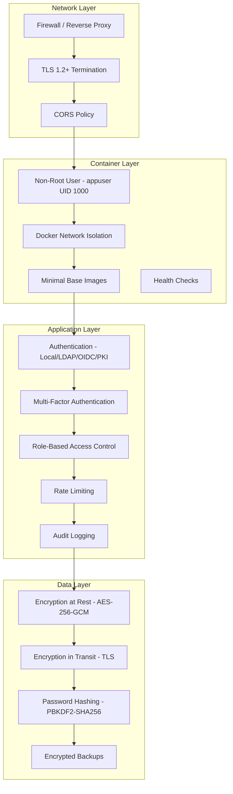

# Security Hardening

This guide covers security best practices for production OpenTranscribe deployments, including authentication hardening, network security, data protection, and compliance considerations.

## Security Architecture



## Security Checklist

Use this checklist before deploying to production.

### Pre-Deployment

- [ ] Change all default passwords (database, MinIO, Redis, admin account)
- [ ] Generate a strong `JWT_SECRET` (minimum 64 characters): `openssl rand -hex 64`
- [ ] Generate a strong `ENCRYPTION_KEY`: `openssl rand -hex 32`
- [ ] Set `DEBUG=false` in `.env`
- [ ] Configure TLS certificates for HTTPS
- [ ] Review and restrict CORS origins (`CORS_ORIGINS`)
- [ ] Set `ALLOWED_HOSTS` to your domain(s)
- [ ] Remove or restrict API documentation endpoint (`/docs`) in production

### Authentication

- [ ] Enable MFA enforcement for admin accounts (at minimum)
- [ ] Configure password policy (minimum 12 characters, complexity requirements)
- [ ] Set account lockout threshold (recommended: 5 failed attempts)
- [ ] Configure session timeout (recommended: 30 minutes for sensitive environments)
- [ ] Enable audit logging

### Infrastructure

- [ ] Restrict exposed ports to only what is necessary (typically 443 only)
- [ ] Configure firewall rules for Docker networks
- [ ] Enable container health checks
- [ ] Set up log aggregation and monitoring
- [ ] Schedule regular backups with encryption
- [ ] Plan credential rotation schedule

## Authentication Hardening

### MFA Enforcement

OpenTranscribe supports TOTP-based multi-factor authentication compatible with standard authenticator apps (Google Authenticator, Microsoft Authenticator, Authy).

**Configuration options:**

| Setting | Description | Recommended |
|---------|-------------|-------------|
| MFA required for all users | Every user must enroll in MFA | High-security environments |
| MFA required for admins only | Only admin-role users must enroll | Standard deployments |
| MFA optional | Users can opt in | Development only |

Configure in **Admin > Settings > Authentication > MFA Policy**.

Backup codes are generated during enrollment (8-character alphanumeric, XXXX-XXXX format). They are stored hashed with PBKDF2-SHA256 and are single-use.

### Password Policies

Configure password requirements to match your organization's security standards:

```bash
# .env configuration
PASSWORD_MIN_LENGTH=12              # Minimum password length
PASSWORD_REQUIRE_UPPERCASE=true     # Require uppercase letter
PASSWORD_REQUIRE_LOWERCASE=true     # Require lowercase letter
PASSWORD_REQUIRE_DIGIT=true         # Require number
PASSWORD_REQUIRE_SPECIAL=true       # Require special character
PASSWORD_HISTORY_COUNT=12           # Prevent reuse of last N passwords
PASSWORD_EXPIRY_DAYS=90             # Force password change (0 = disabled)
```

Passwords are hashed using bcrypt with SHA-256 pre-hash (overcomes bcrypt's 72-byte limit). For FIPS environments, PBKDF2-SHA256 with 600,000 iterations is used instead.

### Account Lockout

Protects against brute-force attacks:

```bash
ACCOUNT_LOCKOUT_THRESHOLD=5         # Lock after N failed attempts
ACCOUNT_LOCKOUT_DURATION=900        # Lockout duration in seconds (15 min)
ACCOUNT_LOCKOUT_RESET_AFTER=1800    # Reset counter after N seconds (30 min)
```

Lockout events are recorded in the audit log. Administrators can manually unlock accounts through the admin panel.

### Session Management

- **Access tokens**: Short-lived JWT tokens (configurable, default 15 minutes)
- **Refresh tokens**: Rotated on each use, preventing token replay
- **Session invalidation**: All sessions terminated on password change
- **Concurrent sessions**: Optionally limit active sessions per user

## Network Security

### Port Exposure

In production, expose only the minimum required ports:

| Port | Service | Exposure |
|------|---------|----------|
| 443 | NGINX (HTTPS) | Public |
| 80 | NGINX (HTTP redirect) | Public (redirect to 443 only) |
| 5432 | PostgreSQL | Internal only |
| 6379 | Redis | Internal only |
| 9000/9001 | MinIO | Internal only |
| 9200 | OpenSearch | Internal only |

All internal services should be accessible only through Docker's internal network, not bound to the host.

### Docker Network Isolation

OpenTranscribe uses Docker networks to isolate services. In production, ensure:

```yaml
# docker-compose.prod.yml - services should NOT expose ports to host
services:
  postgres:
    # Remove "ports:" mapping in production
    # Access only through Docker network
  redis:
    # Remove "ports:" mapping in production
  opensearch:
    # Remove "ports:" mapping in production
```

### LLM Firewall (Self-Hosted Models)

When running vLLM or Ollama on the host machine, Docker containers need firewall rules to reach the LLM server.

**Restrictive approach -- allow only Docker containers:**

```bash
# Allow vLLM only from Docker network
sudo ufw allow from 172.17.0.0/16 to any port 8000 proto tcp comment 'vLLM from Docker'

# Allow Ollama only from Docker network
sudo ufw allow from 172.17.0.0/16 to any port 11434 proto tcp comment 'Ollama from Docker'
```

**Alternative -- use Docker bridge IP in configuration:**

Instead of `localhost`, configure the LLM endpoint as:
- `http://172.17.0.1:8000/v1` (Docker bridge gateway on Linux)
- `http://host.docker.internal:8000/v1` (Docker Desktop on macOS/Windows)

Or add `extra_hosts` to relevant services in `docker-compose.yml`:

```yaml
services:
  backend:
    extra_hosts:
      - host.docker.internal:host-gateway
  celery-nlp-worker:
    extra_hosts:
      - host.docker.internal:host-gateway
```

:::tip
Both the `backend` and `celery-nlp-worker` containers need access to the LLM server. The Settings UI test runs from `backend`, but actual summarization runs from `celery-nlp-worker`.
:::

### TLS Configuration

For production deployments with NGINX:

```bash
# Start with TLS (production mode with NGINX)
./opentr.sh start prod --with-pki
```

Ensure TLS certificates are:
- From a trusted CA (not self-signed) for public deployments
- Renewed before expiration (automate with certbot or similar)
- Using TLS 1.2 or higher (TLS 1.0 and 1.1 should be disabled)

## Data Protection

### Encryption at Rest

**MinIO Storage**: Configure server-side encryption for stored media files:

```bash
# .env configuration
MINIO_KMS_SECRET_KEY=your-256-bit-key  # AES-256 encryption key
```

MinIO supports AES-256-GCM for server-side encryption of objects (transcripts, audio/video files).

**Database**: Sensitive fields (API keys, TOTP secrets, LLM provider credentials) are encrypted in the database using AES-256-GCM with:
- 256-bit key derived via PBKDF2-SHA256
- 96-bit random nonce per encryption
- 128-bit authentication tag

Data format: `v3:base64(salt):base64(nonce):base64(ciphertext+tag)`

**PostgreSQL**: Enable PostgreSQL's built-in encryption for the data directory if required by your compliance framework.

### Encryption in Transit

All inter-service communication should use TLS in production:

- **Client to NGINX**: TLS 1.2+ (configured in NGINX)
- **NGINX to backend**: Internal Docker network (trusted)
- **Backend to PostgreSQL**: Enable `sslmode=require` in database connection string
- **Backend to MinIO**: Configure MinIO with TLS certificates
- **Backend to OpenSearch**: Enable HTTPS for OpenSearch

### Backup Encryption

```bash
# Encrypted backup
./opentr.sh backup
gpg --symmetric --cipher-algo AES256 backups/backup_*.sql

# Encrypted restore
gpg --decrypt backups/backup_*.sql.gpg | ./opentr.sh restore -
```

## API Security

### Rate Limiting

Authentication endpoints are rate-limited to prevent brute-force attacks:

| Endpoint | Limit | Scope |
|----------|-------|-------|
| Login | Configurable | Per-IP and per-user |
| Registration | Configurable | Per-IP |
| Password Reset | Configurable | Per-IP |
| API endpoints | Configurable | Per-user token |

### CORS Configuration

Restrict origins to your domain(s):

```bash
# .env - only allow your domain
CORS_ORIGINS=https://transcribe.yourdomain.com
```

Never use `*` (wildcard) in production.

### Content Security Policy

When using NGINX in production, configure CSP headers:

```nginx
add_header Content-Security-Policy "default-src 'self'; script-src 'self'; style-src 'self' 'unsafe-inline'; img-src 'self' data: blob:; connect-src 'self' wss:; media-src 'self' blob:;" always;
add_header X-Frame-Options DENY always;
add_header X-Content-Type-Options nosniff always;
add_header Referrer-Policy strict-origin-when-cross-origin always;
```

### Input Validation

OpenTranscribe validates all inputs through Pydantic schemas on the backend. File uploads are validated for:
- File type (allowed MIME types only)
- File size (configurable maximum, default 15GB)
- Filename sanitization

## Container Security

### Non-Root Execution

All backend containers run as `appuser` (UID 1000, GID 1000), not root:

- Reduces impact of container escape vulnerabilities
- Compliant with security scanning tools (Trivy, Snyk)
- User groups: `appuser`, `video` (for GPU access)

If you encounter permission issues with model cache directories:

```bash
./scripts/fix-model-permissions.sh
```

### Image Security

- **Multi-stage builds**: Production images use multi-stage Dockerfiles to minimize attack surface
- **Minimal base images**: Only necessary runtime dependencies are included
- **No secrets in images**: All secrets are passed via environment variables or mounted files
- **Regular updates**: Base images should be rebuilt periodically to pick up security patches

### Image Scanning

Scan images before deployment:

```bash
# Using Trivy
trivy image davidamacey/opentranscribe-backend:latest
trivy image davidamacey/opentranscribe-frontend:latest

# Using Docker Scout
docker scout cves davidamacey/opentranscribe-backend:latest
```

## Audit and Compliance

### Audit Logging

All authentication events are logged for security monitoring:

- Login attempts (success and failure) with IP address
- Password changes and resets
- MFA enrollment and removal
- Account lockouts and unlocks
- Session creation and termination
- Administrative actions (user management, settings changes)

Log format supports integration with SIEM systems (Splunk, ELK, etc.).

### Log Retention

Configure log retention based on your compliance requirements:

| Compliance Framework | Minimum Retention |
|---------------------|-------------------|
| SOC 2 | 1 year |
| HIPAA | 6 years |
| FedRAMP | 3 years |
| GDPR | As needed for purpose |

### FedRAMP/NIST Controls Mapping

OpenTranscribe includes features that map to NIST 800-53 controls:

| Control | Implementation |
|---------|---------------|
| **AC-2** (Account Management) | User management, role assignment, account disable |
| **AC-7** (Unsuccessful Login Attempts) | Account lockout after configurable threshold |
| **AC-8** (System Use Notification) | Classification banners (UNCLASSIFIED, CUI, SECRET, TOP SECRET) |
| **AC-12** (Session Termination) | Configurable session timeouts, auto-logout on inactivity |
| **AU-2/AU-3** (Audit Events) | Comprehensive audit logging with timestamps and source IPs |
| **IA-2** (Identification and Authentication) | Multi-factor authentication, PKI/CAC support |
| **IA-5** (Authenticator Management) | Password complexity, history, expiration policies |
| **SC-12** (Cryptographic Key Establishment) | PBKDF2 key derivation |
| **SC-13** (Cryptographic Protection) | AES-256-GCM, HS512 JWT signing |
| **SC-28** (Protection of Information at Rest) | Encrypted sensitive data fields |

Classification banners are configurable in **Admin > Settings > System > Classification Banner**.

## Secrets Management

### Protecting the .env File

The `.env` file contains all sensitive configuration. Protect it:

```bash
# Restrict file permissions
chmod 600 .env
chown root:root .env

# Never commit to version control
# (.env is in .gitignore by default)
```

### Credential Rotation

Establish a rotation schedule for all credentials:

| Credential | Rotation Frequency | How to Rotate |
|-----------|-------------------|---------------|
| `JWT_SECRET` | 90 days | Update in `.env`, restart backend (invalidates all sessions) |
| `ENCRYPTION_KEY` | Annually | Update in `.env`, existing data auto-re-encrypted on access |
| Database password | 90 days | Update in PostgreSQL and `.env`, restart all services |
| MinIO credentials | 90 days | Update in MinIO and `.env`, restart all services |
| LLM API keys | Per provider policy | Update in **Settings > AI > LLM Provider** |

### Avoiding Secrets in Logs

OpenTranscribe redacts sensitive values from log output. When adding custom integrations, never log:
- API keys or tokens
- Passwords or password hashes
- Encryption keys
- User session tokens
- TOTP secrets or backup codes

## FIPS 140-3 Compliance

For government and high-security deployments, OpenTranscribe supports FIPS 140-3 compliant cryptographic operations.

### Enabling FIPS Mode

```bash
# .env configuration
FIPS_VERSION=140-3
PBKDF2_ITERATIONS_V3=600000        # NIST SP 800-132 2024 recommendation
JWT_ALGORITHM_V3=HS512              # HMAC-SHA512 for JWT signing
ENCRYPTION_ALGORITHM_V3=AES-256-GCM # Authenticated encryption
FIPS_MIGRATION_MODE=compatible      # Accept both old and new formats during transition
FIPS_VALIDATE_ENTROPY=true          # Validate entropy sources
```

### Algorithm Requirements

| Component | FIPS 140-2 (Legacy) | FIPS 140-3 | Migration |
|-----------|-------------------|------------|-----------|
| Password Hashing | PBKDF2-SHA256 (210k iter) | PBKDF2-SHA256 (600k iter) | Auto-upgrade on login |
| Symmetric Encryption | Fernet (AES-128-CBC) | AES-256-GCM | Auto-upgrade on access |
| JWT Signing | HS256 | HS512 | Dual verification during transition |
| Token Hashing | SHA-256 | SHA-512 | Auto-upgrade on issuance |
| MFA Backup Codes | bcrypt | PBKDF2-SHA256 (600k iter) | Regeneration required |

### Migration Process

1. **Set `FIPS_MIGRATION_MODE=compatible`** -- accepts both legacy and FIPS 140-3 formats
2. **Restart services** -- `./opentr.sh restart-backend`
3. **Monitor migration** -- users are upgraded automatically on next login
4. **Switch to strict mode** when all users have been upgraded: `FIPS_MIGRATION_MODE=strict`

### TOTP Compatibility

TOTP uses SHA-1 by default per RFC 6238. This is FIPS-allowed because NIST SP 800-131A Rev. 2 permits SHA-1 for HMAC-based applications (SHA-1's collision weakness does not affect HMAC security). This ensures compatibility with standard authenticator apps.

For environments requiring SHA-256/SHA-512 TOTP (with compatible authenticator apps):

```bash
TOTP_ALGORITHM=SHA256  # or SHA512
```

### Verification

Run the compliance verification script:

```bash
./scripts/verify-fips-140-3.sh
```

This checks password hashing algorithm and iterations, JWT signing algorithm, encryption algorithm, and token hash algorithm.

## Vulnerability Reporting

If you discover a security vulnerability in OpenTranscribe:

1. **Do NOT** create a public GitHub issue
2. Email security concerns to the project maintainers (see the repository's SECURITY.md for contact information)
3. Include: description of the vulnerability, steps to reproduce, potential impact, and suggested fixes if any

### Response Timeline

| Severity | Initial Response | Target Fix |
|----------|-----------------|-----------|
| Critical | 24-48 hours | 7 days |
| High | 72 hours | 14 days |
| Medium/Low | 1 week | 30 days |

The project follows responsible disclosure practices and will credit researchers (with permission) in security advisories.
