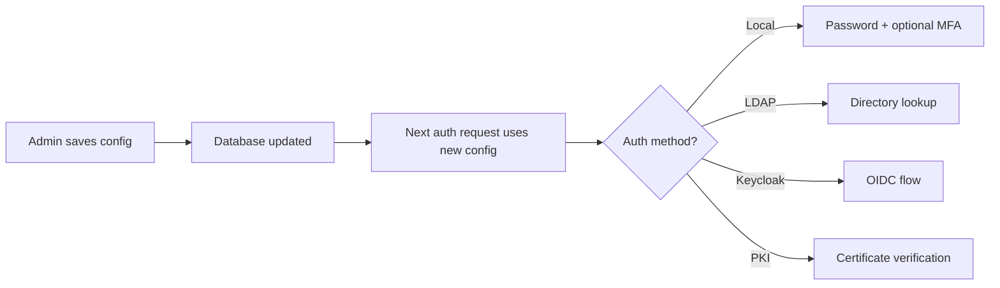
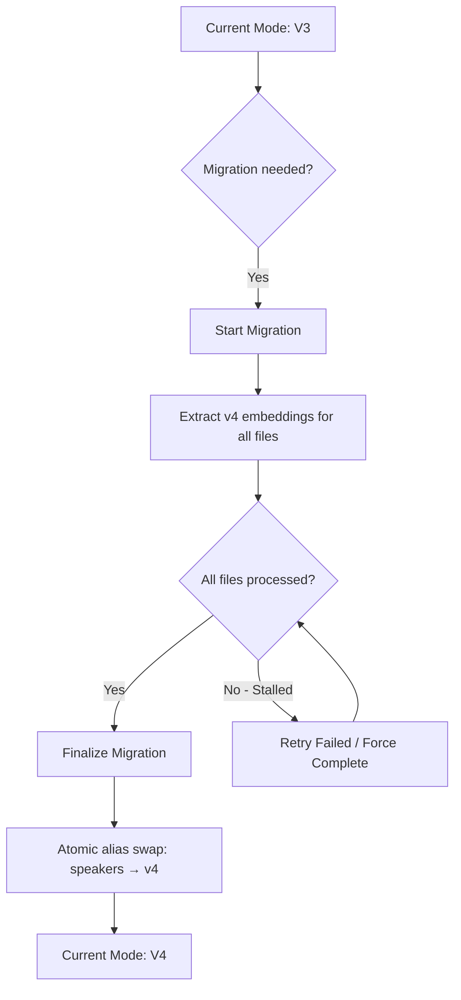

# Admin Panel

The Admin Panel provides system-wide management capabilities for OpenTranscribe administrators. It is accessible through the **Settings** modal and includes tools for user management, authentication configuration, search indexing, data integrity, and system monitoring.

## Access Requirements

The Admin Panel is role-gated. Different sections require different privilege levels:

| Role | Access |
|------|--------|
| **User** | Profile, recording, transcription, and personal settings only |
| **Admin** | All user sections plus user management, system statistics, task health, search, data integrity, retention, and media sources |
| **Super Admin** | All admin sections plus authentication configuration and audit logs |

To access admin features, open **Settings** (gear icon) and scroll to the admin sections in the sidebar.

## System Statistics

The **System Statistics** section provides a real-time dashboard of your OpenTranscribe deployment.

### Metrics Displayed

- **Users** -- Total registered users and recent signups
- **Files** -- Total media files, recent uploads, total audio duration, and transcript segment count
- **Tasks** -- Pending, running, completed, and failed task counts with success rate and average processing time
- **Speakers** -- Total detected speakers and average speakers per file
- **Models** -- Active Whisper and diarization model names
- **System Resources** -- CPU usage (per-core and aggregate), memory usage, disk usage
- **GPU** -- GPU name, VRAM usage (used/total/free), GPU utilization percentage, and temperature

### GPU Monitoring

GPU statistics are collected from the Celery worker via Redis. The backend queries `nvidia-smi` on the worker and caches the results. If Redis has no cached stats, the backend attempts a direct `nvidia-smi` query or dispatches an on-demand collection task to the CPU queue.

In multi-GPU scaling mode, stats are reported per active GPU worker.

## User Management

The **Users** section allows admins to manage all user accounts.

### Creating Users

Click **Add User** to expand the creation form. Required fields:

- **Full Name**
- **Email** (must be unique)
- **Password** (minimum 8 characters)
- **Role** -- `user` or `admin`

### User Table

The user table displays all accounts with columns for name, email, role, and creation date. A search bar filters users by name or email.

### Available Actions

For each user (except yourself):

| Action | Icon | Description |
|--------|------|-------------|
| **Change Role** | Dropdown | Switch between `user` and `admin` roles |
| **Reset Password** | Lock icon | Opens a modal to set a new password (minimum 8 characters, confirmation required) |
| **Recover Files** | Refresh icon | Triggers file recovery for the user |
| **Delete User** | Trash icon | Permanently deletes the account (confirmation required) |
| **Toggle Local Fallback** | Login icon | Super admin only -- enables/disables local password login for external auth users (PKI, Keycloak) |

:::note
You cannot modify your own role or delete your own account from this interface. Your row displays "Current User" instead of action buttons.
:::

## Authentication Configuration

**Super Admin only.** The **Authentication** section provides runtime configuration of all supported authentication methods without restarting services. Database configuration takes precedence over `.env` variables.

### Provider Tabs

| Tab | Purpose |
|-----|---------|
| **Local** | Password policies, registration settings, MFA enforcement |
| **LDAP** | LDAP/Active Directory server connection, base DN, bind credentials, attribute mapping |
| **Keycloak** | OIDC provider URL, client ID/secret, realm configuration |
| **PKI** | X.509 certificate settings, CA trust chain, certificate field mapping |
| **Session** | JWT token lifetimes, refresh token rotation, session timeout |

Each tab has a **Save** button that persists changes to the database and a **Test Connection** button (where applicable) to verify connectivity before committing.

## Security Settings

The **Security** section in the user settings area manages per-user MFA (Multi-Factor Authentication). Admin-level security policies are configured in the Authentication section above.

### MFA Setup Flow

1. Admin enables MFA globally via **Authentication > Local > MFA Enabled**
2. Users see the MFA setup option in their **Security** settings
3. Click **Enable MFA** to generate a QR code
4. Scan with any TOTP authenticator app (Google Authenticator, Microsoft Authenticator, Authy)
5. Enter the 6-digit verification code to confirm
6. Save the generated **backup codes** -- these are shown only once

### MFA Details

- **Standard**: RFC 6238 TOTP with 6-digit codes
- **Backup Codes**: One-time-use recovery codes (copy or download as text file)
- **Disable**: Requires entering a valid TOTP code or backup code
- **External IdP Users**: PKI and Keycloak users bypass local MFA (handled by the identity provider)

## Audit Log Viewer

**Super Admin only.** The **Audit Logs** section provides a searchable, filterable view of all authentication and administrative events.

### Tracked Event Types

| Category | Events |
|----------|--------|
| **Authentication** | Login success/failure, logout, token refresh, session created |
| **MFA** | Setup, verify, disable |
| **Password** | Password changes |
| **Account** | Lockout, unlock |
| **Admin** | User create, update, delete, role change, settings change |

### Filtering

Filter logs using any combination of:

- **Start Date / End Date** -- Date range picker
- **Event Type** -- Dropdown of all tracked event types
- **Outcome** -- Success or Failure

Click **Apply** to reload with the selected filters.

### Log Table Columns

| Column | Description |
|--------|-------------|
| Time | Timestamp in compact locale format |
| Event | Event type code (e.g., `auth.login.success`) |
| User | Username associated with the event |
| Status | OK or FAIL badge |
| IP | Source IP address |
| Details | Click `...` to view full JSON event details in a modal |

### Exporting

Export filtered logs in **CSV** or **JSON** format using the export buttons. The downloaded file is named `audit-logs-YYYY-MM-DD.{format}`.

## Search Settings

The **Search & Indexing** section manages OpenSearch neural search and the document index.

### Status Dashboard

Status chips display at-a-glance metrics:

- **Indexed** -- Files indexed vs total (e.g., `142/142`)
- **Model** -- Current embedding model name
- **Health** -- Overall index health (OK or Needs Repair)
- **Pending** -- Files awaiting indexing (if any)

### Embedding Model Selection

Choose from several pre-configured sentence-transformer models:

| Tier | Models | Dimensions | Size |
|------|--------|------------|------|
| **Fast** | `all-MiniLM-L6-v2` (default), `paraphrase-multilingual-MiniLM-L12-v2` | 384 | ~80 MB |
| **Balanced** | `all-mpnet-base-v2`, `paraphrase-multilingual-mpnet-base-v2` | 768 | ~420 MB |
| **Best** | `all-distilroberta-v1`, `distiluse-base-multilingual-cased-v1` | 768 / 512 | ~300 MB |

Changing the model triggers a full re-index of all documents. A confirmation modal warns about this before applying.

### Re-indexing Operations

| Button | Description |
|--------|-------------|
| **Re-index All** | Rebuilds the entire search index from scratch |
| **Re-index Pending** | Only indexes files that are not yet indexed |
| **Stop** | Cancels a running re-index operation |

Re-indexing progress is tracked in real time via WebSocket with a progress bar, file count, percentage, and ETA.

## Data Integrity

The **Data Integrity** section verifies consistency between the PostgreSQL database and OpenSearch indices.

### Index Overview

Displays a card grid showing each OpenSearch index with:

- Index name and label
- Document count breakdown (speakers, profiles, clusters, metadata, chunks)
- Total document count
- PostgreSQL reference counts (active files, completed files, speakers)

### Integrity Check

Click **Run Check** to scan all indices for orphaned documents -- records in OpenSearch that no longer have a corresponding database entry. The check:

1. Scans each index sequentially with progress tracking
2. Identifies orphaned documents
3. Automatically cleans up (deletes) orphaned records
4. Reports results in a summary table

Results show per-index totals: documents scanned, orphans found, and orphans cleaned.

## Embedding Consistency

The **Embedding Consistency** section ensures all speakers in the PostgreSQL database have corresponding embeddings in the OpenSearch speaker indices.

### Consistency Counts

When you click **Check**, the system reports:

- **Total PG Speakers** -- Speakers in the database
- **v3 Indexed / Missing** -- Speaker embeddings in the v3 index (512-dim, pyannote)
- **v4 Indexed / Missing** -- Speaker embeddings in the v4 index (256-dim, WeSpeaker), if it exists
- **Unrepairable** -- Speakers that cannot be repaired (no audio segments available)
- **Orphans** -- Embeddings in OpenSearch with no matching database speaker

### Repair Operation

Click **Repair** to re-extract missing embeddings. The system processes each file with missing speakers, extracts new embeddings from the audio, and indexes them. Progress is tracked in real time with a progress bar and ETA. You can **Stop** a running repair at any time.

## Embedding Migration (v3 to v4)

The **Embedding Migration** section manages the upgrade from v3 speaker embeddings (512-dim pyannote) to v4 (256-dim WeSpeaker).

### Migration Benefits

- Improved speaker matching accuracy
- Smaller embedding dimensions (256 vs 512) for faster search
- Better cross-recording speaker identification

### Migration Workflow

### Status Chips

- **Mode** -- Current active mode (V3 or V4)
- **V3 Docs** -- Document count in the v3 index
- **V4 Docs** -- Document count in the v4 index
- **Status** -- Migrating indicator when active

### Operations

| Action | Description |
|--------|-------------|
| **Start Migration** | Begins extracting v4 embeddings for all files. Progress tracked via WebSocket. |
| **Stop Migration** | Pauses the migration. Can be resumed later. |
| **Finalize Migration** | Performs an atomic OpenSearch alias swap from v3 to v4. Only available after all files are processed. |
| **Retry Failed** | Re-processes files that failed during migration (available when migration is stalled). |
| **Force Complete** | Skips remaining failed files and finalizes anyway (use with caution). |
| **Force Re-extract** | Re-runs v4 extraction for all files, even those already migrated. |

:::warning
Finalization performs an atomic alias swap. Once finalized, the system uses v4 embeddings for all speaker operations. This is not easily reversible.
:::

## File Retention / Auto-Deletion

The **Retention** section configures automatic deletion of old transcription files.

### Configuration Options

| Setting | Description | Default |
|---------|-------------|---------|
| **Enable Retention** | Master toggle for auto-deletion | Off |
| **Retention Days** | Files older than this are eligible for deletion | 365 |
| **Run Time** | Daily execution time (HH:MM format) | 02:00 |
| **Timezone** | Timezone for the scheduled run | UTC |
| **Delete Error Files** | Also delete files stuck in error status | Off |

### Safety Features

Enabling retention requires an explicit confirmation step -- you must check a confirmation checkbox acknowledging that files will be permanently deleted.

### Preview and Manual Run

- **Preview** -- Shows a table of files that would be deleted under the current settings, including title, owner, age, size, and status
- **Run Now** -- Triggers an immediate retention pass (requires a second confirmation)
- **Refresh Status** -- Checks results after a manual run

### Status Display

Shows the last run timestamp, number of files deleted, and the next scheduled run time.

## Retry Settings

The **Retry Settings** section controls how failed transcription tasks are retried.

| Setting | Description | Default |
|---------|-------------|---------|
| **Limit Retries** | Toggle to cap the number of retry attempts | On |
| **Max Retries** | Maximum number of retry attempts per task (1-10) | 3 |

When retry limits are disabled, failed tasks will continue retrying indefinitely. Click **Save** to apply changes or **Reset to Defaults** to restore the default values.

## Task Health

The **Task Health** section (visible under System Statistics) shows recent task activity:

- Task list with status, file name, duration, and timestamps
- Counts of pending, running, completed, and failed tasks
- Success rate percentage
- Average processing time

This provides a quick operational overview of the transcription pipeline without needing to access the Flower dashboard directly.
