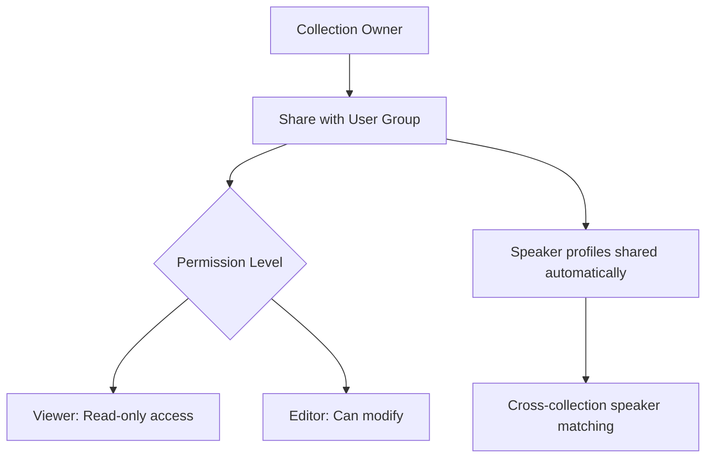

# Collections

Organize related media files into collections for better project management.

## Creating Collections

1. Go to Collections page
2. Click "New Collection"
3. Name your collection
4. Add description (optional)
5. Optionally assign a **default AI prompt** for summarization (see [Per-Collection Default Prompts](./ai-summarization.md#per-collection-default-prompts))
6. Add media files

You can also assign files to collections during upload -- see [Organizing During Upload](./uploading-files.md#organizing-during-upload).

## Use Cases

- **Projects**: Group all meeting recordings for a project
- **Clients**: Organize files by client
- **Events**: Conference sessions
- **Courses**: Lecture series
- **Interviews**: Research interview sets

## Managing Collections

- Add/remove files
- Edit name, description, and default AI prompt
- Share collections with users and groups (see below)
- Export collection data
- View collection analytics

## Collection Sharing Model

## Sharing Collections

Collections can be shared with individual users or user groups:

### User Groups

Create groups to organize team members for easier sharing:

1. Go to **Settings > Groups** (admin) or the Groups page
2. Click **Create Group**
3. Name the group and add members
4. Assign roles (member or admin)

### Sharing a Collection

1. Open a collection
2. Click **Share**
3. Search for users or groups to share with
4. Set permission level:
   - **Viewer** -- Can view files and transcripts in the collection
   - **Editor** -- Can also edit transcripts, speakers, and summaries
5. Confirm sharing

Shared collections appear in recipients' collection lists. **Speaker profiles** associated with files in the collection are automatically shared with recipients, enabling cross-collection speaker recognition.

**Shared Configs and Prompts**: When you share a collection, you can also share the custom AI prompts and configuration presets associated with it. Recipients can use these shared prompts when generating summaries for files in that collection. Prompt sharing is managed separately from collection sharing — see Settings → AI Prompts to share individual prompts with users or groups without sharing an entire collection.

### Removing Access

1. Open the collection's share settings
2. Click remove next to the user or group
3. Access is revoked immediately

## File Retention

Administrators can configure automatic file cleanup to manage storage:

1. Go to **Settings > File Retention**
2. Enable automatic file deletion
3. Configure:
   - **Retention period** (days) -- Files completed more than this many days ago are deleted
   - **Scheduled run time** -- Daily cleanup runs at this time
   - **Timezone** -- Timezone for the scheduled run
   - **Include error files** -- Optionally also delete files with processing errors
4. Use **Preview** to see which files would be affected before enabling
5. Use **Run Now** to trigger an immediate cleanup

:::warning
File retention permanently deletes media files and transcripts. Speaker profiles and voice fingerprints are preserved for future use.
:::

## Next Steps

- [Search & Filters](./search-and-filters.md)
- [First Transcription](../getting-started/first-transcription.md)
