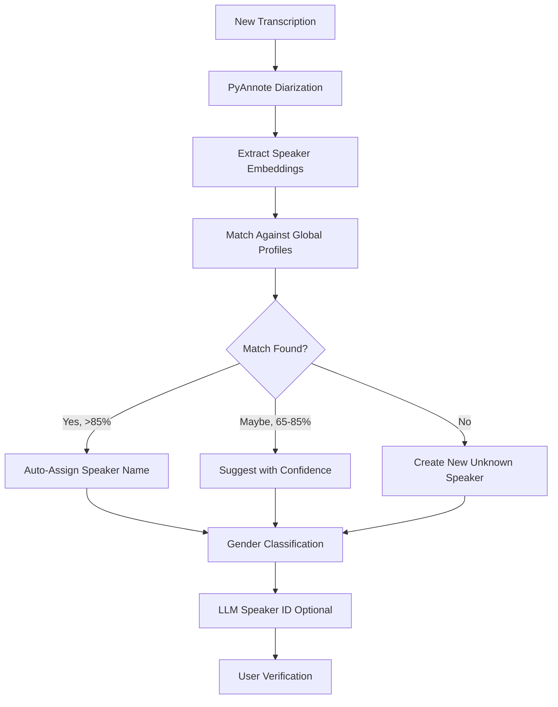

# Speaker Management

OpenTranscribe provides powerful speaker diarization and management features to identify and organize speakers across all your media files.

## Speaker Diarization

**Automatic speaker detection** using PyAnnote.audio identifies different speakers and segments audio by "who spoke when".

### Enabling Speaker Diarization

1. Configure HuggingFace token (required):
   - See [HuggingFace Setup](../installation/huggingface-setup.md)

2. Enable in UI settings or `.env`:
   ```bash
   MIN_SPEAKERS=1
   MAX_SPEAKERS=20  # Increase for large meetings/conferences
   ```

3. Process files - speakers automatically detected

### Disabling Speaker Diarization

Speaker diarization can be skipped when not needed (e.g., single-speaker monologues, or when faster processing is more important than speaker labels):

- **Per-upload**: Uncheck "Run Speaker Diarization" in the upload dialog
- **Per-reprocess**: The reprocess dialog includes the same toggle
- **User default**: Set your preference in Settings → Transcription → Speaker Diarization

Transcripts processed without diarization will not have speaker labels but are otherwise complete.

## Speaker Identification Workflow



## Speaker Profiles

### Creating Speaker Profiles

Speakers are automatically identified as "Speaker 1", "Speaker 2", etc. You can create persistent profiles:

1. Click on speaker label
2. Enter speaker name
3. Save profile

**Auto-profile creation**: When you label a speaker, OpenTranscribe automatically creates a global profile that can be matched across videos.

### Speaker Profile Avatars

Speaker profiles support profile avatars for easy visual identification. Avatars appear throughout the UI wherever speakers are displayed.

### Cross-Video Speaker Recognition

OpenTranscribe uses **voice fingerprinting** to identify the same speaker across different media files:

- Voice embeddings analyzed for similarity
- High-confidence matches auto-linked
- Speaker labels propagate across videos
- View all appearances of a speaker
- Speaker profiles are automatically shared when collections are shared with other users

### LLM-Powered Identification

If LLM is configured, get AI-powered speaker name suggestions based on:
- Conversation context
- Topics discussed
- Speaking patterns
- Professional role indicators

## Global Speakers Page

The dedicated **Speakers** page (accessible from the sidebar) provides a centralized view of all speaker profiles and clusters:

### Speakers Tab
- Browse all named speaker profiles
- View appearance count across files
- Edit names, avatars, and details
- Delete or merge speakers

### Clusters Tab
- **GPU-accelerated pre-clustering** groups unnamed speakers by voice similarity
- Review suggested clusters and promote them to named profiles
- **Play/pause audio** directly from cluster cards to verify speaker identity
- **Unassign and blacklist** -- remove a mis-clustered segment and prevent it from being re-assigned
- **Outlier analysis** -- identify segments that don't match the cluster well
- Trigger manual re-clustering when needed


### Gender Classification

OpenTranscribe can automatically detect speaker gender attributes:

- **Gender badges** displayed on speaker profiles and cluster cards
- Used for **gender-informed cluster validation** -- prevents merging speakers of different detected genders
- Configure in **Settings > Speaker Attributes**
- Gender detection runs during the diarization pipeline

## Speaker Analytics

View comprehensive speaker statistics:

- **Talk Time**: Total speaking duration
- **Word Count**: Words spoken
- **Turn-Taking**: Number of speaking turns
- **Interruptions**: Detected interruptions
- **Speaking Pace**: Words per minute
- **Question Frequency**: Questions asked
- **Cross-Media Appearances**: Videos featuring speaker

## Managing Speakers

### Edit Speaker Labels

1. Click speaker name in transcript
2. Edit name
3. Changes apply to all segments


### Jump-to-Timestamp in Speaker Editor

The speaker editor includes jump-to-timestamp links next to each segment ([#147](https://github.com/davidamacey/OpenTranscribe/issues/147)):

- Click the timestamp badge next to any segment in the speaker editor to jump the media player to that moment
- Useful for quickly verifying speaker assignments by listening to the actual audio
- Works for both named profiles and unnamed clusters

### Merge Speakers

If diarization incorrectly splits one speaker:

1. Select segments
2. Assign to same speaker profile
3. Consolidate analytics

### Speaker Verification Status

Track speaker identification confidence:
- ✅ Verified: Manually confirmed
- AI Suggested: LLM identification
- Auto-Matched: Voice fingerprint match
- Unverified: Default detection

## Configuration

### Adjust Speaker Detection Range

For meetings with many participants:

```bash
# .env configuration
MIN_SPEAKERS=2       # Minimum speakers to detect
MAX_SPEAKERS=50      # Maximum speakers (no hard limit)
```

**Note**: PyAnnote can handle 50+ speakers for large conferences.

### Speaker Display Preferences

Customize in UI settings:
- Color coding by speaker
- Show/hide speaker analytics
- Filter by speaker
- Export with speaker labels

## Troubleshooting

### All Speakers Shown as "Speaker 1"

**Causes**:
- HuggingFace token not configured
- Single speaker in audio
- Poor audio quality

**Solutions**:
- Verify HuggingFace setup
- Check audio has multiple speakers
- Ensure clear audio quality

### Too Many/Few Speakers Detected

**Solutions**:
```bash
# Adjust detection range
MIN_SPEAKERS=1
MAX_SPEAKERS=30  # Tune based on actual speaker count
```

### Speaker Segments Fragmented

**Cause**: Diarization split one speaker into multiple

**Solution**: Manually merge segments to same profile

## Best Practices

1. **Label Important Speakers**: Create profiles for frequent speakers
2. **Verify AI Suggestions**: Review LLM-suggested names
3. **Use Consistent Names**: Maintain naming convention
4. **Review Cross-Video Matches**: Confirm auto-matched speakers
5. **Adjust Detection Range**: Tune MIN/MAX_SPEAKERS for your use case

## Next Steps

- [First Transcription](../getting-started/first-transcription.md)
- [AI Summarization](./ai-summarization.md)
- [Search & Filters](./search-and-filters.md)
