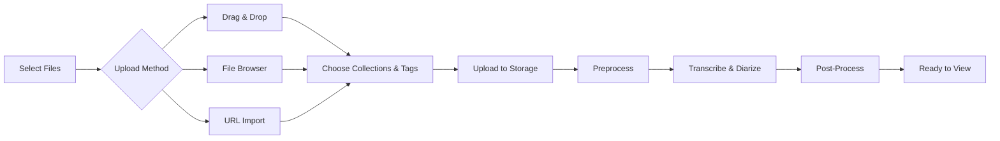

# Uploading Files

Learn how to upload and process media files in OpenTranscribe.

## Supported Formats

### Audio
- MP3, WAV, FLAC, M4A, OGG, WMA
- Any format FFmpeg can decode

### Video
- MP4, MOV, AVI, MKV, WebM
- Maximum size: 4GB

## Upload & Processing Workflow



## Upload Methods

### Drag & Drop
1. Drag files to upload area
2. Multiple files supported
3. Optionally organize into collections and tags (see below)
4. Auto-queue processing


### File Browser
1. Click "Upload" button
2. Select file(s)
3. Optionally organize into collections and tags (see below)
4. Confirm upload

### Media URL (1800+ Platforms)
1. Paste video URL from supported platforms
2. Supported: YouTube, Dailymotion, Twitter/X, TikTok, Vimeo, and 1800+ more
3. Auto-downloads in web-compatible format and processes


**Best supported platforms:**
- YouTube (including playlists)
- Dailymotion
- Twitter/X

**Limited support** (may require authentication):
- Vimeo, Instagram, Facebook, TikTok

:::tip Platform Guidance
If a video fails to download, OpenTranscribe provides helpful error messages with platform-specific suggestions. Common issues include:
- **Authentication required** - Video requires login (try YouTube or Dailymotion instead)
- **Age/geo-restricted** - Content blocked in your region
- **Premium content** - Requires subscription on source platform
:::

### URL Download Quality Settings

You can configure download quality preferences in **Settings > Downloads**:

- **Video Quality**: Choose resolution (e.g., 1080p, 720p, 480p, or best available)
- **Audio Only**: Download only the audio track (faster, saves storage)
- **Audio Quality**: Select audio bitrate when downloading audio only

You can also override these defaults per-download by expanding the quality options panel in the URL upload dialog.

## Organizing During Upload

When uploading files, you can assign them to **collections** and **tags** directly in the upload dialog:

1. Expand the **Organize** section in the upload dialog
2. Select one or more existing **collections** or create new ones
3. Add existing **tags** or type new tag names
4. Upload the file -- it will be automatically organized

This saves time compared to organizing files after upload. Tags and collections can also be managed later from the file detail page.

:::tip Auto-Labeling
If auto-labeling is enabled (Settings > Auto-Label), OpenTranscribe can automatically suggest tags and collections based on AI topic analysis after transcription completes. See [AI Summarization](./ai-summarization.md#auto-labeling) for details.
:::

## Selective Reprocessing

Already-transcribed files can be reprocessed with a stage picker that lets you run only specific stages:

1. Open a file's detail page
2. Click **Reprocess** (or select multiple files in the gallery and use bulk reprocess)
3. Choose which stages to re-run:
   - **Transcription** -- Full re-transcription with current Whisper model
   - **Re-diarize** -- Re-run speaker diarization only (keeps existing transcript)
   - **Search Indexing** -- Rebuild the search index entry
   - **Analytics** -- Recalculate speaker analytics
   - **Speaker LLM** -- Re-run AI speaker identification
   - **Summarization** -- Regenerate AI summary
   - **Topic Extraction** -- Re-run AI topic analysis
4. Optionally adjust speaker settings (min/max speakers)
5. Confirm and process

This is useful when you want to update just the summary with a new prompt without re-transcribing, or re-diarize with different speaker count settings.

## Export Options

OpenTranscribe supports multiple export formats accessible from the **Export** dropdown on any completed transcript page. You can also bulk-export across multiple files.

### TXT -- Plain Text

A configurable plain-text export. When you choose TXT, a dialog lets you toggle what to include:

- **Timestamps** -- Segment start/end times in `[MM:SS - MM:SS]` format
- **Speaker names** -- Speaker labels before each segment
- **Comments** -- User-added comments inline

Your preferences are remembered for future exports. Consecutive segments from the same speaker are automatically merged for readability. Overlapping speech is formatted as a special block:

```
[02:15 - 02:20] OVERLAPPING SPEECH:
  Alice (02:15 - 02:18): That's a great idea but--
  Bob (02:16 - 02:20): I completely disagree!
```

### JSON -- Structured Data

Exports the full transcript as a JSON file containing:
- Every segment with `start_time`, `end_time`, `text`, and `speaker_id`
- Speaker metadata and display names
- Word-level timestamps (when available)

Useful for programmatic analysis, importing into other tools, or building custom reports.

### CSV -- Spreadsheet Format

Exports segments as comma-separated values with columns for timestamp, speaker, and text. Open directly in Excel, Google Sheets, or any spreadsheet application for sorting, filtering, and analysis.

### SRT -- SubRip Subtitles

Industry-standard subtitle format compatible with virtually all video players (VLC, MPC, Plex, etc.). Features:
- Movie-style formatting with 42-character line wrapping
- Optimal display timing based on reading speed (200 WPM)
- Speaker labels included by default (toggle with the include speakers option)
- Overlapping speech merged into single cues with speaker attribution
- Long segments automatically split into readable subtitle blocks

### VTT -- WebVTT Subtitles

Web Video Text Tracks format for HTML5 video players and web applications. Same formatting as SRT but uses the WebVTT standard (dots instead of commas in timestamps, `WEBVTT` header).

### Bulk Export

Export subtitles for multiple files at once:
1. Select files in the gallery using multi-select (checkboxes)
2. Choose **Export** from the bulk actions menu
3. Select your format (SRT, VTT, or TXT)
4. Files are bundled into a single **ZIP download**

Up to 100 files can be exported in a single bulk operation. Files that are not yet completed are automatically skipped.

### Video Download with Embedded Subtitles

When downloading a video file, OpenTranscribe automatically embeds subtitles using FFmpeg:
- Subtitles are added as a soft subtitle track in the downloaded MP4
- Speaker labels are included by default
- Use the **Download Original** option to get the file without embedded subtitles

---

## File Management

### Editing File Metadata

After upload, you can update a file's metadata from the detail page:

1. Click on a file to open the detail view
2. Click the **title** at the top to edit it inline
3. Press **Enter** or click outside to save

Editable fields:
- **Title** -- Display name shown in the gallery and search results (also updates the search index)
- **Filename** -- Original filename

### File Status Tracking

Each file has a status indicating its current state:

| Status | Description |
|--------|-------------|
| `pending` | File uploaded, waiting to be queued |
| `queued` | In the processing queue |
| `downloading` | URL-sourced file is being downloaded |
| `processing` | Transcription/diarization in progress |
| `completed` | Processing finished successfully |
| `error` | Processing failed (check the error message for details) |
| `cancelling` | Cancellation requested, waiting for worker |
| `cancelled` | Processing was cancelled by the user |
| `orphaned` | Processing appears stuck with no active worker |

You can view detailed status information -- including active task ID, last error message, and retry count -- via the **status detail** panel on the file page.

### Bulk Operations

Select multiple files in the gallery using the checkbox on each card, then use the bulk actions toolbar:

| Action | Description |
|--------|-------------|
| **Delete** | Delete selected files and all associated data |
| **Reprocess** | Re-run the full transcription pipeline |
| **Selective Reprocess** | Choose specific stages to re-run |
| **Summarize** | Generate AI summaries for all selected files |
| **Cancel** | Cancel active processing tasks |
| **Retry** | Retry failed or cancelled files |
| **Export** | Bulk export subtitles as a ZIP file |

All bulk operations report per-file success/failure results.

### Recovering Stuck or Failed Files

If a file is stuck in `processing` status or has failed:

1. **Check the status detail** -- Click the file and look at the error message and recommendations
2. **Retry** -- For files in `error`, `cancelled`, or `orphaned` status, click **Retry** to re-queue
3. **Cancel and retry** -- For stuck processing files, click **Cancel** first, then **Retry**
4. **Recover** -- Use the **Recover** action to attempt automatic recovery of stuck files
5. **Force delete** (admin only) -- Admins can force-delete files even while processing

The system automatically detects stuck files (processing longer than the threshold, default 2 hours) and provides recovery recommendations.

:::info Admin Tools
Administrators have access to additional file management capabilities:
- **Stuck files report** -- View all files stuck in processing beyond a configurable threshold
- **Cleanup orphaned files** -- Bulk recover or mark files that lost their worker connection
- **Reset retry count** -- Allow re-processing beyond the normal retry limit
:::

---

## Speaker Analytics

Once a file completes processing, OpenTranscribe computes detailed analytics automatically (or on-demand if missing). View analytics from the **Analytics** tab on the file detail page.

### Talk Time

- **Per-speaker talk time** in seconds and as a percentage of total duration
- **Total talk time** across all speakers
- **Silence ratio** -- percentage of the file with no speech detected

### Word Count and Speaking Pace

- **Word count** per speaker and overall total
- **Speaking pace** in words per minute (WPM), calculated as total words divided by total talk time
- Useful for identifying fast or slow speakers in meetings

### Interruptions

- **Interruption count** per speaker -- detected when a new speaker begins before the previous speaker finishes
- **Total interruptions** across the conversation
- Helps identify dominant speakers or heated discussions

### Turn-Taking

- **Turn count** per speaker -- number of times each speaker takes the floor
- **Total turns** in the conversation
- Reveals participation balance and conversation dynamics

### Questions

- **Question count** per speaker -- detected by segments ending with `?`
- **Total questions** asked during the conversation

### Refreshing Analytics

If speaker names are updated or segments are edited, you can recalculate analytics:
- Click **Refresh Analytics** on the file detail page
- Or select **Analytics** as a reprocessing stage during selective reprocess

---

## Recording Audio

Record audio directly in your browser without any external software:

### Starting a Recording

1. Click the **microphone icon** in the top navigation bar
2. Grant microphone permission when prompted by your browser
3. **Select your microphone** from the device dropdown (if you have multiple)
4. Click **"Start Recording"**

### During Recording

- **Audio level meter** shows real-time volume so you can verify your microphone is working
- **Duration counter** displays elapsed recording time
- **Pause/Resume** the recording at any time without losing progress
- Recording format: WebM with Opus codec at 128 kbps

### Finishing a Recording

1. Click **"Stop"** when you are finished
2. The recorded audio is automatically uploaded to OpenTranscribe
3. Standard transcription processing begins immediately

:::tip Recording Quality
For best results, use an external microphone rather than a built-in laptop mic. Ensure your environment is quiet and speak clearly. Monitor the audio level indicator to confirm your voice is being captured.
:::

:::note Browser Support
Recording requires a modern browser with MediaRecorder API support (Chrome, Firefox, Edge, Safari 14.1+). Your browser must have permission to access the microphone.
:::

## Upload Manager

Floating upload manager shows:
- Upload progress
- Queue position
- Processing status
- Error messages

## Next Steps

- [First Transcription](../getting-started/first-transcription.md)
- [Speaker Management](./speaker-management.md)
