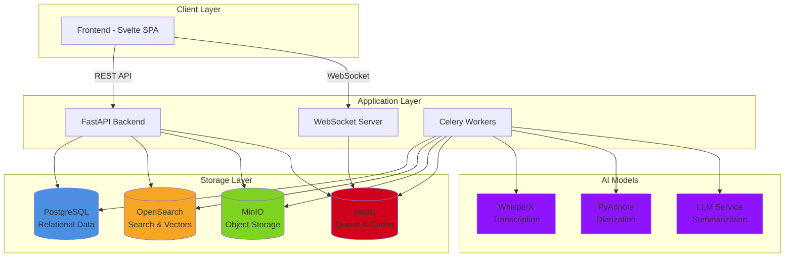

# OpenTranscribe Database Schema

This document provides a visual overview of the OpenTranscribe database schema and entity relationships.

## Entity Relationship Diagram

### PostgreSQL Tables

```mermaid
erDiagram
    user ||--o{ media_file : owns
    user ||--o{ speaker_profile : creates
    user ||--o{ speaker : owns
    user ||--o{ comment : writes
    user ||--o{ task : has
    user ||--o{ collection : owns
    user ||--o{ speaker_collection : owns
    user ||--o{ topic_suggestion : receives
    user ||--o{ summary_prompt : creates
    user ||--o{ user_setting : has
    user ||--o{ user_llm_settings : configures

    media_file ||--o{ transcript_segment : contains
    media_file ||--o{ speaker : has
    media_file ||--o{ comment : has
    media_file ||--|o analytics : has
    media_file ||--o{ file_tag : tagged_with
    media_file ||--o{ collection_member : belongs_to
    media_file ||--o| topic_suggestion : has
    media_file ||--o{ task : tracks
    media_file }o--|| opensearch_transcript : "indexed_in"
    media_file }o--|| opensearch_summary : "has_summary_in"

    speaker_profile ||--o{ speaker : identifies
    speaker_profile ||--o{ speaker_collection_member : belongs_to
    speaker_profile }o--|| opensearch_speaker_profile : "embedding_stored_in"

    speaker ||--o{ transcript_segment : speaks
    speaker ||--o{ speaker_match : matches
    speaker }o--|| opensearch_speaker : "embedding_stored_in"

    tag ||--o{ file_tag : used_in

    collection ||--o{ collection_member : contains

    speaker_collection ||--o{ speaker_collection_member : contains

    user {
        int id PK
        uuid uuid UK
        string email UK
        string hashed_password
        string full_name
        boolean is_active
        boolean is_superuser
        string role
        timestamp created_at
        timestamp updated_at
    }

    media_file {
        int id PK
        uuid uuid UK
        string filename
        string storage_path
        bigint file_size
        float duration
        timestamp upload_time
        timestamp completed_at
        string content_type
        string status
        boolean is_public
        string language
        text summary
        string summary_opensearch_id
        string summary_status
        text translated_text
        string file_hash
        string thumbnail_path
        jsonb metadata_raw
        jsonb metadata_important
        jsonb waveform_data
        string media_format
        string codec
        float frame_rate
        int frame_count
        int resolution_width
        int resolution_height
        string aspect_ratio
        int audio_channels
        int audio_sample_rate
        int audio_bit_depth
        timestamp creation_date
        timestamp last_modified_date
        string device_make
        string device_model
        string title
        string author
        text description
        string source_url
        string active_task_id
        timestamp task_started_at
        timestamp task_last_update
        boolean cancellation_requested
        int retry_count
        int max_retries
        text last_error_message
        boolean force_delete_eligible
        int recovery_attempts
        timestamp last_recovery_attempt
        int user_id FK
    }

    speaker_profile {
        int id PK
        uuid uuid UK
        int user_id FK
        string name
        text description
        int embedding_count
        timestamp last_embedding_update
        timestamp created_at
        timestamp updated_at
    }

    speaker {
        int id PK
        uuid uuid UK
        int user_id FK
        int media_file_id FK
        int profile_id FK
        string name
        string display_name
        string suggested_name
        boolean verified
        float confidence
        timestamp created_at
        string computed_status
        string status_text
        string status_color
        string resolved_display_name
    }

    transcript_segment {
        int id PK
        uuid uuid UK
        int media_file_id FK
        int speaker_id FK
        float start_time
        float end_time
        text text
    }

    comment {
        int id PK
        uuid uuid UK
        int media_file_id FK
        int user_id FK
        text text
        float timestamp
        timestamp created_at
    }

    task {
        string id PK
        int user_id FK
        int media_file_id FK
        string task_type
        string status
        float progress
        timestamp created_at
        timestamp updated_at
        timestamp completed_at
        text error_message
    }

    analytics {
        int id PK
        uuid uuid UK
        int media_file_id FK
        jsonb overall_analytics
        timestamp computed_at
        string version
    }

    tag {
        int id PK
        uuid uuid UK
        string name UK
        timestamp created_at
    }

    file_tag {
        int id PK
        uuid uuid UK
        int media_file_id FK
        int tag_id FK
        timestamp created_at
    }

    collection {
        int id PK
        uuid uuid UK
        string name
        text description
        int user_id FK
        boolean is_public
        timestamp created_at
        timestamp updated_at
    }

    collection_member {
        int id PK
        uuid uuid UK
        int collection_id FK
        int media_file_id FK
        timestamp added_at
    }

    speaker_collection {
        int id PK
        uuid uuid UK
        string name
        text description
        int user_id FK
        boolean is_public
        timestamp created_at
        timestamp updated_at
    }

    speaker_collection_member {
        int id PK
        uuid uuid UK
        int collection_id FK
        int speaker_profile_id FK
        timestamp added_at
    }

    speaker_match {
        int id PK
        uuid uuid UK
        int speaker1_id FK
        int speaker2_id FK
        float confidence
        timestamp created_at
        timestamp updated_at
    }

    topic_suggestion {
        int id PK
        uuid uuid UK
        int media_file_id FK
        int user_id FK
        jsonb suggested_tags
        jsonb suggested_collections
        string status
        jsonb user_decisions
        timestamp created_at
        timestamp updated_at
    }

    summary_prompt {
        int id PK
        uuid uuid UK
        string name
        text description
        text prompt_text
        boolean is_system_default
        int user_id FK
        boolean is_active
        string content_type
        timestamp created_at
        timestamp updated_at
    }

    user_setting {
        int id PK
        uuid uuid UK
        int user_id FK
        string setting_key
        text setting_value
        timestamp created_at
        timestamp updated_at
    }

    user_llm_settings {
        int id PK
        uuid uuid UK
        int user_id FK
        string name
        string provider
        string model_name
        text api_key
        string base_url
        int max_tokens
        string temperature
        boolean is_active
        timestamp last_tested
        string test_status
        text test_message
        timestamp created_at
        timestamp updated_at
    }

    opensearch_transcript {
        keyword _id "file_uuid"
        int file_id
        keyword file_uuid
        int user_id
        text content
        keyword[] speakers
        keyword[] tags
        date upload_time
        text title
        knn_vector embedding "384-dim"
    }

    opensearch_speaker {
        keyword _id "speaker_uuid"
        int speaker_id
        keyword speaker_uuid
        int profile_id
        keyword profile_uuid
        int user_id
        keyword name
        keyword display_name
        int[] collection_ids
        int media_file_id
        int segment_count
        date created_at
        date updated_at
        knn_vector embedding "192-dim_pyannote"
    }

    opensearch_speaker_profile {
        keyword _id "profile_{uuid}"
        keyword document_type "profile"
        int profile_id
        keyword profile_uuid
        keyword profile_name
        int user_id
        int speaker_count
        date updated_at
        knn_vector embedding "192-dim_pyannote"
    }

    opensearch_summary {
        keyword _id "generated_uuid"
        int file_id
        int user_id
        int summary_version
        keyword provider
        keyword model
        date created_at
        date updated_at
        text bluf
        text brief_summary
        nested major_topics
        nested action_items
        text[] key_decisions
        text[] follow_up_items
        text searchable_content
        object metadata
    }
```



### OpenSearch Indices

OpenSearch is used for full-text search and vector similarity operations. The system maintains four primary indices:

1. **transcripts** - Full-text and semantic search on transcriptions
2. **speakers** - Voice embedding storage and similarity matching (both individual speakers and profiles)
3. **transcript_summaries** - AI-generated summaries with structured data

**Key Implementation Notes:**
- PostgreSQL stores relational data and references OpenSearch document IDs
- OpenSearch stores vector embeddings (not in PostgreSQL for performance)
- Speaker embeddings use PyAnnote (192-dim), transcript embeddings use sentence-transformers (384-dim)
- Document IDs in OpenSearch are UUIDs from PostgreSQL for consistency
- Speaker profiles use prefixed IDs (`profile_{uuid}`) to avoid conflicts

## Schema Overview

### Core Entities

#### User Management
- **user**: User accounts with role-based access control
- **user_setting**: User preferences and configuration
- **user_llm_settings**: User-specific LLM provider configurations

#### Media & Transcription
- **media_file**: Core entity for uploaded audio/video files with extensive metadata
- **transcript_segment**: Individual transcript segments with timestamps
- **analytics**: Computed analytics for media files (talk time, etc.)

#### Speaker Management
- **speaker**: Speaker instances within specific media files
- **speaker_profile**: Global speaker identities for cross-file recognition
- **speaker_match**: Cross-references between similar speakers
- **speaker_collection**: User-organized collections of speaker profiles
- **speaker_collection_member**: Join table for speaker collections

#### Organization & Categorization
- **tag**: Tags for categorizing media files
- **file_tag**: Many-to-many relationship between media files and tags
- **collection**: User-organized collections of media files
- **collection_member**: Join table for media file collections

#### AI Features
- **topic_suggestion**: LLM-powered tag and collection suggestions
- **summary_prompt**: Custom prompts for AI summarization

#### Collaboration & Tracking
- **comment**: User comments on media files with optional timestamps
- **task**: Background task tracking (transcription, diarization, summarization)

### Key Relationships

1. **User → Media Files**: One-to-many (users own multiple media files)
2. **Media File → Transcript Segments**: One-to-many (files have multiple segments)
3. **Media File → Speakers**: One-to-many (files have multiple speaker instances)
4. **Speaker → Speaker Profile**: Many-to-one (multiple instances can link to one profile)
5. **Media File → Collections**: Many-to-many via collection_member
6. **Media File → Tags**: Many-to-many via file_tag
7. **Speaker Profile → Speaker Collections**: Many-to-many via speaker_collection_member

### Notable Features

- **UUID Support**: All entities have both integer IDs (for internal use) and UUIDs (for external APIs)
- **Soft References**: Speaker embeddings stored in OpenSearch for vector similarity, not in PostgreSQL
- **Task Tracking**: Comprehensive task management for async AI processing
- **Computed Fields**: Speaker status fields calculated by backend services
- **Audit Trail**: created_at/updated_at timestamps on most entities
- **Cascade Deletes**: Proper cleanup when users or media files are deleted

### Storage Pattern & Data Distribution

The application uses a multi-tier storage architecture optimized for different data types:

#### PostgreSQL
- **Relational data**: User accounts, media file metadata, speakers, transcript segments
- **Relationships**: Foreign keys between users, files, speakers, collections
- **Transactional data**: Comments, tasks, analytics
- **Configuration**: User settings, LLM configurations, prompts
- **References**: OpenSearch document IDs stored in `media_file.summary_opensearch_id`

#### OpenSearch
- **Full-text search**: Searchable transcript content with highlighting
- **Vector embeddings**:
  - Speaker voice embeddings (PyAnnote 192-dim) for voice matching
  - Speaker profile embeddings (averaged from multiple speakers)
  - Transcript semantic embeddings (sentence-transformers 384-dim) for semantic search
- **AI summaries**: Structured summary data with nested action items and topics
- **Search indices**: Optimized for kNN similarity search and text matching

#### MinIO (S3-Compatible Storage)
- **Media files**: Original uploaded audio/video files
- **Thumbnails**: Video preview images
- **Extracted audio**: Audio tracks extracted from video files for transcription
- **Organized by user**: Files stored in user-specific buckets/paths

#### Redis
- **Task queues**: Celery task management for async processing
- **Caching**: Session data and temporary state
- **Real-time updates**: WebSocket message broker for progress notifications

### Cross-Storage Relationships

1. **Media File Processing Flow**:
   - File uploaded → MinIO storage
   - Metadata → PostgreSQL `media_file` table
   - Transcription → PostgreSQL `transcript_segment` table + OpenSearch `transcripts` index
   - Speaker embeddings → OpenSearch `speakers` index (referenced from PostgreSQL `speaker` table)
   - AI summary → OpenSearch `transcript_summaries` index (ID stored in PostgreSQL)

2. **Speaker Identification**:
   - Speaker instance → PostgreSQL `speaker` table
   - Voice embedding → OpenSearch `speakers` index (using `speaker.uuid` as document ID)
   - Speaker profile → PostgreSQL `speaker_profile` table
   - Profile embedding → OpenSearch `speakers` index with `profile_{uuid}` ID
   - Cross-file matching uses kNN search in OpenSearch, results saved to PostgreSQL

3. **Search Operations**:
   - User searches transcripts → OpenSearch full-text + vector search
   - Results include file IDs → Join with PostgreSQL for full metadata
   - Speaker matching → OpenSearch kNN search → Update PostgreSQL speaker assignments

## Complete System Architecture



### Data Flow Examples

#### Transcription Processing
```
1. User uploads file via UI
2. API stores file → MinIO
3. API creates MediaFile record → PostgreSQL
4. API dispatches transcription task → Redis/Celery
5. Celery worker:
   - Downloads from MinIO
   - Runs WhisperX → generates transcript segments
   - Stores segments → PostgreSQL (transcript_segment table)
   - Runs PyAnnote → generates speaker embeddings
   - Stores embeddings → OpenSearch (speakers index)
   - Indexes transcript → OpenSearch (transcripts index)
6. WebSocket notifies UI of completion
```

#### Speaker Matching
```
1. New speaker detected during diarization
2. Speaker embedding generated by PyAnnote
3. OpenSearch kNN search for similar embeddings
4. If match found (confidence > threshold):
   - Suggest match to user
   - Store match → PostgreSQL (speaker table with suggested_name)
5. User confirms match:
   - Update speaker → PostgreSQL (profile_id, verified=true)
   - Update embedding metadata → OpenSearch
```

#### AI Summarization
```
1. User requests summary for completed transcript
2. API retrieves transcript segments → PostgreSQL
3. API dispatches summarization task → Redis/Celery
4. Celery worker:
   - Formats transcript with speaker info
   - Calls LLM service (OpenAI/Claude/vLLM/Ollama)
   - Parses structured JSON response
   - Stores summary → OpenSearch (transcript_summaries index)
   - Updates media_file.summary_opensearch_id → PostgreSQL
5. WebSocket notifies UI
6. UI fetches summary from OpenSearch
```

## File Locations

- **Schema Definition**: [database/init_db.sql](../database/init_db.sql)
- **SQLAlchemy Models**: [backend/app/models/](../backend/app/models/)
- **Pydantic Schemas**: [backend/app/schemas/](../backend/app/schemas/)
- **OpenSearch Service**: [backend/app/services/opensearch_service.py](../backend/app/services/opensearch_service.py)
- **Summary Service**: [backend/app/services/opensearch_summary_service.py](../backend/app/services/opensearch_summary_service.py)
